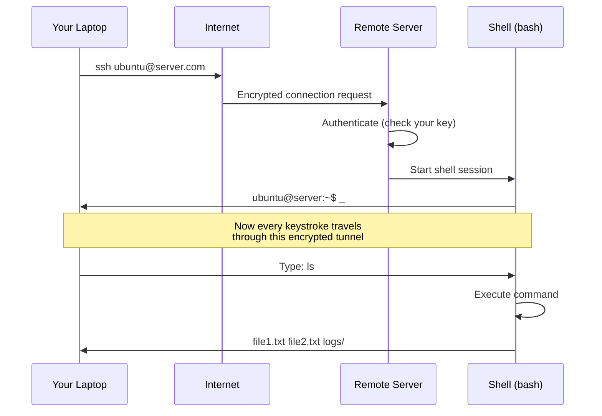

# Lesson 1.0: The Remote Server Problem

> **Duration**: 10 min | **Section**: A - What IS a Terminal?

## 🎯 The Problem (3-5 min)

You just deployed your first AI application to the cloud. It's 2am. Your phone buzzes: **"ALERT: Service down."**

You open your laptop, SSH into the production server, and see this:

```
ubuntu@ip-172-31-42-17:~$ _
```

A blinking cursor. Nothing else.

No mouse. No desktop. No file explorer. No "right-click → Open With". Just... a cursor.

**Now what?**

> **Scenario**: Your app is crashing because a log file filled up the disk. You need to find that file, delete it, and restart the service. You have 5 minutes before customers start complaining. The only interface you have is that blinking cursor.

## 🧪 Try It: The Naive Approach (5-10 min)

If you've never used a terminal, your instincts might be:

- "Where's the file manager?"
- "Can I just... click somewhere?"
- "Maybe I'll try typing 'help'?"

Go ahead—try typing `help` in a terminal:

```bash
help
```

You get... a wall of cryptic text about "bash built-in commands." Not helpful when you're panicking at 2am.

**The problem**: Servers don't have graphical interfaces. They're optimized for:
- Speed (no GPU needed for rendering windows)
- Security (fewer running services = fewer vulnerabilities)
- Remote access (text transmits faster than graphics)

## 🔍 Under the Hood (10-15 min)

When you SSH into a server, here's what's actually happening:



**Key insight**: That blinking cursor IS your interface. The **shell** (usually `bash` or `zsh`) is waiting for your commands. It's not broken—it's ready.

### What You're Actually Looking At

| Part | Meaning |
|:-----|:--------|
| `ubuntu` | Your username |
| `@` | "at" |
| `ip-172-31-42-17` | The server's hostname |
| `:` | Separator |
| `~` | Your current location (home directory) |
| `$` | Ready for your command (not root user) |
| `_` | Cursor (where you type) |

So `ubuntu@ip-172-31-42-17:~$` means: "User ubuntu, on server ip-172-31-42-17, currently in home directory, ready for commands."

## 💥 Where It Breaks (3-5 min)

The problem isn't that terminals are bad. The problem is **you don't speak the language yet**.

Imagine landing in a foreign country where:
- Nobody speaks your language
- There are no pictures or signs
- You need to find food, shelter, and transportation
- You have a phrase book, but it's 500 pages long

That's what the terminal feels like at first.

**But here's the secret**: You only need about 20 commands to handle 90% of situations. And once you learn them, you'll be FASTER than clicking through menus.

## ✅ The Fix (10-15 min)

The fix is simple: **Learn the language.**

By the end of this module, you'll know:

| Command | What It Does |
|:--------|:-------------|
| `pwd` | "Where am I?" |
| `ls` | "What's here?" |
| `cd` | "Go somewhere" |
| `cat` | "Show file contents" |
| `rm` | "Delete this" |
| `chmod` | "Change permissions" |
| `ssh` | "Connect to remote server" |

And here's what you'll do when that 2am alert hits:

```bash
# 1. Find what's using disk space
df -h                           # Check disk usage
du -sh /var/log/*              # Find big directories

# 2. Find the problem file
ls -lhS /var/log/              # List by size

# 3. Clear it
sudo truncate -s 0 /var/log/huge.log   # Empty the file

# 4. Restart the service
sudo systemctl restart myapp

# 5. Verify
systemctl status myapp
```

**Total time**: 2 minutes. Crisis averted. Back to sleep.

## 🎯 Practice

1. Open a terminal on your computer:
   - **Mac**: `Cmd + Space`, type "Terminal"
   - **Linux**: `Ctrl + Alt + T`
   - **Windows**: Install WSL, then open Ubuntu

2. Look at your prompt. Identify:
   - Your username (before the `@`)
   - Your hostname (after the `@`)
   - Your current directory (`~` means home)

3. Type `whoami` and press Enter:
   ```bash
   whoami
   # Expected: your username (e.g., alice, ubuntu, your-name)
   ```

4. Type `hostname` and press Enter:
   ```bash
   hostname
   # Expected: your computer's name (e.g., macbook-pro, my-laptop, ip-172-31-42-17)
   ```

5. Type `pwd` and press Enter:
   ```bash
   pwd
   # Expected: your home directory path (e.g., /home/alice, /Users/alice)
   ```

## 🔑 Key Takeaways

- Servers use terminals because they're fast, secure, and remote-friendly
- The prompt tells you WHO you are, WHERE you are, and that the shell is READY
- You only need ~20 commands to handle most situations
- The terminal isn't scary—it's just a different language

## ❓ Common Questions

| Question | Answer |
|----------|--------|
| Why don't servers have GUIs? | Speed, security, and they're accessed remotely. Sending text is faster than rendering graphics. |
| What if I type something wrong? | Usually nothing bad happens. The shell will say "command not found." You can always press `Ctrl + C` to cancel. |
| Is this the same on Mac and Linux? | Almost identical. macOS is based on Unix, just like Linux. Windows is different (use WSL). |
| What's the difference between terminal, shell, and command line? | Terminal = the window. Shell = the program that interprets commands. Command line = where you type. Often used interchangeably. |

## 🔗 Further Reading

- [Ubuntu Terminal Tutorial](https://ubuntu.com/tutorials/command-line-for-beginners)
- [The Linux Command Line (free book)](https://linuxcommand.org/tlcl.php)
- [Explain Shell](https://explainshell.com/) - Paste any command to see what it does
