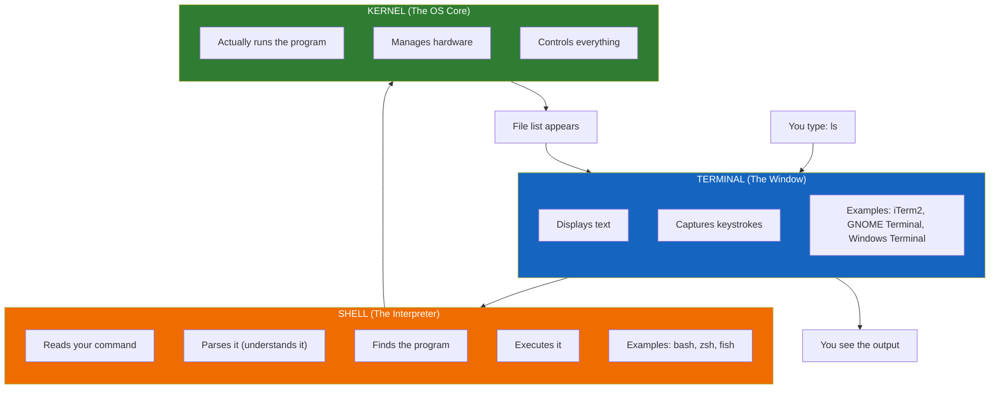
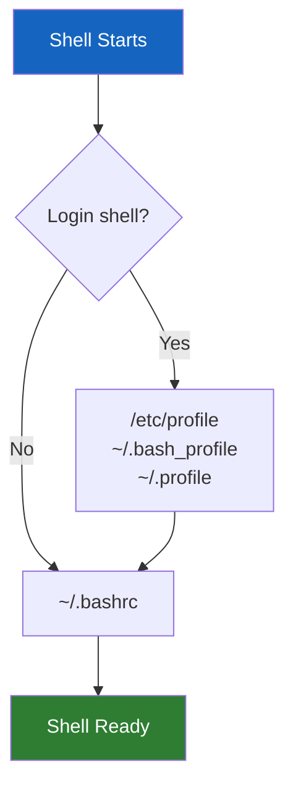

 # Lesson 1.1: What IS a Shell?

> **Duration**: 20 min | **Section**: A - What IS a Terminal?

## 🎯 The Problem (3-5 min)

You've opened a terminal. You see a blinking cursor. But what's actually running behind that cursor?

When you type `ls` and press Enter, something has to:
1. Read what you typed
2. Understand it's a command called "ls"
3. Find the program called `ls` on your computer
4. Run it
5. Show you the results

**What is that "something"?**

> **Scenario**: You're on a Mac and type `ls`. Your colleague is on Ubuntu and types `ls`. You both get file listings. But you're on different operating systems—how does the same command work on both?

## 🧪 Try It: The Naive Approach (5-10 min)

You might think: "The terminal runs my commands."

But try this:

```bash
echo $SHELL
```

You'll see something like `/bin/bash` or `/bin/zsh`.

That's not "terminal"—that's a **shell**. They're different things!

Now try:

```bash
ps -p $$
```

This shows the **process** that's running your session. It says `bash` or `zsh`, not "terminal."

**The confusion**: People use "terminal," "shell," and "command line" interchangeably. But they're three different things.

## 🔍 Under the Hood (10-15 min)

Here's what's actually happening when you type a command:



### The Analogy

Think of it like a restaurant:

| Component | Restaurant Analogy | What It Does |
|:----------|:-------------------|:-------------|
| **Terminal** | The table & menu | Where you sit and communicate |
| **Shell** | The waiter | Takes your order, translates it for the kitchen |
| **Kernel** | The kitchen | Actually prepares the food |

You don't talk directly to the kitchen. You tell the waiter (shell) what you want, and they handle the details.

### Popular Shells

| Shell | Full Name | Default On | Known For |
|:------|:----------|:-----------|:----------|
| `bash` | Bourne Again Shell | Most Linux distros | Universal, scriptable |
| `zsh` | Z Shell | macOS (since Catalina) | Better autocomplete, themes |
| `fish` | Friendly Interactive Shell | None (install it) | Beginner-friendly, colorful |
| `sh` | Bourne Shell | Ancient Unix | Minimal, always available |

### What the Shell Actually Does

When you type `ls -la /home`:

```mermaid
flowchart LR
    subgraph PARSE["1. PARSE"]
        P1["Command: ls"]
        P2["Flags: -la"]
        P3["Argument: /home"]
    end
    
    subgraph FIND["2. FIND"]
        F1["Search $PATH"]
        F2["Found: /bin/ls"]
    end
    
    subgraph EXEC["3. EXECUTE"]
        E1["Fork new process"]
        E2["Run /bin/ls with args"]
        E3["Wait for completion"]
    end
    
    subgraph OUTPUT["4. OUTPUT"]
        O1["Capture stdout"]
        O2["Display in terminal"]
    end
    
    PARSE --> FIND --> EXEC --> OUTPUT
    
    style PARSE fill:#1565C0,color:#fff
    style FIND fill:#EF6C00,color:#fff
    style EXEC fill:#7B1FA2,color:#fff
    style OUTPUT fill:#2E7D32,color:#fff
```



**Key insight**: `ls` is NOT built into the shell. It's a separate program at `/bin/ls`. The shell just finds and runs it.

## 💥 Where It Breaks (3-5 min)

Understanding the shell/terminal distinction matters when:

1. **You change shells**: If you switch from `bash` to `zsh`, your terminal looks the same, but your config files change (`.bashrc` → `.zshrc`)

2. **You write scripts**: A script starting with `#!/bin/bash` won't work if you use `zsh`-specific syntax

3. **You debug problems**: "My terminal is broken" vs "My shell config is broken" are very different problems

Try this:

```bash
# Check what shell you're running
echo $SHELL

# Check what shells are available
cat /etc/shells

# Temporarily switch to a different shell
sh
echo "Now I'm in sh"
exit
echo "Back to original shell"
```

## ✅ The Fix (10-15 min)

The fix is knowing which layer you're dealing with:

| Problem | Layer | Solution |
|:--------|:------|:---------|
| "My terminal colors are wrong" | Terminal | Change terminal settings |
| "My prompt looks ugly" | Shell | Edit `.bashrc` or `.zshrc` |
| "Command not found" | Shell (PATH) | Add directory to `$PATH` |
| "Keyboard shortcuts don't work" | Terminal | Check terminal key bindings |
| "Aliases don't load" | Shell config | Check shell startup files |

### Your Shell Config Files

When your shell starts, it reads configuration files:



**For bash**:
- `~/.bashrc` - Runs every time you open a terminal
- `~/.bash_profile` - Runs only for login shells

**For zsh**:
- `~/.zshrc` - Runs every time you open a terminal
- `~/.zprofile` - Runs only for login shells

## 🎯 Practice

1. Find your current shell:
   ```bash
   echo $SHELL
   ```

2. List available shells on your system:
   ```bash
   cat /etc/shells
   ```

3. Find where `ls` actually lives:
   ```bash
   which ls
   ```

4. See your shell configuration:
   ```bash
   cat ~/.bashrc    # or ~/.zshrc for zsh users
   ```

5. Try a different shell temporarily:
   ```bash
   sh              # Enter minimal shell
   echo "hello"    # Works the same
   exit            # Return to your shell
   ```

## 🔑 Key Takeaways

- **Terminal** = the window that displays text (iTerm, GNOME Terminal)
- **Shell** = the program that interprets commands (bash, zsh)
- **Kernel** = the OS core that actually executes programs
- Commands like `ls` are separate programs—the shell just finds and runs them
- Your shell behavior is configured in files like `~/.bashrc` or `~/.zshrc`

## ❓ Common Questions

| Question | Answer |
|----------|--------|
| Should I use bash or zsh? | Either works. zsh has nicer defaults. bash is more universal for scripts. |
| What's the `$` in my prompt? | It means you're a normal user. `#` means you're root (admin). |
| Can I change my shell? | Yes: `chsh -s /bin/zsh` (then log out and back in) |
| What's `/bin` vs `/usr/bin`? | Both contain programs. Historical reasons—treat them as the same. |

## 🔗 Further Reading

- [Bash Reference Manual](https://www.gnu.org/software/bash/manual/bash.html)
- [Zsh Documentation](https://zsh.sourceforge.io/Doc/)
- [What is a Shell? (Red Hat)](https://www.redhat.com/sysadmin/linux-shell-basics)
