# Lesson 1.2: The Filesystem Under the Hood

> **Duration**: 20 min | **Section**: A - What IS a Terminal?

## 🎯 The Problem (3-5 min)

You need to edit a configuration file. Someone tells you: "It's at `/etc/nginx/nginx.conf`."

You stare at that path. Questions flood your mind:
- What does `/` mean?
- Why `etc`? Is that "etcetera"?
- How is this different from `C:\Program Files\` on Windows?

**The real question**: How do files actually get organized on a Linux system?

> **Scenario**: You're setting up a web server. The documentation says to put your website files in `/var/www/html`, logs go in `/var/log/nginx`, and configs in `/etc/nginx`. Why those specific places? Who decided this?

## 🧪 Try It: The Naive Approach (5-10 min)

If you're coming from Windows or Mac GUI, you might think:
- "There's a C: drive and maybe a D: drive"
- "My files are in Documents, Pictures, Downloads"
- "Programs are in Applications or Program Files"

Try this on Linux:

```bash
ls /
```

You'll see something like:

```
bin   dev  home  lib64  mnt  proc  run   srv  tmp  var
boot  etc  lib   media  opt  root  sbin  sys  usr
```

No C: drive. No "Documents." Just cryptic three-letter folders.

**The confusion**: This looks nothing like what you're used to.

## 🔍 Under the Hood (10-15 min)

Here's the fundamental insight: **In Linux, EVERYTHING is a file.**

- Regular files? Files.
- Directories? Special files that contain lists of other files.
- Your keyboard? A file at `/dev/input/...`
- Your screen? A file.
- Running processes? Files in `/proc/`.
- Network connections? Files.

This is the **Unix Philosophy**: Represent everything as files, so you can use the same tools (read, write, copy) on everything.


### The Key Directories Explained

| Directory | Purpose | Example Contents |
|:----------|:--------|:-----------------|
| `/` | Root of everything | Everything branches from here |
| `/home` | User files | `/home/alice/Documents/` |
| `/etc` | System configuration | `/etc/nginx/nginx.conf` |
| `/var` | Variable/changing data | `/var/log/`, `/var/www/` |
| `/usr` | User programs (read-only) | `/usr/bin/python3` |
| `/bin` | Essential commands | `ls`, `cp`, `cat` |
| `/tmp` | Temporary files | Cleared on reboot |
| `/dev` | Device files | `/dev/sda` (hard drive) |
| `/proc` | Process information | `/proc/cpuinfo` |

### Why "Everything is a File" Matters

Want to see your CPU info? Read a file:

```bash
cat /proc/cpuinfo
```

Want to see how much memory you have? Read a file:

```bash
cat /proc/meminfo
```

Want to send output to "nowhere"? Write to a special file:

```bash
echo "this disappears" > /dev/null
```

**This is powerful**: The same commands that work on text files work on devices, processes, and system information.

### Paths: Absolute vs Relative


| Path Type | Example | Meaning |
|:----------|:--------|:--------|
| Absolute | `/home/alice/file.txt` | Always the same, no matter where you are |
| Relative | `file.txt` | Depends on your current directory |
| Relative | `../bob/file.txt` | Go up one level, then into bob's folder |
| Relative | `./script.sh` | Current directory (explicit) |

### Special Path Shortcuts

| Symbol | Meaning | Example |
|:-------|:--------|:--------|
| `/` | Root directory | `cd /` |
| `~` | Your home directory | `cd ~` = `cd /home/yourname` |
| `.` | Current directory | `./run.sh` |
| `..` | Parent directory | `cd ..` |
| `-` | Previous directory | `cd -` |

## 💥 Where It Breaks (3-5 min)

The "everything is a file" model breaks your expectations when:

1. **You expect Windows-style paths**:
   - Wrong: `C:\Users\Alice\Documents`
   - Right: `/home/alice/Documents`

2. **You forget paths are case-sensitive**:
   - `/home/Alice` ≠ `/home/alice`

3. **You don't know where to put things**:
   - Config files? `/etc/` for system-wide, `~/.config/` for personal
   - Log files? `/var/log/`
   - Web files? `/var/www/`
   - Temp files? `/tmp/`

4. **Hidden files surprise you**:
   - Files starting with `.` are hidden
   - `ls` doesn't show them
   - `ls -a` shows ALL files including hidden

## ✅ The Fix (10-15 min)

Memorize this mental map:

```mermaid
flowchart TD
    subgraph USERSPACE["👤 USER STUFF"]
        HOME["~ (your home)
        Your files, configs, projects"]
    end
    
    subgraph SYSTEM["⚙️ SYSTEM STUFF"]
        ETC["/etc
        Configuration"]
        VAR["/var
        Logs, databases, websites"]
        USR["/usr
        Installed programs"]
    end
    
    subgraph SPECIAL["🔧 SPECIAL"]
        DEV["/dev - Devices"]
        PROC["/proc - Processes"]
        TMP["/tmp - Temporary"]
    end
    
    style USERSPACE fill:#2E7D32,color:#fff
    style SYSTEM fill:#1565C0,color:#fff
    style SPECIAL fill:#7B1FA2,color:#fff
```



**Quick reference for common tasks**:

| I need to... | Look in... |
|:-------------|:-----------|
| Find my files | `~` or `/home/yourname` |
| Edit system config | `/etc/` |
| Read log files | `/var/log/` |
| Find installed programs | `/usr/bin/` or `/bin/` |
| Store website files | `/var/www/html/` |
| Put temporary files | `/tmp/` |

## 🎯 Practice

1. See the top-level directories:
   ```bash
   ls /
   ```

2. Find your home directory (two ways):
   ```bash
   echo ~
   echo $HOME
   ```

3. Read system information from "files":
   ```bash
   cat /proc/cpuinfo | head -20    # CPU info
   cat /etc/hostname               # Computer name
   cat /etc/os-release            # OS version
   ```

4. See hidden files in your home:
   ```bash
   ls -la ~
   ```

5. Explore the structure:
   ```bash
   ls /etc | head -10      # Config files
   ls /var/log | head -10  # Log files
   ls /usr/bin | head -10  # Programs
   ```

## 🔑 Key Takeaways

- Linux has ONE tree starting at `/` (no C: or D: drives)
- **Everything is a file**: devices, processes, configs—all accessible as files
- Know the key directories: `/home`, `/etc`, `/var`, `/usr`, `/tmp`
- Paths are case-sensitive: `File.txt` ≠ `file.txt`
- Hidden files start with `.` — use `ls -a` to see them
- `~` = your home directory

## ❓ Common Questions

| Question | Answer |
|----------|--------|
| Where are my "Documents"? | `/home/yourname/Documents` or just `~/Documents` |
| Where do I install programs? | Usually you don't—package managers put them in `/usr/`. Personal scripts go in `~/bin/`. |
| What's the difference between `/bin` and `/usr/bin`? | Historical. Treat them as the same—both contain commands. |
| Can I delete things in `/tmp`? | Yes, but the system clears it on reboot anyway. |
| What if I mess up `/etc`? | You might break your system. Always backup before editing system configs. |

## 🔗 Further Reading

- [Filesystem Hierarchy Standard](https://refspecs.linuxfoundation.org/FHS_3.0/fhs/index.html) - The official specification
- [Linux Directory Structure Explained](https://www.howtogeek.com/117435/htg-explains-the-linux-directory-structure-explained/)
- [Everything is a File in Linux](https://www.howtogeek.com/117939/htg-explains-what-everything-is-a-file-means-on-linux/)
