# Lesson 1.3: Filesystem Diagram

> **Duration**: 15 min | **Section**: A - What IS a Terminal?

## 🎯 The Problem (3-5 min)

You know the directories exist. You've seen `/home`, `/etc`, `/var`. But when someone says "navigate to `/var/log/nginx/`," can you visualize the path?

**The real challenge**: Building a mental model you can navigate without thinking.

> **Scenario**: A senior engineer says "Check the logs in `/var/log`, then look at the nginx config in `/etc/nginx`, and the site files should be in `/var/www/html`." Can you trace that path in your head?

## 🧪 Try It: The Naive Approach (5-10 min)

Without a mental model, you might:
- Keep running `ls` to see where you are
- Get lost in nested directories
- Forget where you came from
- Mix up absolute and relative paths

Try navigating without a mental picture:

```bash
cd /var/log
cd ../../etc/nginx
cd /home
cd ..
pwd    # Where am I now???
```

It's like walking through a maze without a map.

## 🔍 Under the Hood (10-15 min)

Here's the complete mental model you need to internalize:


### The "Address System" Analogy

Think of the filesystem like a postal address:

```
/home/alice/code/projects/myapp/src/main.py
 │     │     │      │       │     │    └── The file
 │     │     │      │       │     └── Folder: src
 │     │     │      │       └── Folder: myapp
 │     │     │      └── Folder: projects
 │     │     └── Folder: code
 │     └── alice's home
 └── Home directory area
```

Like: `Country / State / City / Street / Building / Apartment / Room`

### Tracing Common Paths

Here's how to visualize common locations:


### Navigation Shortcuts Visualized

```mermaid
flowchart TD
    subgraph SHORTCUTS["NAVIGATION SHORTCUTS"]
        ROOT2["/ = Root (top of tree)"]
        TILDE["~ = Your home (/home/you)"]
        DOT[". = Current directory"]
        DOTDOT[".. = Parent (one level up)"]
        DASH["- = Previous location"]
    end
    
    subgraph EXAMPLE["EXAMPLE: You're in /home/alice/code"]
        E1["cd / → goes to /"]
        E2["cd ~ → goes to /home/alice"]
        E3["cd . → stays in /home/alice/code"]
        E4["cd .. → goes to /home/alice"]
        E5["cd ../.. → goes to /home"]
    end
```



## 💥 Where It Breaks (3-5 min)

Common navigation mistakes:

| Mistake | What Happens | Fix |
|:--------|:-------------|:----|
| `cd etc` when in `/` | Works | - |
| `cd etc` when in `/home` | Error: No such directory | Use `cd /etc` (absolute) |
| `cd ~/code` | Goes to your code folder | - |
| `cd ~bob/code` | Goes to BOB's code folder | - |
| Forgetting where you are | Lost | Always check with `pwd` |

## ✅ The Fix (10-15 min)

**Burn this map into your brain**:

### Tier 1: Know These Cold

| Path | What It Is | When You Use It |
|:-----|:-----------|:----------------|
| `~` | Your home | Your files, configs |
| `/etc` | Configs | Edit nginx, ssh, hosts |
| `/var/log` | Logs | Debug problems |
| `/tmp` | Scratch space | Temporary work |

### Tier 2: Know These Well

| Path | What It Is | When You Use It |
|:-----|:-----------|:----------------|
| `/var/www` | Web files | Serving websites |
| `/usr/bin` | Commands | Finding where programs live |
| `/home` | All users | Multi-user systems |
| `~/.ssh` | SSH keys | Authentication |

### Tier 3: Know These Exist

| Path | What It Is |
|:-----|:-----------|
| `/dev` | Device files (disks, USB) |
| `/proc` | Process info (virtual) |
| `/sys` | System info (virtual) |
| `/boot` | Bootloader files |
| `/root` | Root user's home (not `/home/root`) |

## 🎯 Practice

1. Draw the tree on paper from memory:
   ```
   /
   ├── home/
   │   └── yourname/
   ├── etc/
   ├── var/
   │   ├── log/
   │   └── www/
   ├── usr/
   │   └── bin/
   └── tmp/
   ```

2. Navigate without getting lost:
   ```bash
   cd /                    # Start at root
   pwd                     # Confirm: /
   cd var/log              # Go to logs
   pwd                     # Confirm: /var/log
   cd ~                    # Jump home
   pwd                     # Confirm: /home/yourname
   cd -                    # Go back to /var/log
   pwd                     # Confirm: /var/log
   ```

3. Use `tree` to visualize (install if needed):
   ```bash
   # Install tree
   sudo apt install tree   # Ubuntu/Debian
   brew install tree       # Mac
   
   # Visualize
   tree -L 2 /             # 2 levels from root
   tree -L 3 ~             # 3 levels from home
   ```

4. Find where common programs live:
   ```bash
   which python3
   which ls
   which bash
   ```

## 🔑 Key Takeaways

- The filesystem is a **tree** with `/` (root) at the top
- Memorize the key directories: `~`, `/etc`, `/var`, `/usr`, `/tmp`
- Paths are like addresses: `/country/state/city/street`
- Use shortcuts: `~` (home), `..` (up), `-` (previous)
- When lost, always `pwd` to check your location

## ❓ Common Questions

| Question | Answer |
|----------|--------|
| Why is root's home `/root` not `/home/root`? | Root is special. Keeping it outside `/home` means it's still accessible if `/home` is on a separate disk that fails to mount. |
| Can I rename these directories? | Technically yes, but everything will break. These paths are hardcoded in thousands of programs. |
| Why `/usr`? What's "usr"? | Historical. Originally "User" but now means "Unix System Resources." Don't overthink it. |
| Is `/` the same as `~`? | No! `/` is root of the entire filesystem. `~` is your home directory (`/home/yourname`). |

## 🔗 Further Reading

- [Linux Filesystem Hierarchy](https://tldp.org/LDP/Linux-Filesystem-Hierarchy/html/)
- [Interactive Filesystem Diagram](https://www.linux.org/threads/linux-file-system-structure.14757/)
