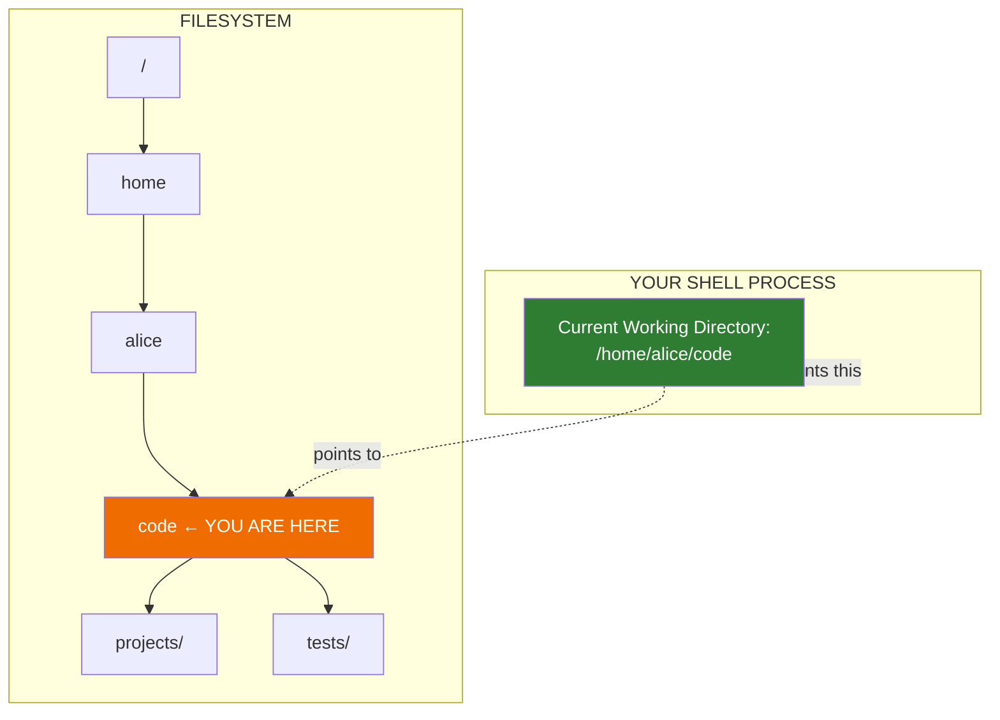
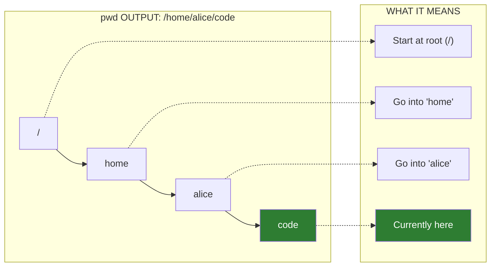

# Lesson 1.4: Navigation: Where Am I?

> **Duration**: 15 min | **Section**: A - What IS a Terminal?

## 🎯 The Problem (3-5 min)

You're in a terminal. You've been `cd`-ing around. Someone asks: "What directory are you in?"

You have no idea.

Unlike a file manager where you can SEE the folder path at the top, the terminal doesn't show your full location (unless you configure it to).

> **Scenario**: You're following a tutorial. It says "Make sure you're in the project directory before running this command." You run the command. It fails. Why? You're in the wrong directory. But how were you supposed to know?

## 🧪 Try It: The Naive Approach (5-10 min)

Without knowing better, you might:
- Look at the prompt (but it might only show `~` or the current folder name)
- Guess based on what you remember typing
- Keep running `ls` hoping to recognize the files

The prompt might show:

```bash
alice@server:~$           # Only shows ~
alice@server:code$        # Only shows "code"
$                         # Shows nothing!
```

None of these tell you the FULL path.

## 🔍 Under the Hood (10-15 min)

Every process in Linux has a "current working directory" (CWD). When you open a terminal, you start in your home directory. Every `cd` command changes your CWD.

The command `pwd` means **Print Working Directory**:

```bash
pwd
```

Output:
```
/home/alice/code/projects/myapp
```

NOW you know exactly where you are.



### What's in the Prompt

Your shell prompt is configurable. Here's what the parts mean:

```
alice@server:/var/log$
  │     │       │    │
  │     │       │    └── $ = regular user (# = root)
  │     │       └── Current directory (might be abbreviated)
  │     └── Hostname (server name)
  └── Username
```

**The catch**: By default, the prompt might only show the LAST part of the path:

```bash
# You're in /home/alice/code/projects/myapp/src/components
# But prompt shows:
alice@server:components$

# You THINK you're in some "components" folder
# But WHICH components folder??? You might have 5!
```

Always use `pwd` to be sure.

### Understanding `pwd` Output



## 💥 Where It Breaks (3-5 min)

Getting lost happens when:

1. **You forget where you started**:
   ```bash
   cd code
   cd projects
   cd myapp
   cd src
   # Now where am I??? 
   pwd  # Oh! /home/alice/code/projects/myapp/src
   ```

2. **Symlinks confuse you**:
   ```bash
   cd /var/www/html    # This might be a symlink
   pwd                  # Shows /var/www/html
   pwd -P               # Shows REAL path (following symlinks)
   ```

3. **Environment variables**:
   ```bash
   cd $PROJECT_DIR
   pwd                  # Where did that take me?
   ```

## ✅ The Fix (10-15 min)

### Method 1: Always Use `pwd`

Make it a habit. Before running any important command:

```bash
pwd           # Check where you are
ls            # Check what's here
THEN run your command
```

### Method 2: Configure Your Prompt

Add the full path to your prompt. Edit `~/.bashrc`:

```bash
# Add this line to ~/.bashrc
PS1='\u@\h:\w\$ '

# \u = username
# \h = hostname
# \w = FULL working directory (not abbreviated)
# \$ = $ for user, # for root
```

After saving, run:
```bash
source ~/.bashrc
```

Now your prompt shows the full path:
```
alice@server:/home/alice/code/projects/myapp$
```

### Method 3: Use Path Aliases

Create shortcuts to common locations:

```bash
# Add to ~/.bashrc
alias proj='cd ~/code/projects'
alias logs='cd /var/log'

# Now you can:
proj    # Jumps to projects
pwd     # /home/alice/code/projects
```

### Quick Reference Card

| Command | What It Does |
|:--------|:-------------|
| `pwd` | Print current directory (full path) |
| `pwd -P` | Print real path (resolve symlinks) |
| `echo $PWD` | Same as pwd (PWD is an environment variable) |
| `echo $OLDPWD` | Previous directory (where you came from) |

## 🎯 Practice

1. Check your current location:
   ```bash
   pwd
   ```

2. Navigate somewhere and confirm:
   ```bash
   cd /var/log
   pwd              # Should show /var/log
   ```

3. Use the home shortcut:
   ```bash
   cd ~
   pwd              # Should show /home/yourname
   ```

4. Check the difference with symlinks:
   ```bash
   # If you have any symlinks
   pwd              # Logical path
   pwd -P           # Physical (real) path
   ```

5. Check the PWD environment variable:
   ```bash
   echo $PWD        # Same as pwd
   echo $OLDPWD     # Where you were before
   ```

## 🔑 Key Takeaways

- `pwd` = Print Working Directory = "Where am I?"
- The prompt might abbreviate your location—don't trust it completely
- Always `pwd` before running important commands
- `pwd -P` shows the real path if symlinks are involved
- `$PWD` and `$OLDPWD` store current and previous directories

## ❓ Common Questions

| Question | Answer |
|----------|--------|
| Why does my prompt only show `~`? | That's short for your home directory. Run `pwd` to see the full path. |
| What's the difference between `pwd` and `echo $PWD`? | Usually identical. `$PWD` is a variable the shell updates. `pwd` is a command. |
| Can `pwd` ever be wrong? | Rarely. If a directory is moved/renamed while you're in it, `pwd` might show a stale path. |
| What does `~` mean exactly? | It expands to your home directory: `/home/yourname`. |

## 🔗 Further Reading

- [Bash Prompt Customization](https://www.gnu.org/software/bash/manual/html_node/Controlling-the-Prompt.html)
- [Understanding $PWD](https://www.gnu.org/software/bash/manual/html_node/Bash-Variables.html)
