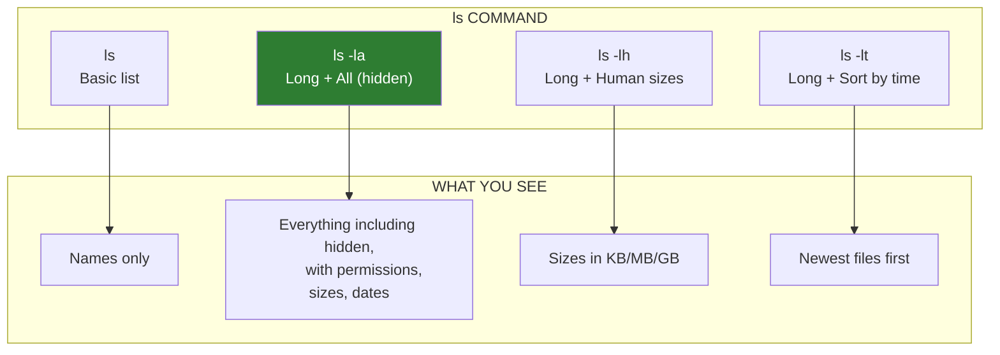
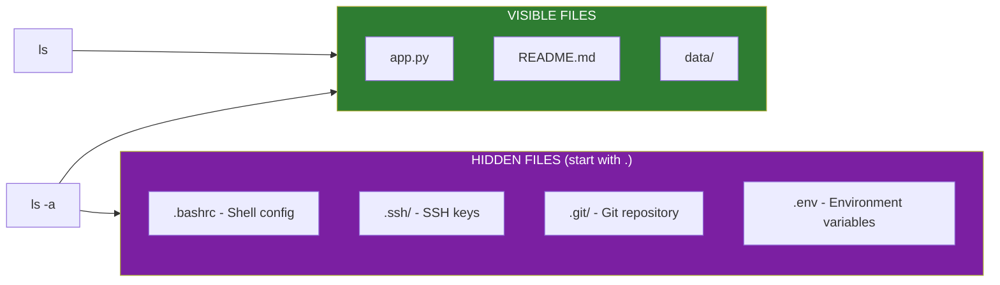

# Lesson 1.5: Navigation: What's Here?

> **Duration**: 15 min | **Section**: A - What IS a Terminal?

## 🎯 The Problem (3-5 min)

You know WHERE you are (`pwd`). But what's actually IN this directory?

In a graphical file manager, you just look—icons, file names, folders are all visible. In a terminal, the directory looks empty until you ask to see its contents.

> **Scenario**: You've SSH'd into a server. You're in `/var/www/html`. Is your website actually there? Are there config files? Is anything here at all? You can't see a thing until you explicitly ask.

## 🧪 Try It: The Naive Approach (5-10 min)

The most basic command:

```bash
ls
```

You might see:
```
app.py  config.json  data  logs  README.md  requirements.txt
```

Looks good. But wait...

```bash
ls -la
```

Now you see:
```
total 32
drwxr-xr-x  5 alice  staff   160 Dec 15 10:30 .
drwxr-xr-x  8 alice  staff   256 Dec 10 14:22 ..
-rw-r--r--  1 alice  staff   245 Dec 15 10:30 .env
drwxr-xr-x  2 alice  staff    64 Dec 12 09:15 .git
-rw-r--r--  1 alice  staff  1420 Dec 15 10:30 app.py
-rw-r--r--  1 alice  staff   387 Dec 14 16:45 config.json
drwxr-xr-x  3 alice  staff    96 Dec 13 11:20 data
drwxr-xr-x  2 alice  staff    64 Dec 15 10:30 logs
-rw-r--r--  1 alice  staff   892 Dec 11 08:30 README.md
-rw-r--r--  1 alice  staff   156 Dec 10 14:25 requirements.txt
```

Wait—there's a `.env` file and a `.git` folder that weren't shown before! **Hidden files exist.**

## 🔍 Under the Hood (10-15 min)

`ls` stands for "list." But it has many options that change what and how it shows.



### Decoding `ls -l` Output

```
-rw-r--r--  1 alice  staff  1420 Dec 15 10:30 app.py
│├──┬───┘   │   │      │     │        │         │
││  │       │   │      │     │        │         └── Filename
││  │       │   │      │     │        └── Modification date/time
││  │       │   │      │     └── Size in bytes
││  │       │   │      └── Group owner
││  │       │   └── User owner
││  │       └── Number of hard links
││  └── Permissions (9 characters: owner/group/others)
│└── File type (- = file, d = directory, l = link)
```

### The Key Flags

| Flag | Meaning | Example |
|:-----|:--------|:--------|
| `-l` | Long format (details) | `ls -l` |
| `-a` | All (including hidden) | `ls -a` |
| `-h` | Human-readable sizes | `ls -lh` (shows 1.4K instead of 1420) |
| `-t` | Sort by time (newest first) | `ls -lt` |
| `-r` | Reverse sort order | `ls -ltr` (oldest first) |
| `-S` | Sort by size (largest first) | `ls -lS` |
| `-R` | Recursive (show subdirectories) | `ls -R` |

**Pro tip**: Combine flags: `ls -lah` = long + all + human-readable

### Hidden Files: The Dot Convention

Files starting with `.` are hidden by default:



**Why hidden?** These are usually configuration files you don't need to see daily. But they're IMPORTANT—your shell config, SSH keys, git repos are all hidden.

### Special Entries: `.` and `..`

Every directory contains two special entries:

| Entry | Meaning |
|:------|:--------|
| `.` | Current directory (this folder) |
| `..` | Parent directory (one level up) |

That's why `cd ..` takes you up—you're changing to the `..` entry.

## 💥 Where It Breaks (3-5 min)

Common mistakes:

| Mistake | Problem | Fix |
|:--------|:--------|:----|
| `ls` missing hidden files | You don't see `.env`, `.git` | Use `ls -a` |
| Confused by sizes | "1420 bytes—is that big?" | Use `ls -lh` for human sizes |
| Can't find newest file | Which was modified last? | Use `ls -lt` |
| Long list scrolls off screen | Too many files | Pipe to less: `ls -la \| less` |

## ✅ The Fix (10-15 min)

### The "Default" ls You Should Use

Add this to your `~/.bashrc`:

```bash
alias ll='ls -lah'
```

Now typing `ll` gives you:
- Long format (details)
- All files (including hidden)
- Human-readable sizes

### Quick Reference

```bash
# Basic: What's here?
ls

# Full details (THE MOST USEFUL)
ls -lah

# Find big files
ls -lhS

# Find recent changes
ls -lt | head -10

# See a specific directory (without cd-ing there)
ls -la /var/log

# Count files
ls -1 | wc -l

# Only directories
ls -d */

# Only hidden files
ls -d .*
```

### Filtering Output

```bash
# Only .py files
ls *.py

# Files starting with "app"
ls app*

# All config files
ls *.json *.yaml *.yml

# Everything except .log files
ls -I "*.log"
```

## 🎯 Practice

1. See basic contents:
   ```bash
   cd ~
   ls
   ```

2. See EVERYTHING (including hidden):
   ```bash
   ls -la
   ```

3. Make sense of sizes:
   ```bash
   ls -lh
   ```

4. Find the largest files:
   ```bash
   ls -lhS | head -10
   ```

5. Find recently modified files:
   ```bash
   ls -lt | head -10
   ```

6. List another directory without going there:
   ```bash
   ls -la /var/log
   ```

7. Count files in current directory:
   ```bash
   ls -1 | wc -l
   ```

## 🔑 Key Takeaways

- `ls` = list directory contents
- Always use `ls -la` to see hidden files and details
- Use `ls -lh` for human-readable sizes
- Files starting with `.` are hidden (but important!)
- `.` = current directory, `..` = parent directory
- Combine flags: `ls -lah` = your new best friend

## ❓ Common Questions

| Question | Answer |
|----------|--------|
| Why are some files green/blue/red? | Color coding: directories = blue, executables = green, symlinks = cyan. Depends on your terminal settings. |
| What's the difference between `ls -la` and `ls -al`? | Nothing. Flag order doesn't matter. |
| How do I see contents of all subdirectories? | `ls -R` for recursive, or use `tree` (install it). |
| Why does `ls /` show different colors than `ls ~`? | Same colors, different file types. System directories vs your personal files. |

## 🔗 Further Reading

- [GNU ls Manual](https://www.gnu.org/software/coreutils/manual/html_node/ls-invocation.html)
- [LS Colors Explained](https://www.howtogeek.com/307701/how-to-customize-the-bash-ls-colors/)
