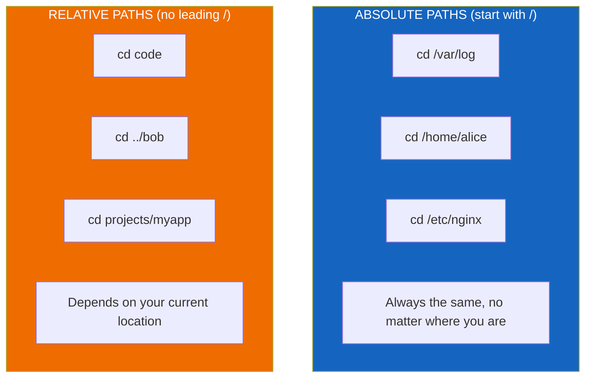
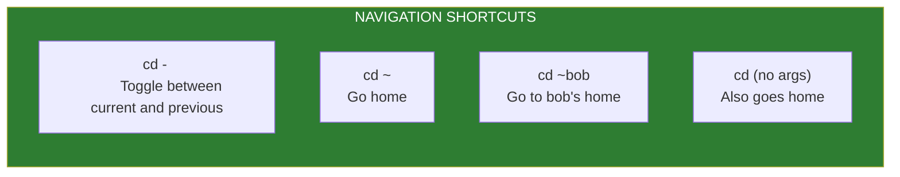
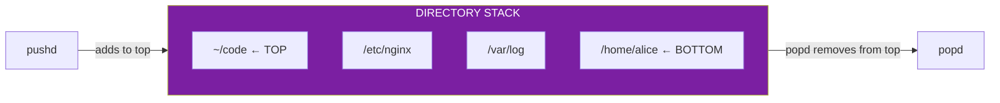

# Lesson 1.6: Navigation: Moving Around

> **Duration**: 20 min | **Section**: A - What IS a Terminal?

## 🎯 The Problem (3-5 min)

You know where you are (`pwd`). You know what's here (`ls`). Now you need to GO somewhere else.

In a GUI, you double-click folders. In a terminal, you type `cd` (change directory). Simple enough—but there are tricks that make you 10x faster.

> **Scenario**: You need to check a log file in `/var/log`, edit a config in `/etc/nginx`, then go back to your project in `~/code/myapp`. Without navigation shortcuts, you'll be typing full paths all day.

## 🧪 Try It: The Naive Approach (5-10 min)

The verbose way:

```bash
cd /home/alice/code/projects/myapp
cd /var/log
cd /etc/nginx
cd /home/alice/code/projects/myapp  # Back to project
```

Lots of typing. Easy to make typos. Slow.

## 🔍 Under the Hood (10-15 min)

`cd` changes your shell's "current working directory." Every path you type is relative to this location (unless it starts with `/`).



### Path Examples

If you're in `/home/alice`:

| Command | Where You Go |
|:--------|:-------------|
| `cd code` | `/home/alice/code` |
| `cd code/projects` | `/home/alice/code/projects` |
| `cd ..` | `/home` |
| `cd ../bob` | `/home/bob` |
| `cd /var/log` | `/var/log` (absolute) |
| `cd ~` | `/home/alice` |
| `cd` | `/home/alice` (same as `cd ~`) |

### The Power Shortcuts



**The magic of `cd -`**:

```bash
pwd                  # /home/alice/code
cd /var/log
pwd                  # /var/log
cd -                 # Back to /home/alice/code!
pwd                  # /home/alice/code
cd -                 # Back to /var/log!
pwd                  # /var/log
```

This toggles between your last two locations. Incredibly useful when you're working in two places.

### Tab Completion

The shell can complete paths for you. Type part of a name and press TAB:

```bash
cd /var/lo<TAB>     # Completes to /var/log
cd ~/cod<TAB>       # Completes to ~/code
cd ~/code/pro<TAB>  # Completes to ~/code/projects
```

If there are multiple matches, press TAB twice to see all options:

```bash
cd /var/l<TAB><TAB>
lib  local  lock  log    # Shows all matches starting with 'l'
```

### Pushd and Popd: Directory Stack

For power users—maintain a stack of directories:

```bash
pushd /var/log       # Go to /var/log, remember where you were
pushd /etc/nginx     # Go to /etc/nginx, remember /var/log
pushd ~/code         # Go to ~/code, remember /etc/nginx

# Now go back:
popd                 # Back to /etc/nginx
popd                 # Back to /var/log
popd                 # Back to original location
```



## 💥 Where It Breaks (3-5 min)

| Mistake | What Happens | Fix |
|:--------|:-------------|:----|
| `cd code` when code doesn't exist here | Error: No such directory | Check with `ls` first, or use absolute path |
| Spaces in directory names | `cd my folder` = error | Quote it: `cd "my folder"` or escape: `cd my\ folder` |
| Forgot where you came from | Lost your previous location | Use `cd -` or `pushd`/`popd` |
| Typo in path | Error: No such directory | Use tab completion! |

## ✅ The Fix (10-15 min)

### Speed Navigation Habits

1. **Always use tab completion**—never type full names
2. **Use `cd -` constantly**—toggle between two locations
3. **Use `~` for home**—shorter than `/home/yourname`
4. **Create aliases for common paths**

### Useful Aliases

Add to your `~/.bashrc`:

```bash
# Quick navigation
alias ..='cd ..'
alias ...='cd ../..'
alias ....='cd ../../..'

# Project shortcuts
alias proj='cd ~/code/projects'
alias logs='cd /var/log'
alias conf='cd /etc'

# After editing bashrc, reload it:
source ~/.bashrc
```

### CDPATH: Auto-Search Directories

Make `cd` automatically search in common locations:

```bash
# Add to ~/.bashrc
export CDPATH=".:~:~/code:~/code/projects"

# Now this works from ANYWHERE:
cd myapp    # Finds ~/code/projects/myapp automatically!
```

### Quick Reference

```bash
# Basic movement
cd path           # Go to path
cd ..             # Go up one level
cd ../..          # Go up two levels
cd ~              # Go home
cd                # Go home (shorthand)
cd -              # Toggle previous location

# Power moves
pushd path        # Go to path, save current location
popd              # Return to saved location
cd ~username      # Go to another user's home

# Tips
cd path<TAB>      # Auto-complete path
cd -<TAB>         # Show directory history (if configured)
```

## 🎯 Practice

1. Basic navigation:
   ```bash
   cd /var
   pwd              # /var
   cd log
   pwd              # /var/log
   cd ..
   pwd              # /var
   cd ~
   pwd              # /home/yourname
   ```

2. Use the toggle:
   ```bash
   cd /var/log
   cd ~/code        # Or any other location
   cd -             # Back to /var/log
   cd -             # Back to ~/code
   ```

3. Practice tab completion:
   ```bash
   cd /etc/sys<TAB>       # See what completes
   cd /usr/lo<TAB>        # See what completes
   ```

4. Navigate without changing directory:
   ```bash
   pwd
   (cd /tmp && ls)    # Runs in subshell, doesn't change your location
   pwd                # Still in original location!
   ```

5. Try pushd/popd:
   ```bash
   pushd /var/log
   pushd /etc
   pushd /tmp
   dirs              # Shows your stack
   popd
   popd
   popd
   pwd               # Back where you started
   ```

## 🔑 Key Takeaways

- `cd` = change directory
- Absolute paths start with `/`, relative paths don't
- Use `cd -` to toggle between two locations
- Use `~` as shortcut for home directory
- **Always use tab completion**—saves time and prevents typos
- `pushd`/`popd` for complex navigation workflows

## ❓ Common Questions

| Question | Answer |
|----------|--------|
| What if a directory has spaces? | Quote it: `cd "my folder"` or escape: `cd my\ folder` |
| Can I go to a directory and run a command, then come back? | Yes: `(cd /tmp && ls)` runs in a subshell |
| What's the difference between `cd ~` and `cd`? | None—both go to your home directory |
| How do I see my pushd stack? | Run `dirs` to see saved directories |

## 🔗 Further Reading

- [Bash cd Command](https://www.gnu.org/software/bash/manual/html_node/Bourne-Shell-Builtins.html)
- [Directory Stack Builtins](https://www.gnu.org/software/bash/manual/html_node/Directory-Stack-Builtins.html)
- [CDPATH Tutorial](https://www.linux.com/news/cdpath-forgotten-shell-variable/)
