# Lesson 1.7: Terminal Q&A

> **Duration**: 10 min | **Section**: A - What IS a Terminal?

## 🎯 The Problem (3-5 min)

You've learned the basics: `pwd`, `ls`, `cd`. But questions keep coming up:
- "I'm lost—how do I get home?"
- "What's that `.` thing?"
- "Why did my command show nothing?"
- "How do I stop something that's running?"

This lesson answers the most common beginner questions.

> **Scenario**: You've been practicing navigation. Things go wrong. You need quick answers to get unstuck.

## 🔍 Under the Hood (10-15 min)

### Q: "I'm lost! How do I get home?"

**Answer**: Any of these work:

```bash
cd          # Just cd with no arguments
cd ~        # Explicit home shortcut
cd $HOME    # Using the environment variable
```

**Mental reset**: When in doubt, go home and start over.

```mermaid
flowchart TD
    LOST["😰 I'm lost!"] --> HOME["cd ~"]
    HOME --> PWD["pwd"]
    PWD --> LS["ls"]
    LS --> FOUND["😌 I know where I am now"]
    
    style LOST fill:#C62828,color:#fff
    style FOUND fill:#2E7D32,color:#fff
```



---

### Q: "What's `.` and `..`?"

**Answer**:

| Symbol | Meaning | Example |
|:-------|:--------|:--------|
| `.` | Current directory | `./script.sh` = run script in current folder |
| `..` | Parent directory | `cd ..` = go up one level |

**Why `.` matters**:

```bash
# This WON'T work (command not found):
script.sh

# This WILL work:
./script.sh
```

The shell only looks in `$PATH` for commands. Your current directory isn't in `$PATH` (for security). So you use `./` to explicitly say "look here."

---

### Q: "I ran a command and nothing happened!"

**Answer**: In Unix, silence means success.

```bash
cp file1.txt file2.txt    # No output = it worked!
mv old.txt new.txt        # No output = it worked!
mkdir newfolder           # No output = it worked!
```

**The philosophy**: Only speak when there's a problem.

To verify something worked:
```bash
cp file1.txt file2.txt && echo "Success!"
```

Or just check:
```bash
cp file1.txt file2.txt
ls file2.txt    # If it shows, it worked
```

---

### Q: "How do I stop something that's running?"

**Answer**: Keyboard shortcuts:

| Shortcut | What It Does |
|:---------|:-------------|
| `Ctrl + C` | **Cancel/Kill** the running command |
| `Ctrl + D` | **End input** (logout if nothing running) |
| `Ctrl + Z` | **Suspend** (pause) the command |
| `Ctrl + L` | **Clear** the screen (same as `clear`) |

```mermaid
flowchart TD
    STUCK["Command is running...
    (maybe stuck?)"] --> CTRL_C["Ctrl + C"]
    CTRL_C --> STOPPED["Command cancelled ✓"]
    
    PAUSE["Want to pause, not kill?"] --> CTRL_Z["Ctrl + Z"]
    CTRL_Z --> BG["[1]+ Stopped
    (process suspended)"]
    BG --> FG["fg (to resume)"]
    
    style STUCK fill:#EF6C00,color:#fff
    style STOPPED fill:#2E7D32,color:#fff
```



---

### Q: "Why does `ls` show colors?"

**Answer**: Most terminals color-code file types:

| Color | Meaning |
|:------|:--------|
| Blue | Directory |
| Green | Executable file |
| Cyan | Symlink (shortcut) |
| Red | Broken symlink |
| White/Default | Regular file |

If you don't have colors:
```bash
alias ls='ls --color=auto'
```

---

### Q: "What's that `$` at the end of my prompt?"

**Answer**:

| Symbol | Meaning |
|:-------|:--------|
| `$` | You're a regular user |
| `#` | You're root (superuser/admin) |

**Warning**: If you see `#`, you have maximum power—and maximum ability to break things. Be careful!

---

### Q: "How do I see what I typed before?"

**Answer**: Use the arrow keys:

| Key | What It Does |
|:----|:-------------|
| `↑` (Up) | Previous command |
| `↓` (Down) | Next command in history |
| `Ctrl + R` | **Search** through history |

The history is stored in `~/.bash_history`. You can view it:
```bash
history           # Show all history
history | tail    # Last few commands
```

---

### Q: "How do I clear the screen?"

**Answer**:
```bash
clear
# OR
Ctrl + L
```

---

### Q: "Why can't I delete this file?"

**Answer**: Check permissions:
```bash
ls -l thefile.txt
```

If you see `-r--r--r--`, you don't have write permission. Options:
1. `chmod +w thefile.txt` (if you own it)
2. `sudo rm thefile.txt` (if you have admin access)
3. Ask the owner to change permissions

---

### Q: "How do I paste in the terminal?"

**Answer**: It depends on your terminal:

| Terminal | Paste |
|:---------|:------|
| macOS Terminal | `Cmd + V` |
| Linux GNOME | `Ctrl + Shift + V` |
| Windows Terminal | `Ctrl + V` |
| Most terminals | Right-click |

**Note**: `Ctrl + V` alone often doesn't work because it's reserved for "verbatim insert" in terminals.

---

### Q: "What's the difference between `rm` and `mv`?"

**Answer**:

| Command | What It Does |
|:--------|:-------------|
| `rm file` | **Delete** the file (gone forever!) |
| `mv file trash/` | **Move** file to trash folder (recoverable) |

**There is no recycle bin**. `rm` = gone. Create a "trash" workflow if you want recovery:
```bash
mkdir -p ~/.trash
alias rm='mv -t ~/.trash'    # NOT recommended—breaks scripts
```

Better: Use `trash-cli` package if available.

## 🎯 Practice

1. Get unstuck:
   ```bash
   cd /some/deep/nested/path/that/doesnt/exist    # Error!
   cd ~           # Reset to home
   pwd            # Confirm you're home
   ```

2. Use keyboard shortcuts:
   ```bash
   sleep 60       # Starts a 60-second sleep
   # Now press Ctrl + C to cancel it
   ```

3. Check history:
   ```bash
   history | tail -20    # Last 20 commands
   ```

4. Try Ctrl + R:
   ```bash
   # Press Ctrl + R
   # Start typing part of a previous command
   # Press Enter to run it, or Ctrl + C to cancel
   ```

5. Understand `.`:
   ```bash
   ls .           # Same as ls (current directory)
   ls ..          # Parent directory
   ls ../..       # Two levels up
   ```

## � Common Pitfalls

| Pitfall | What Happens | Fix |
|---------|--------------|-----|
| Typing `cd` with a typo | "No such file or directory" | Check spelling with `ls` first |
| Forgetting `-r` with `cp` on directories | "omitting directory" error | Use `cp -r source/ dest/` |
| Using `rm` instead of `mv` | File gone forever | Create a trash alias: `alias rm='mv -t ~/.trash'` |
| `Ctrl+S` to "save" | Terminal freezes! | Press `Ctrl+Q` to unfreeze |
| Pasting multiline commands | Runs immediately | Be careful with copy-paste from web |

## �🔑 Key Takeaways

- `cd` or `cd ~` = go home (get unstuck)
- `.` = here, `..` = up one level
- Silence = success in Unix
- `Ctrl + C` = cancel/kill running command
- `Ctrl + R` = search command history
- Check `ls -l` for permissions when access denied

## ❓ Quick Reference

| Problem | Solution |
|:--------|:---------|
| Lost | `cd ~` then `pwd` |
| Command stuck | `Ctrl + C` |
| Need previous command | `↑` arrow |
| Screen is messy | `Ctrl + L` or `clear` |
| Permission denied | `ls -l file`, check permissions |
| Paste not working | Try `Ctrl + Shift + V` or right-click |

## 🔗 Further Reading

- [Bash Keyboard Shortcuts](https://www.howtogeek.com/181/keyboard-shortcuts-for-bash-command-shell-for-ubuntu-debian-suse-redhat-linux-etc/)
- [Command History in Bash](https://www.gnu.org/software/bash/manual/html_node/Bash-History-Builtins.html)
