# Lesson 1.8: The File Problem

> **Duration**: 5 min | **Section**: B - File Operations

## 🎯 The Problem (3-5 min)

You're on a server. You need to:
- Create a new folder for your project
- Create configuration files
- Copy an existing config as a template
- Delete old log files that are eating disk space
- Rename files to follow a naming convention

In a GUI, you right-click and select "New Folder," "Copy," "Paste," "Delete."

In a terminal, you type commands. **But which commands?**

> **Scenario**: Your boss says "Set up a new project directory structure: `src/`, `tests/`, `docs/`, and a `README.md`. Then copy the config template from the old project. Delete the .log files from last month. Oh, and rename `app.py` to `main.py`."
>
> You have 5 minutes. All you have is a terminal.

## 🔍 Under the Hood (10-15 min)

Here's the map of file operation commands:

```mermaid
flowchart TD
    subgraph CREATE["📁 CREATE"]
        TOUCH["touch file
        Create empty file"]
        MKDIR["mkdir folder
        Create folder"]
        MKDIRP["mkdir -p a/b/c
        Create nested folders"]
    end
    
    subgraph DESTROY["🗑️ DESTROY"]
        RM["rm file
        Delete file FOREVER"]
        RMRF["rm -rf folder
        Delete folder + contents"]
        RMDIR["rmdir folder
        Delete EMPTY folder only"]
    end
    
    subgraph MOVE["📦 MOVE/COPY"]
        CP["cp src dest
        Copy file"]
        MV["mv src dest
        Move OR rename"]
        CPR["cp -r src dest
        Copy folder"]
    end
    
    subgraph VIEW["👀 VIEW"]
        CAT["cat file
        Print contents"]
        LESS["less file
        Paginated view"]
        HEAD["head/tail
        First/last lines"]
    end
    
    style CREATE fill:#2E7D32,color:#fff
    style DESTROY fill:#C62828,color:#fff
    style MOVE fill:#1565C0,color:#fff
    style VIEW fill:#7B1FA2,color:#fff
```



### The Command Vocabulary

| Task | Command | Example |
|:-----|:--------|:--------|
| Create empty file | `touch` | `touch README.md` |
| Create folder | `mkdir` | `mkdir src` |
| Create nested folders | `mkdir -p` | `mkdir -p src/utils/helpers` |
| Delete file | `rm` | `rm oldfile.txt` |
| Delete folder (empty) | `rmdir` | `rmdir empty_folder` |
| Delete folder (with stuff) | `rm -r` | `rm -r old_project` |
| Copy file | `cp` | `cp original.txt copy.txt` |
| Copy folder | `cp -r` | `cp -r src src_backup` |
| Move/rename | `mv` | `mv old.txt new.txt` |
| View file | `cat` | `cat config.json` |
| View long file | `less` | `less big_log.txt` |
| View start | `head` | `head -20 file.txt` |
| View end | `tail` | `tail -50 file.txt` |

## ⚠️ The Golden Rule

```mermaid
flowchart LR
    RM["rm = DELETE FOREVER"]
    
    RM --> GONE["💀 NO RECYCLE BIN
    NO UNDO
    NO RECOVERY*"]
    
    style RM fill:#C62828,color:#fff
    style GONE fill:#C62828,color:#fff
```



*\*Unless you have backups or specialized recovery tools*

**ALWAYS double-check before `rm`**:
```bash
# FIRST: See what you're about to delete
ls *.log

# THEN: If it looks right, delete
rm *.log
```

## 🎯 What's Coming

The next lessons will cover each category in detail:
- **1.9**: Creating files and folders
- **1.10**: Deleting things (carefully!)
- **1.11**: Moving and copying
- **1.12**: Viewing file contents
- **1.13**: Editing files
- **1.14**: Q&A

By the end, you'll handle that 5-minute task in 30 seconds:

```bash
# Create project structure
mkdir -p src tests docs

# Create README
touch README.md

# Copy template
cp ../old_project/config.template.json config.json

# Delete old logs
rm logs/*.log

# Rename file
mv app.py main.py

# Done!
```

## 🔑 Key Takeaways

- File operations in terminal = a handful of commands
- Create: `touch` (files), `mkdir` (folders)
- Copy: `cp`, Move/Rename: `mv`
- Delete: `rm` (**CAREFUL—no undo!**)
- View: `cat`, `less`, `head`, `tail`

## 🔗 Further Reading

- [GNU Coreutils](https://www.gnu.org/software/coreutils/manual/coreutils.html) - Official documentation for these commands
