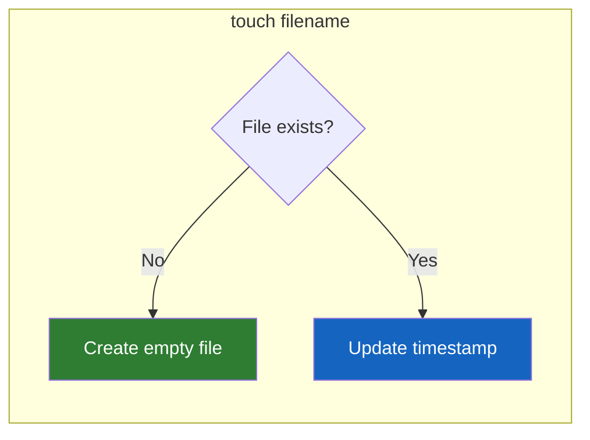
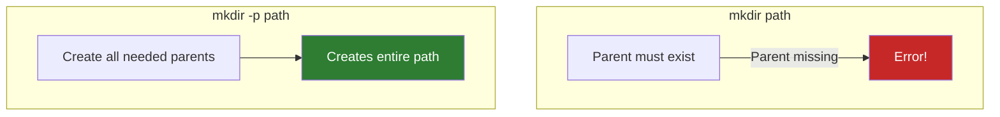

# Lesson 1.9: Creating Things

> **Duration**: 20 min | **Section**: B - File Operations

## 🎯 The Problem (3-5 min)

You need to create:
- A new Python file to start coding
- A folder structure for your project
- Multiple nested directories at once

How do you create stuff from the command line?

> **Scenario**: You're starting a new Flask project. You need this structure:
> ```
> myproject/
> ├── src/
> │   ├── routes/
> │   └── models/
> ├── tests/
> ├── docs/
> ├── app.py
> ├── config.py
> └── requirements.txt
> ```
> Do it without a GUI.

## 🧪 Try It: The Naive Approach (5-10 min)

You might try:

```bash
mkdir myproject
mkdir myproject/src
mkdir myproject/src/routes
mkdir myproject/src/models
mkdir myproject/tests
mkdir myproject/docs
```

That's 6 commands for 6 folders. Tedious!

And for files? Maybe you try:
```bash
touch app.py        # Works!
create config.py    # Error: command not found
new requirements.txt # Error: command not found
```

Unlike folders, files are created with `touch` (the command name isn't obvious).

## 🔍 Under the Hood (10-15 min)

### Creating Files: `touch`

`touch` originally means "update the timestamp of a file." But if the file doesn't exist, it creates an empty one:

```bash
touch filename.txt    # Creates empty file

# Verify:
ls -l filename.txt    # Shows 0 bytes
```



**Create multiple files at once**:
```bash
touch file1.txt file2.txt file3.txt

# Or with brace expansion:
touch {app,config,utils}.py
# Creates: app.py, config.py, utils.py
```

### Creating Directories: `mkdir`

```bash
mkdir foldername     # Create a folder

# Verify:
ls -d foldername     # Shows the folder
```

**The Problem**: What if you want nested folders?

```bash
mkdir src/routes/api    # Error: No such file or directory
```

Why? `src` and `src/routes` don't exist yet. `mkdir` won't create parents by default.

### The Fix: `mkdir -p` (Create Parents)

```bash
mkdir -p src/routes/api
# Creates:
# src/
# src/routes/
# src/routes/api/
```

The `-p` flag means "create parent directories as needed."



**Create multiple directories**:
```bash
mkdir -p src tests docs

# With nested structure:
mkdir -p src/{routes,models,utils} tests/{unit,integration}
# Creates:
# src/routes, src/models, src/utils
# tests/unit, tests/integration
```

### Brace Expansion: The Power Move

Brace expansion `{a,b,c}` is a shell feature, not a command:

```bash
echo {1,2,3}           # Output: 1 2 3
echo file{A,B,C}.txt   # Output: fileA.txt fileB.txt fileC.txt

# Use with mkdir:
mkdir -p project/{src,tests,docs}

# Use with touch:
touch project/{README.md,LICENSE,.gitignore}
```

## 💥 Where It Breaks (3-5 min)

| Mistake | What Happens | Fix |
|:--------|:-------------|:----|
| `mkdir existing/new` | Error if `existing` doesn't exist | Use `mkdir -p` |
| `touch /root/file` | Permission denied | You can't write to root's home |
| Spaces in names | `mkdir my folder` creates TWO folders | Quote: `mkdir "my folder"` |
| `touch` on existing file | Updates timestamp (doesn't erase!) | This is fine |

**Spaces in names**:
```bash
# WRONG:
mkdir my project        # Creates "my" AND "project"

# RIGHT:
mkdir "my project"      # Creates one folder with space
mkdir my\ project       # Same, using escape

# BEST PRACTICE:
mkdir my-project        # Use dashes, no spaces
mkdir my_project        # Or underscores
```

## ✅ The Fix (10-15 min)

### The Complete Project Setup (One Command!)

Remember that Flask project structure? Here's the one-liner:

```bash
# Create all folders
mkdir -p myproject/{src/{routes,models},tests,docs}

# Create all files
touch myproject/{app.py,config.py,requirements.txt,README.md,.gitignore}
touch myproject/src/__init__.py
touch myproject/src/{routes,models}/__init__.py

# Verify
tree myproject
```

Output:
```
myproject/
├── app.py
├── config.py
├── docs/
├── .gitignore
├── README.md
├── requirements.txt
├── src/
│   ├── __init__.py
│   ├── models/
│   │   └── __init__.py
│   └── routes/
│       └── __init__.py
└── tests/
```

### Quick Reference

```bash
# Files
touch file.txt              # Create empty file
touch a.txt b.txt c.txt     # Create multiple
touch {a,b,c}.txt           # Same with braces
touch file.{py,js,css}      # Creates file.py, file.js, file.css

# Directories
mkdir folder                # Create folder
mkdir -p a/b/c              # Create nested (with parents)
mkdir {src,tests,docs}      # Create multiple
mkdir -p proj/{src,tests}   # Nested + multiple
```

## 🎯 Practice

1. Create a single file:
   ```bash
   touch hello.txt
   ls -l hello.txt
   ```

2. Create multiple files:
   ```bash
   touch {one,two,three}.txt
   ls *.txt
   ```

3. Create a directory:
   ```bash
   mkdir myfolder
   ls -d myfolder
   ```

4. Create nested directories:
   ```bash
   mkdir -p deep/nested/folder/structure
   tree deep   # or: ls -R deep
   ```

5. Create a project structure:
   ```bash
   mkdir -p demo/{src,tests,docs}
   touch demo/{README.md,setup.py}
   touch demo/src/__init__.py
   tree demo
   ```

6. Clean up:
   ```bash
   rm -r demo deep hello.txt one.txt two.txt three.txt myfolder
   ```

## 🔑 Key Takeaways

- `touch` creates empty files (or updates timestamps)
- `mkdir` creates directories
- `mkdir -p` creates parent directories as needed
- Brace expansion `{a,b,c}` multiplies commands
- Avoid spaces in names—use dashes or underscores
- Combine commands for fast project setup

## ❓ Common Questions

| Question | Answer |
|----------|--------|
| Does `touch` erase existing files? | No! It only updates the timestamp. |
| Why `touch` for creating files? | Historical. "Touch" meant update timestamp; creating was a side effect. |
| Can I create a file with content? | Yes: `echo "content" > file.txt` or use an editor. |
| What's `__init__.py`? | Python marker for packages. Covered in Python module. |

## 🔗 Further Reading

- [mkdir Manual](https://www.gnu.org/software/coreutils/manual/html_node/mkdir-invocation.html)
- [touch Manual](https://www.gnu.org/software/coreutils/manual/html_node/touch-invocation.html)
- [Bash Brace Expansion](https://www.gnu.org/software/bash/manual/html_node/Brace-Expansion.html)
