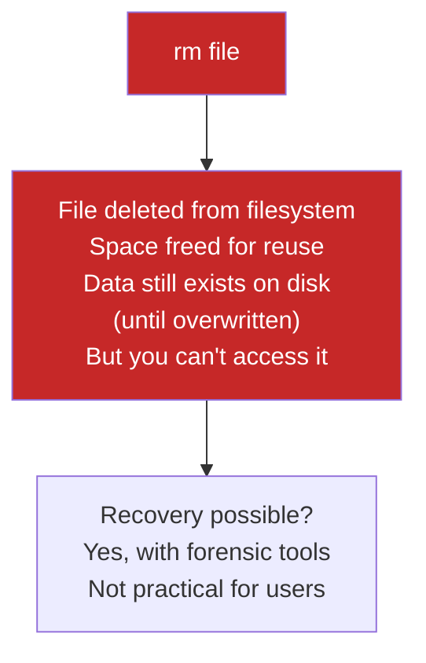

# Lesson 1.10: Destroying Things (Carefully!)

> **Duration**: 20 min | **Section**: B - File Operations

## 🎯 The Problem (3-5 min)

You need to delete files. Old logs. Failed experiments. Temporary junk.

In a GUI, you drag to trash. Things sit there until you empty the trash. You can recover mistakes.

In a terminal, `rm` deletes **instantly and permanently**. There is no trash. There is no undo.

> **Scenario**: You're cleaning up a server. There are 500 old log files eating disk space. You type `rm *` in what you THINK is the log directory. But you're actually in `/home/alice`. You just deleted everything in your home folder. Your photos. Your code. Your SSH keys. Gone.

## 🧪 Try It: The Naive Approach (5-10 min)

The dangerous way:

```bash
cd /var/log
rm *            # Delete everything here!
```

What if you weren't in `/var/log`? What if you were in your home directory? **Disaster.**

Even worse:
```bash
rm -rf /       # DELETE THE ENTIRE SYSTEM
```

This is why Unix has a reputation for being unforgiving.

## 🔍 Under the Hood (10-15 min)

### The `rm` Command

```bash
rm filename        # Delete a file
rm file1 file2     # Delete multiple files
rm *.log           # Delete all .log files
```



### The Flags

| Flag | Meaning | Example |
|:-----|:--------|:--------|
| `-f` | Force (no confirmation, no errors for missing files) | `rm -f file` |
| `-r` | Recursive (delete folders and contents) | `rm -r folder` |
| `-i` | Interactive (ask before each delete) | `rm -i file` |
| `-v` | Verbose (show what's being deleted) | `rm -v file` |

### The Nuclear Option: `rm -rf`

```bash
rm -rf folder
```

- `-r` = Recursive (delete folder and EVERYTHING inside)
- `-f` = Force (don't ask, don't stop for errors)

**This deletes instantly with no confirmation.**


### What Happens to Deleted Data?

When you `rm` a file:
1. The **directory entry** is removed (the "filename")
2. The **inode** (file metadata) is marked free
3. The **data blocks** are marked available for reuse
4. The actual data stays on disk **until overwritten**

That's why forensic tools can sometimes recover files. But for practical purposes, consider it gone.

## 💥 Where It Breaks (3-5 min)

### Horror Stories

```bash
# Meant to type:
rm -rf ./tmp/

# Actually typed:
rm -rf / tmp/      # SPACE before 'tmp' = delete root AND tmp!
```

```bash
# In the wrong directory:
cd /var/log        # Thought you were here
rm -rf *           # But you were in /home/alice
```

```bash
# Variable expansion gone wrong:
rm -rf $FOLDER     # If FOLDER is empty, this becomes:
rm -rf             # Which is invalid, but some shells...
```

### Protective Measures

Modern systems have some safeguards:
```bash
rm -rf /          # Many systems block this
rm: it is dangerous to operate recursively on '/'
rm: use --no-preserve-root to override this failsafe
```

But `rm -rf /*` or `rm -rf ~/*` are NOT protected!

## ✅ The Fix (10-15 min)

### Rule 1: Always Check First

```bash
# BEFORE deleting:
pwd                 # Where am I?
ls *.log            # What matches this pattern?

# THEN delete:
rm *.log
```

### Rule 2: Use `-i` for Important Deletions

```bash
rm -i important_file.txt
# rm: remove regular file 'important_file.txt'? y
```

### Rule 3: Use `--` to End Flags

If a filename starts with `-`:
```bash
# This file: -weird-name.txt
rm -weird-name.txt      # Error! -w looks like a flag

# Fix:
rm -- -weird-name.txt   # -- means "end of flags"
rm ./-weird-name.txt    # Or use a path
```

### Rule 4: Safe Alternatives

```bash
# Instead of rm, move to a "trash" folder:
mkdir -p ~/.trash
mv unwanted_file ~/.trash/

# Or use trash-cli (if installed):
trash-put file.txt
trash-list
trash-restore
trash-empty
```

### Rule 5: For Dangerous Operations, Use `echo` First

```bash
# See what the pattern matches:
echo rm -rf /var/log/*.log

# Output: rm -rf /var/log/access.log /var/log/error.log ...
# Looks right? Now run it for real:
rm -rf /var/log/*.log
```

### Quick Reference: Safe Deletion Workflow

```bash
# 1. Check location
pwd

# 2. Preview what you're deleting
ls -la pattern*

# 3. Interactive delete (small number of files)
rm -i pattern*

# OR: Delete with verbose output
rm -v pattern*

# 4. For folders
ls -d folder/        # Verify it exists
rm -ri folder/       # Interactive + recursive
# OR
rm -rv folder/       # Verbose (see what's deleted)
```

## 🎯 Practice

1. Create test files:
   ```bash
   mkdir -p ~/test_delete
   cd ~/test_delete
   touch file{1,2,3}.txt old{1,2}.log
   ls
   ```

2. Delete with confirmation:
   ```bash
   rm -i file1.txt
   # Answer y or n
   ```

3. Delete with verbose:
   ```bash
   rm -v file2.txt
   # Shows: removed 'file2.txt'
   ```

4. Delete by pattern:
   ```bash
   # First preview:
   ls *.log
   # Then delete:
   rm *.log
   ```

5. Delete folder:
   ```bash
   mkdir subfolder
   touch subfolder/test.txt
   rm -rv subfolder
   # Shows each file being removed
   ```

6. Clean up:
   ```bash
   cd ~
   rm -r test_delete
   ```

## 🔑 Key Takeaways

- `rm` = delete **forever** (no trash, no undo)
- `rm -r` = delete folder and contents
- `rm -f` = force (no prompts, no errors)
- `rm -rf` = the "nuclear option" (**extremely dangerous**)
- **Always** `pwd` and `ls` before deleting
- Consider `rm -i` or `rm -v` for safety
- When in doubt, `mv` to a trash folder instead

## ❓ Common Questions

| Question | Answer |
|----------|--------|
| Can I recover deleted files? | With forensic tools, sometimes. Practically, no. |
| Why is there no trash? | Unix philosophy: do what I say, don't second-guess. |
| Is `rmdir` safer than `rm -r`? | Yes—`rmdir` only deletes EMPTY directories. |
| What if I accidentally delete something important? | Restore from backup. You DO have backups, right? |

## 🔗 Further Reading

- [rm Manual](https://www.gnu.org/software/coreutils/manual/html_node/rm-invocation.html)
- [trash-cli](https://github.com/andreafrancia/trash-cli) - Safe deletion tool
- [Safe rm alternatives](https://github.com/alanzchen/rm-protection)
