# Lesson 1.11: Moving & Copying Under the Hood

> **Duration**: 20 min | **Section**: B - File Operations

## 🎯 The Problem (3-5 min)

You need to:
- Copy a config file to use as a template
- Move files to a different folder
- Rename a file
- Back up a directory before making changes

What's the difference between copying and moving? Why is moving sometimes instant and sometimes slow?

> **Scenario**: You have a `config.example.json` file. You want to create `config.json` from it. Do you copy it? Move it? What's the difference?

## 🧪 Try It: The Naive Approach (5-10 min)

Intuitive guesses:
- "Copy" = make a duplicate
- "Move" = change location

Let's test:

```bash
# Create a test file
echo "test content" > original.txt

# Copy it
cp original.txt copy.txt
ls          # Both files exist!

# Move/rename it
mv copy.txt renamed.txt
ls          # copy.txt is gone, renamed.txt exists
```

Basic behavior is straightforward. But there's more going on under the hood.

## 🔍 Under the Hood (10-15 min)

### Copying: `cp`

`cp` creates a **new file** with the same content:


**What happens**:
1. New inode created
2. Data blocks allocated
3. Content copied byte-by-byte
4. **Time**: Proportional to file size

```bash
# Copy file
cp source.txt dest.txt

# Copy and preserve metadata (timestamps, permissions)
cp -p source.txt dest.txt

# Copy directory (requires -r)
cp -r source_folder/ dest_folder/
```

### Moving: `mv`

`mv` behaves differently depending on whether you're staying on the same filesystem:

```mermaid
flowchart TD
    MV["mv source dest"] --> CHECK{"Same filesystem?"}
    
    CHECK -->|Yes| FAST["Just update directory entry
    (rename pointer)
    ⚡ INSTANT"]
    
    CHECK -->|No| SLOW["Copy all data
    Then delete source
    🐌 Slow (like cp + rm)"]
    
    style FAST fill:#2E7D32,color:#fff
    style SLOW fill:#EF6C00,color:#fff
```



**Same filesystem (instant)**:
```bash
mv file.txt newname.txt      # Rename: instant
mv file.txt ./subfolder/     # Move within same disk: instant
```

**Different filesystem (slow)**:
```bash
mv /home/file.txt /mnt/usb/  # Different disk: copies then deletes
```

### The Truth About Renaming

There is no `rename` command for single files. `mv` IS rename:

```bash
mv oldname.txt newname.txt    # This IS renaming!
```

### Overwriting Behavior

By default, `cp` and `mv` overwrite without asking:

```bash
cp source.txt dest.txt        # If dest.txt exists, it's OVERWRITTEN
mv source.txt dest.txt        # Same behavior
```

**Protect yourself**:
```bash
cp -i source.txt dest.txt     # -i = interactive (ask first)
mv -i source.txt dest.txt     # Same for mv
cp -n source.txt dest.txt     # -n = no clobber (never overwrite)
```

### Copying Directories

```bash
cp folder newfolder           # ERROR! Can't copy directory without -r

cp -r folder newfolder        # -r = recursive (copy folder + contents)
```


## 💥 Where It Breaks (3-5 min)

| Mistake | What Happens | Fix |
|:--------|:-------------|:----|
| `cp folder newfolder` | Error (directories need -r) | `cp -r folder newfolder` |
| `cp file existing_file` | Overwrites without warning | Use `cp -i` |
| `mv file dir/` when dir doesn't exist | Creates FILE named "dir" | Check with `ls -d dir` first |
| Moving across filesystems | Slow + might fail mid-copy | Use `rsync` for large transfers |

### The Trailing Slash Trap

```bash
cp -r source dest      # If dest exists: creates dest/source
cp -r source/ dest     # Copies CONTENTS of source into dest
```

Be explicit:
```bash
cp -r source/ dest/    # Clear: copy contents of source into dest
```

## ✅ The Fix (10-15 min)

### The Safe Workflow

```bash
# 1. Check source exists
ls -la source.txt

# 2. Check destination (does it exist? will you overwrite?)
ls -la dest.txt 2>/dev/null || echo "dest doesn't exist (good)"

# 3. Copy interactively
cp -i source.txt dest.txt

# 4. Verify
ls -la dest.txt
diff source.txt dest.txt    # Should show no differences
```

### Quick Reference

```bash
# Files
cp source dest              # Copy file
cp -i source dest           # Copy with overwrite prompt
cp -p source dest           # Copy preserving metadata
mv source dest              # Move OR rename
mv -i source dest           # Move with overwrite prompt

# Directories
cp -r source/ dest/         # Copy directory recursively
cp -rp source/ dest/        # Copy with preserved metadata
mv source/ dest/            # Move directory (fast if same filesystem)

# Multiple files into directory
cp file1 file2 file3 dir/   # Copy all into dir
mv file1 file2 file3 dir/   # Move all into dir

# Backup before overwriting
cp -b source dest           # Creates dest~ backup
cp --backup=numbered source dest  # Creates dest.~1~, dest.~2~, etc.
```

### Pro Tip: Use `rsync` for Large Copies

For big directories or unreliable transfers:

```bash
rsync -av source/ dest/     # -a = archive mode, -v = verbose
rsync -avP source/ dest/    # -P = progress + partial (resume interrupted)
```

`rsync` advantages:
- Shows progress
- Can resume interrupted transfers
- Only copies changed files (great for backups)

## 🎯 Practice

1. Copy a file:
   ```bash
   echo "original" > test.txt
   cp test.txt copy.txt
   cat copy.txt
   ```

2. Rename a file:
   ```bash
   mv copy.txt renamed.txt
   ls          # copy.txt gone, renamed.txt exists
   ```

3. Try to overwrite (interactive):
   ```bash
   echo "different" > another.txt
   cp -i another.txt test.txt
   # Answer y or n
   ```

4. Copy a directory:
   ```bash
   mkdir -p mydir/subdir
   touch mydir/file.txt mydir/subdir/nested.txt
   cp -r mydir mydir_backup
   tree mydir_backup
   ```

5. Move directory:
   ```bash
   mv mydir_backup mydir_moved
   ls -d mydir_moved
   ```

6. Clean up:
   ```bash
   rm -r test.txt renamed.txt another.txt mydir mydir_moved
   ```

## 🔑 Key Takeaways

- `cp` = copy (creates new file with same content)
- `mv` = move OR rename (same command!)
- `mv` on same filesystem = instant (just updates pointer)
- `mv` across filesystems = slow (copies then deletes)
- `-r` required for directories with `cp`
- Use `-i` to prompt before overwriting
- `rsync` is better for large/important transfers

## ❓ Common Questions

| Question | Answer |
|----------|--------|
| Is there a `rename` command? | Yes, but it's for batch renaming with patterns. For single files, use `mv`. |
| Why is `mv` sometimes instant and sometimes slow? | Instant on same filesystem (updates directory entry), slow across filesystems (must copy data). |
| How do I copy only newer files? | Use `cp -u` (update) or better, `rsync`. |
| What's the difference between `cp -r` and `rsync`? | rsync is smarter: shows progress, resumes, skips unchanged files. |

## 🔗 Further Reading

- [cp Manual](https://www.gnu.org/software/coreutils/manual/html_node/cp-invocation.html)
- [mv Manual](https://www.gnu.org/software/coreutils/manual/html_node/mv-invocation.html)
- [rsync Manual](https://linux.die.net/man/1/rsync)
