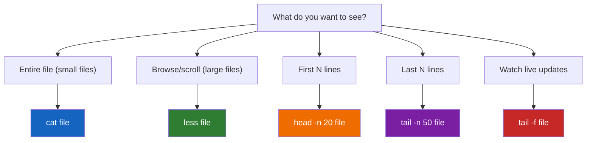
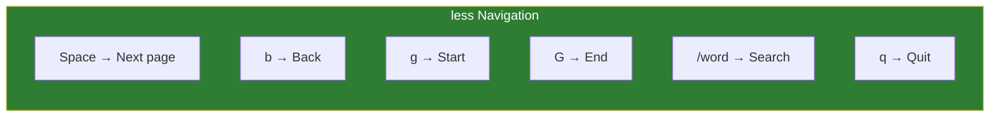
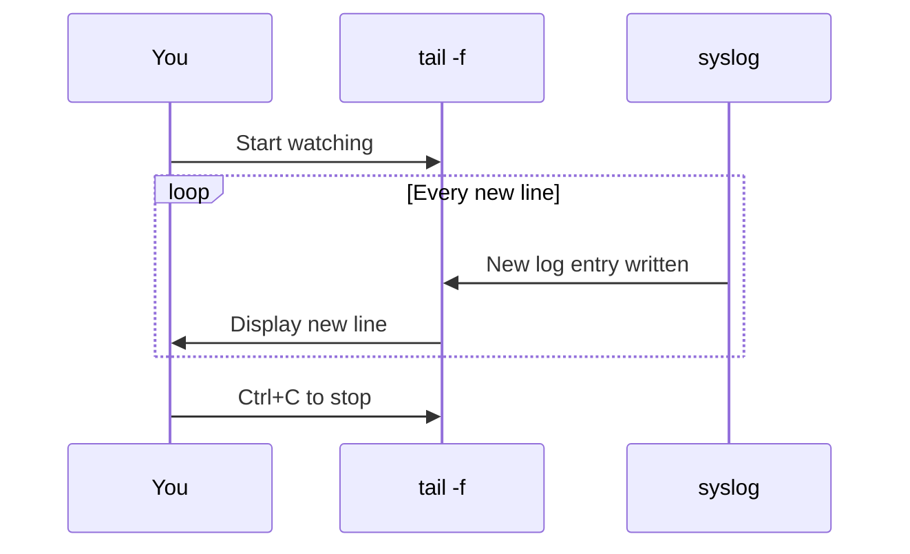

# Lesson 1.12: Viewing Files

> **Duration**: 20 min | **Section**: B - File Operations

## 🎯 The Problem (3-5 min)

You need to look at a file's contents. Maybe:
- Check a config file
- Read log entries
- See what's in a script before running it

You can't just double-click. You need commands.

> **Scenario**: The server is acting strange. The log file at `/var/log/syslog` is 2GB. You need to see the last 50 lines to find recent errors. How do you view JUST those lines without loading 2GB into memory?

## 🧪 Try It: The Naive Approach (5-10 min)

```bash
cat /var/log/syslog
```

**Bad idea!** 2GB of text floods your terminal. Your screen fills with scrolling text for minutes. You can't even see the recent entries—they scrolled by too fast.

`Ctrl + C` to stop the madness.

## 🔍 Under the Hood (10-15 min)

Different tools for different situations:



### `cat`: Concatenate and Print

`cat` dumps the entire file to the terminal:

```bash
cat file.txt           # Print entire file
cat file1 file2        # Print both files (concatenate)
cat -n file.txt        # With line numbers
```

**Best for**: Small files (< 100 lines)
**Bad for**: Anything large

### `less`: The Pager

`less` lets you scroll through files:

```bash
less file.txt
```

**Navigation**:
| Key | Action |
|:----|:-------|
| `Space` | Next page |
| `b` | Previous page |
| `↓` / `j` | Down one line |
| `↑` / `k` | Up one line |
| `g` | Go to beginning |
| `G` | Go to end |
| `/pattern` | Search forward |
| `?pattern` | Search backward |
| `n` | Next search result |
| `N` | Previous search result |
| `q` | Quit |



**Why "less"?** There was a command called `more` that only went forward. `less` does more than `more`. (Unix humor.)

### `head`: First N Lines

```bash
head file.txt          # First 10 lines (default)
head -n 20 file.txt    # First 20 lines
head -n 5 *.txt        # First 5 lines of each .txt file
```

**Use case**: Preview a file, check CSV headers

### `tail`: Last N Lines

```bash
tail file.txt          # Last 10 lines (default)
tail -n 50 file.txt    # Last 50 lines
tail -f file.txt       # FOLLOW: watch for new lines in real-time!
```

**The magic of `tail -f`**:

```bash
tail -f /var/log/syslog
```

This watches the file. When new lines are appended, they appear immediately. **Perfect for watching logs in real-time.**

Press `Ctrl + C` to stop following.



### Combining Tools with Pipes

```bash
# First 20 lines of a file
head -n 20 file.txt

# Last 50 lines
tail -n 50 file.txt

# Lines 50-70 (head first 70, then tail last 20)
head -n 70 file.txt | tail -n 20

# Paginate output of any command
cat file.txt | less
ls -la | less
```

## 💥 Where It Breaks (3-5 min)

| Mistake | What Happens | Fix |
|:--------|:-------------|:----|
| `cat hugefile.log` | Terminal flooded | Use `less` or `tail` |
| Can't exit less | Stuck in pager | Press `q` |
| `tail -f` nothing showing | File isn't being written | Check if logs are going elsewhere |
| Binary file corrupts terminal | Garbage characters, broken display | Type `reset` to fix terminal |

**Binary files**:
```bash
cat /bin/ls        # DANGER: corrupts terminal display
# Fix:
reset              # Resets terminal to normal
# Or just close and reopen terminal
```

## ✅ The Fix (10-15 min)

### Decision Tree

```bash
# Small file? → cat
cat config.json

# Large file? → less
less huge.log

# Just need beginning? → head
head -n 20 file.txt

# Just need end? → tail
tail -n 100 file.txt

# Watching live? → tail -f
tail -f /var/log/syslog

# Want line numbers? → cat -n or less -N
cat -n file.txt
less -N file.txt
```

### Quick Reference

```bash
# Viewing entire files
cat file.txt              # Print all (small files only)
cat -n file.txt           # With line numbers

# Paginated viewing
less file.txt             # Scroll with arrows/space, q to quit
less -N file.txt          # With line numbers

# Beginning of file
head file.txt             # First 10 lines
head -n 30 file.txt       # First 30 lines

# End of file
tail file.txt             # Last 10 lines
tail -n 100 file.txt      # Last 100 lines
tail -f file.txt          # Follow (watch live)

# Specific range
head -n 50 file | tail -n 10    # Lines 41-50

# Combining with other commands
grep "error" log.txt | less     # Search results, paginated
ls -la | head -n 20             # First 20 lines of ls output
```

### Searching in less

While in `less`:
```
/error      Search forward for "error"
n           Next match
N           Previous match
?error      Search backward for "error"
```

## 🎯 Practice

1. Create a test file:
   ```bash
   seq 1 1000 > numbers.txt    # Creates file with 1-1000
   ```

2. View with cat (floods screen):
   ```bash
   cat numbers.txt
   # Ctrl+C if needed
   ```

3. View with less:
   ```bash
   less numbers.txt
   # Press space to page, q to quit
   ```

4. First and last lines:
   ```bash
   head numbers.txt       # First 10
   tail numbers.txt       # Last 10
   head -n 5 numbers.txt  # First 5
   ```

5. Watch a file (open second terminal):
   ```bash
   # Terminal 1:
   tail -f numbers.txt
   
   # Terminal 2:
   echo "1001" >> numbers.txt
   # Watch Terminal 1 - "1001" appears!
   ```

6. Clean up:
   ```bash
   rm numbers.txt
   ```

## 🔑 Key Takeaways

- `cat` = dump entire file (small files only)
- `less` = paginated viewing (large files)
- `head -n N` = first N lines
- `tail -n N` = last N lines
- `tail -f` = follow live updates (watching logs)
- Never `cat` a binary file (use `file` command to check type first)

## ❓ Common Questions

| Question | Answer |
|----------|--------|
| How do I exit less? | Press `q` |
| How do I search in less? | Type `/` then your search term |
| What's the difference between `more` and `less`? | `less` can scroll backward, `more` can't. |
| How do I view a specific line number? | `sed -n '50p' file` shows line 50, or use `less +50 file` |

## 🔗 Further Reading

- [less Manual](https://www.greenwoodsoftware.com/less/faq.html)
- [tail Manual](https://www.gnu.org/software/coreutils/manual/html_node/tail-invocation.html)
- [head Manual](https://www.gnu.org/software/coreutils/manual/html_node/head-invocation.html)
