# Lesson 1.13: Editing Files from the Terminal

> **Duration**: 25 min | **Section**: B - File Operations

## 🎯 The Problem (3-5 min)

You're SSH'd into a remote server. You need to edit a configuration file. There's no VS Code. No Sublime Text. No GUI at all.

You have two options:
1. **Download → edit locally → upload** (slow, error-prone)
2. **Edit directly on the server** (fast, requires terminal skills)

> **Scenario**: Your web server is down. The config file has a typo. You SSH in and need to fix one character. You don't have time to download, edit, upload. You need to fix it NOW.

## 🧪 Try It: The Naive Approach (5-10 min)

You might try:
```bash
cat config.txt           # View the file
# See the error... but how do I change it?
```

Or:
```bash
echo "new content" > config.txt    # This OVERWRITES the entire file!
```

You need a proper text editor.

## 🔍 Under the Hood (10-15 min)

### Terminal Text Editors

```mermaid
flowchart TD
    EDITORS["Terminal Editors"] --> NANO["nano
    (Beginner-friendly)"]
    EDITORS --> VIM["vim
    (Powerful, steep learning curve)"]
    EDITORS --> EMACS["emacs
    (Powerful, different paradigm)"]
    
    NANO --> N1["👍 Easy to use
    👍 Shows shortcuts on screen
    👎 Limited features"]
    
    VIM --> V1["👍 Extremely powerful
    👍 Available everywhere
    👎 Modal editing is confusing
    👎 Steep learning curve"]
    
    EMACS --> E1["👍 Extremely extensible
    👍 Built-in everything
    👎 Complex keybindings
    👎 Less common on servers"]
    
    style NANO fill:#2E7D32,color:#fff
    style VIM fill:#1565C0,color:#fff
    style EMACS fill:#7B1FA2,color:#fff
```



### Nano: The Beginner's Editor

```bash
nano filename.txt
```

Nano is simple. It shows you the shortcuts at the bottom:
- `^X` means `Ctrl + X` (exit)
- `^O` means `Ctrl + O` (save/write Out)

```mermaid
flowchart LR
    subgraph NANO["nano Workflow"]
        OPEN["nano file.txt"] --> EDIT["Type your changes"]
        EDIT --> SAVE["Ctrl+O → Enter (save)"]
        SAVE --> EXIT["Ctrl+X (exit)"]
    end
    
    style NANO fill:#2E7D32,color:#fff
```



**Essential nano shortcuts**:
| Shortcut | Action |
|:---------|:-------|
| `Ctrl + O` | Save file (write Out) |
| `Ctrl + X` | Exit |
| `Ctrl + K` | Cut line |
| `Ctrl + U` | Paste line |
| `Ctrl + W` | Search |
| `Ctrl + G` | Help |

### Vim: The Power Tool

Vim is **modal**—it has different modes:


**Opening vim**:
```bash
vim filename.txt
# or
vi filename.txt      # vi is usually aliased to vim
```

**The survival guide**:
1. You start in **NORMAL** mode (can't type text!)
2. Press `i` to enter **INSERT** mode (now you can type)
3. Press `Esc` to return to **NORMAL** mode
4. Type `:wq` and press `Enter` to save and quit
5. Type `:q!` and press `Enter` to quit WITHOUT saving


**Essential vim commands**:

| Mode | Key | Action |
|:-----|:----|:-------|
| Normal | `i` | Insert mode (at cursor) |
| Normal | `a` | Insert mode (after cursor) |
| Normal | `o` | New line below, insert mode |
| Normal | `dd` | Delete line |
| Normal | `yy` | Copy (yank) line |
| Normal | `p` | Paste |
| Normal | `u` | Undo |
| Normal | `Ctrl+r` | Redo |
| Normal | `/pattern` | Search |
| Normal | `n` | Next search result |
| Command | `:w` | Save |
| Command | `:q` | Quit |
| Command | `:wq` | Save and quit |
| Command | `:q!` | Quit without saving |

### Quick Edits Without Opening an Editor

For simple changes:

```bash
# Append a line to a file
echo "new line" >> file.txt

# Replace text in a file (sed)
sed -i 's/old/new/g' file.txt

# Insert a line at the beginning
echo "first line" | cat - file.txt > temp && mv temp file.txt
```

## 💥 Where It Breaks (3-5 min)

### The Classic Vim Trap

```bash
vim file.txt
# You start typing... but nothing appears!
# You've typed random vim commands
# Now your file is corrupted
```

**You forgot to press `i` first!**

Worse:
```bash
# You try to exit
:q
# Error: E37: No write since last change

:quit
# Same error

# Panic sets in...
```

### Escape Hatches

| Situation | Solution |
|:----------|:---------|
| Can't type text in vim | Press `i` first |
| Stuck in insert mode | Press `Esc` |
| Want to quit without saving | `:q!` |
| Want to save and quit | `:wq` |
| Completely lost | `Esc` then `:q!` |
| Terminal is frozen | `Ctrl+Q` might help |

## ✅ The Fix (10-15 min)

### Choose Your Editor

**If you're a beginner**: Use `nano`. It just works.

```bash
nano /etc/config.conf
# Make changes
# Ctrl+O, Enter to save
# Ctrl+X to exit
```

**If you need power/vim is required**: Learn the basics.

```bash
vim /etc/config.conf
# Press i to insert
# Make changes
# Press Esc
# Type :wq Enter to save and quit
```

### Setting Your Default Editor

```bash
# Check current default
echo $EDITOR

# Set nano as default (add to ~/.bashrc)
export EDITOR=nano

# Or vim
export EDITOR=vim
```

Now commands that open an editor (like `git commit`) will use your choice.

### Practical Workflow

**For quick one-line changes**:
```bash
# View the file, find the problem
cat config.txt

# Make a targeted replacement
sed -i 's/wrong_value/right_value/' config.txt

# Verify
cat config.txt
```

**For multi-line edits**:
```bash
# Use nano for simplicity
nano config.txt
```

**For complex editing on remote servers**:
```bash
# Edit locally with VS Code's Remote SSH extension
# (Best of both worlds!)
```

### Quick Reference

```bash
# Nano
nano file.txt         # Open file
Ctrl+O                # Save
Ctrl+X                # Exit
Ctrl+K                # Cut line
Ctrl+U                # Paste
Ctrl+W                # Search

# Vim
vim file.txt          # Open file
i                     # Enter insert mode
Esc                   # Exit insert mode
:w                    # Save
:q                    # Quit
:wq                   # Save and quit
:q!                   # Quit without saving

# Quick sed edit
sed -i 's/old/new/g' file.txt
```

## 🎯 Practice

1. Create a test file:
   ```bash
   echo -e "line 1\nline 2\nline 3" > practice.txt
   cat practice.txt
   ```

2. Edit with nano:
   ```bash
   nano practice.txt
   # Change "line 2" to "CHANGED"
   # Ctrl+O, Enter to save
   # Ctrl+X to exit
   cat practice.txt
   ```

3. Edit with vim:
   ```bash
   vim practice.txt
   # Press i to insert
   # Navigate to "line 3", change it
   # Press Esc
   # Type :wq Enter
   cat practice.txt
   ```

4. Quick edit with sed:
   ```bash
   sed -i 's/line 1/FIRST LINE/' practice.txt
   cat practice.txt
   ```

5. Clean up:
   ```bash
   rm practice.txt
   ```

## 🔑 Key Takeaways

- `nano` = beginner-friendly, shows shortcuts on screen
- `vim` = powerful but modal (remember: `i` to insert, `Esc` to escape)
- Vim survival: `i` (insert), `Esc` (normal), `:wq` (save+quit), `:q!` (abandon)
- For quick changes, `sed` can edit files without opening an editor
- Set `$EDITOR` to your preferred editor

## ❓ Common Questions

| Question | Answer |
|----------|--------|
| How do I exit vim? | `Esc` then `:q!` (quit without saving) or `:wq` (save and quit) |
| Should I learn vim? | Eventually, yes. It's everywhere. But start with nano. |
| What's the difference between vi and vim? | vim = "vi improved". Same commands, more features. |
| Can I use VS Code over SSH? | Yes! VS Code Remote SSH extension is excellent. |

## 🔗 Further Reading

- [Nano Editor Guide](https://www.nano-editor.org/dist/latest/nano.html)
- [Vim Tutorial](https://www.openvim.com/) - Interactive vim learning
- [Learn Vim the Hard Way](https://learnvimscriptthehardway.stevelosh.com/)
- [VS Code Remote SSH](https://code.visualstudio.com/docs/remote/ssh)
