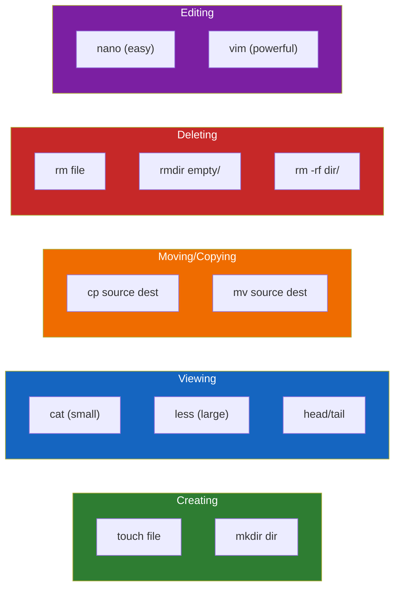

# Lesson 1.14: File Operations Q&A

> **Duration**: 10 min | **Section**: B - File Operations (Wrap-up)

## 📋 Section B Summary

We've covered the core file operations:



## 🧠 Concept Check

Answer these before moving on:

| Concept | Question | Answer |
|:--------|:---------|:-------|
| Create | How do you create an empty file? | `touch filename` |
| Create | How do you create nested directories? | `mkdir -p path/to/dir` |
| View | What command shows the last 20 lines? | `tail -n 20 file` |
| View | How do you watch a log file in real-time? | `tail -f logfile` |
| Copy | How do you copy a directory? | `cp -r source dest` |
| Move | Why is `mv` sometimes instant, sometimes slow? | Instant on same filesystem (updates pointer), slow across filesystems (copies data) |
| Delete | What's dangerous about `rm -rf`? | Deletes recursively without confirmation |
| Delete | How do you safely delete? | `rm -i` or `rm -v` |
| Edit | How do you exit vim? | `Esc` then `:wq` (save) or `:q!` (abandon) |

## ❓ Frequently Asked Questions

### Creating Files

| Question | Answer |
|----------|--------|
| What's the difference between `touch` and `echo`? | `touch` creates empty file or updates timestamp. `echo > file` creates file with empty line. |
| Can I create a file with content in one command? | `echo "content" > file` or `cat > file` then type. |
| How do I create multiple files at once? | `touch file{1,2,3}.txt` or `touch file{1..10}.txt` |

### Viewing Files

| Question | Answer |
|----------|--------|
| How do I see a specific line number? | `sed -n '50p' file` or `head -n 50 file | tail -n 1` |
| How do I count lines in a file? | `wc -l file` |
| How do I view files side by side? | `diff file1 file2` or `sdiff file1 file2` |
| What if my terminal gets messed up after viewing a binary file? | Type `reset` and press Enter |

### Copying and Moving

| Question | Answer |
|----------|--------|
| How do I copy only files that are newer? | `cp -u source dest` or use `rsync` |
| How do I rename multiple files at once? | Use `rename 's/old/new/' files*` or a loop |
| What's the safest way to move large directories? | `rsync -av --remove-source-files source/ dest/` |

### Deleting Files

| Question | Answer |
|----------|--------|
| Can I recover deleted files? | Not easily. Use forensic tools or restore from backup. |
| How do I delete files matching a pattern? | `rm *.log` or `find . -name "*.log" -delete` |
| How do I delete empty directories? | `rmdir dir` or `find . -type d -empty -delete` |

### Editing Files

| Question | Answer |
|----------|--------|
| How do I change my default editor? | `export EDITOR=nano` (add to `~/.bashrc`) |
| Can I edit files without opening an editor? | Yes: `sed -i 's/old/new/g' file` |
| How do I edit multiple files at once in vim? | `vim file1 file2` then `:n` for next, `:prev` for previous |

## 🔗 Command Quick Reference

### File Operations Cheatsheet

```bash
# === CREATING ===
touch file.txt                  # Create empty file
mkdir dir                       # Create directory
mkdir -p path/to/deep/dir       # Create nested directories

# === VIEWING ===
cat file.txt                    # Print entire file
less file.txt                   # Paginate (q to quit)
head -n 20 file.txt            # First 20 lines
tail -n 50 file.txt            # Last 50 lines
tail -f file.txt               # Follow live updates

# === COPYING ===
cp source.txt dest.txt         # Copy file
cp -r source/ dest/            # Copy directory
cp -i source dest              # Ask before overwrite

# === MOVING/RENAMING ===
mv old.txt new.txt             # Rename
mv file.txt dir/               # Move to directory
mv -i source dest              # Ask before overwrite

# === DELETING ===
rm file.txt                    # Delete file
rm -i file.txt                 # Delete with confirmation
rm -r dir/                     # Delete directory
rm -rf dir/                    # Force delete (DANGEROUS)
rmdir empty_dir/               # Delete empty directory only

# === EDITING ===
nano file.txt                  # Easy editor
vim file.txt                   # Power editor

# === INFO ===
file myfile                    # What type of file?
wc -l file.txt                 # Count lines
du -h file.txt                 # File size
```

## 🎯 Practice: Putting It All Together

Complete this workflow:

```bash
# 1. Create a project structure
mkdir -p project/{src,docs,tests}
touch project/src/main.py project/docs/README.md

# 2. Add content
echo "# My Project" > project/docs/README.md
echo "print('hello')" > project/src/main.py

# 3. View the structure
tree project/    # or ls -laR project/

# 4. Make a backup
cp -r project/ project_backup/

# 5. Rename something
mv project/src/main.py project/src/app.py

# 6. Check the file
cat project/src/app.py

# 7. Edit it (add a line)
echo "print('world')" >> project/src/app.py

# 8. Verify
cat project/src/app.py

# 9. Clean up
rm -rf project project_backup
```

## � Common Pitfalls

| Pitfall | What Happens | Fix |
|---------|--------------|-----|
| `rm -rf /` with sudo | Deletes EVERYTHING | Never use `rm -rf /` or `rm -rf /*` |
| `mv file1 file2` when file2 exists | file2 overwritten silently | Use `mv -i` for interactive mode |
| `cp` large files same disk | Doubles disk usage | Use `mv` if you don't need original |
| Editing binary files | Terminal displays garbage | Type `reset` to fix terminal |
| `vim` and can't exit | Stuck in vim forever | Press `Esc`, type `:q!`, press Enter |

## �🔑 Key Takeaways

- `touch` creates files, `mkdir -p` creates nested directories
- `cp -r` copies directories, `mv` renames/moves
- `rm` deletes forever—use `-i` for safety
- `cat` for small files, `less` for large, `tail -f` for logs
- `nano` is easy, `vim` is powerful (`:wq` to save and exit!)
- Silence means success in Unix

## ✅ Section Complete!

You can now:
- Create files and directories
- View file contents (small and large files)
- Copy and move files safely
- Delete files (carefully!)
- Edit files from the terminal

**Next up**: Section C - Permissions & Ownership

We'll explore:
- Why you get "Permission denied"
- What `chmod` and `chown` really do
- The mystery of `rwxr-xr-x`
- sudo and the root user
