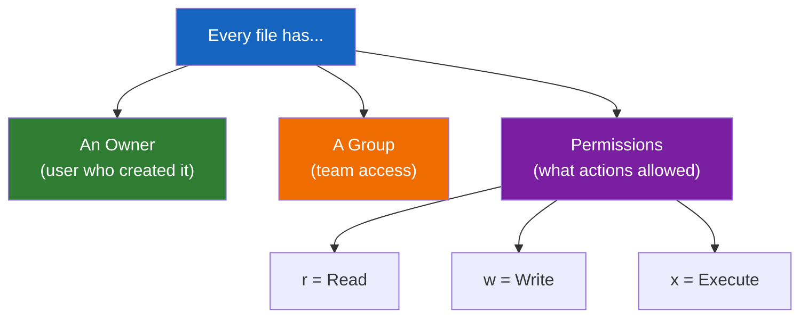

# Lesson 1.15: The Permissions Problem

> **Duration**: 5 min | **Section**: C - Permissions & Ownership (Introduction)

## 🎯 The Problem

You try to run a script:

```bash
./my_script.sh
```

And you get:

```
bash: ./my_script.sh: Permission denied
```

Or you try to edit a system file:

```bash
nano /etc/hosts
```

You make changes, press `Ctrl+O` to save:

```
[ Error writing /etc/hosts: Permission denied ]
```

**Why can't you access your own files? Why can't you modify certain files?**

## 🤔 The Questions

- Who decides what I can and can't do?
- What are these cryptic strings like `rwxr-xr-x`?
- Why does `sudo` magically fix things?
- What's the difference between owner, group, and others?

## 🔍 What We'll Discover



## 🎯 By the End of This Section

You will understand:
1. How permissions work (the `rwx` system)
2. Why you get "Permission denied"
3. How to change permissions (`chmod`)
4. How to change ownership (`chown`)
5. What `sudo` does and when to use it

## 🔗 The Real-World Stakes

| Without Permissions | What Happens |
|:-------------------|:-------------|
| No execute on script | Can't run your own code |
| No write on config | Can't configure server |
| No read on logs | Can't debug problems |
| Wrong permissions on SSH keys | SSH refuses to connect |
| World-writable files | Security vulnerability |

> **The famous SSH key error**:
> ```
> @@@@@@@@@@@@@@@@@@@@@@@@@@@@@@@@@@@@@@@@@@@@@@@@@@@@@@@@@@@
> @         WARNING: UNPROTECTED PRIVATE KEY FILE!          @
> @@@@@@@@@@@@@@@@@@@@@@@@@@@@@@@@@@@@@@@@@@@@@@@@@@@@@@@@@@@
> Permissions 0644 for '/home/user/.ssh/id_rsa' are too open.
> ```
>
> SSH won't even use your key if the permissions are wrong.

Let's understand why.
