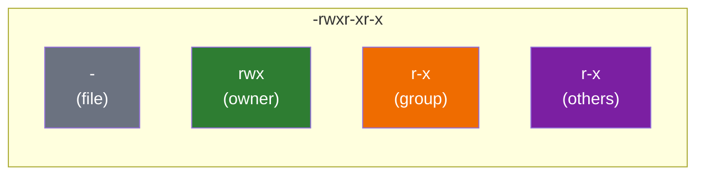
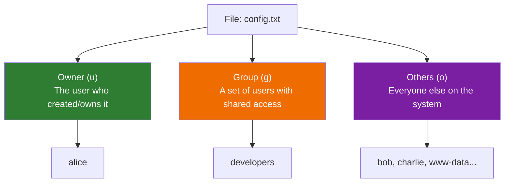
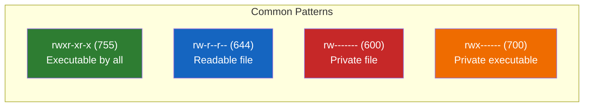
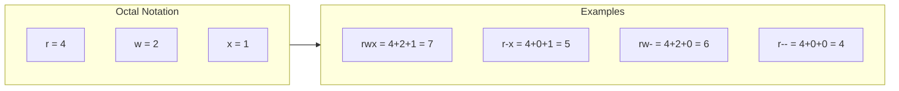
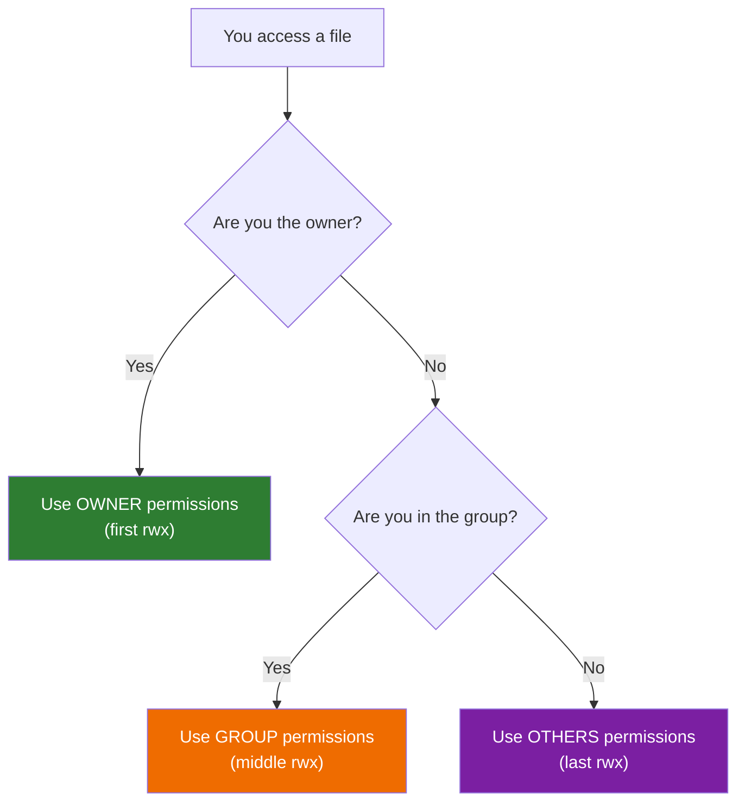

# Lesson 1.16: Understanding Permissions

> **Duration**: 25 min | **Section**: C - Permissions & Ownership

## 🎯 The Problem (3-5 min)

Run this command:

```bash
ls -l /bin/ls
```

You see something like:

```
-rwxr-xr-x 1 root root 142144 Sep  5  2019 /bin/ls
```

What does `-rwxr-xr-x` mean? What's `root root`? Why is this important?

> **Scenario**: You download a script from GitHub. You try to run it. "Permission denied." Why? The file exists. You own it. Why can't you run it?

## 🧪 Try It: The Naive Approach (5-10 min)

```bash
# Download a script
echo '#!/bin/bash\necho "Hello!"' > script.sh

# Try to run it
./script.sh
# bash: ./script.sh: Permission denied

# But you CAN do this:
bash script.sh
# Hello!
```

**The file runs fine with `bash`, but `./script.sh` fails. What's different?**

## 🔍 Under the Hood (10-15 min)

### The Permission String Decoded

```
-rwxr-xr-x
│└┬┘└┬┘└┬┘
│ │  │  └── Others (everyone else)
│ │  └───── Group (team members)
│ └──────── Owner (user who owns file)
└────────── File type (- = file, d = directory, l = link)
```



### The Three Permissions

| Symbol | Meaning | For Files | For Directories |
|:------:|:--------|:----------|:----------------|
| `r` | Read | View contents | List contents |
| `w` | Write | Modify contents | Create/delete files |
| `x` | Execute | Run as program | Enter (cd into) |
| `-` | None | No permission | No permission |

### The Three Categories



### Reading Permission Strings

```
-rwxr-xr-x
```

| Position | Value | Meaning |
|:---------|:------|:--------|
| 1 | `-` | Regular file |
| 2-4 | `rwx` | Owner can read, write, execute |
| 5-7 | `r-x` | Group can read and execute (no write) |
| 8-10 | `r-x` | Others can read and execute (no write) |

### Common Permission Patterns



| Pattern | Meaning | Use Case |
|:--------|:--------|:---------|
| `rwxr-xr-x` | Owner full, others read/execute | Public scripts, programs |
| `rw-r--r--` | Owner read/write, others read | Config files, documents |
| `rw-------` | Owner only | Private keys, passwords |
| `rwx------` | Owner only, executable | Private scripts |
| `rwxrwxr-x` | Owner & group full, others read/execute | Team projects |

### Numeric Notation (Octal)

Each permission has a number:
- `r` = 4
- `w` = 2
- `x` = 1

Add them up for each category:

```
rwx = 4+2+1 = 7
r-x = 4+0+1 = 5
r-- = 4+0+0 = 4
--- = 0+0+0 = 0
```

So:
- `rwxr-xr-x` = `755`
- `rw-r--r--` = `644`
- `rw-------` = `600`



### Viewing Permissions

```bash
ls -l file.txt
# -rw-r--r-- 1 alice developers 1234 Jan 1 10:00 file.txt
#  │         │ │     │
#  │         │ │     └── Group: developers
#  │         │ └──────── Owner: alice
#  │         └────────── Number of hard links
#  └──────────────────── Permissions
```

## 💥 Where It Breaks (3-5 min)

| Error | Cause | Fix |
|:------|:------|:----|
| `Permission denied` running script | Missing execute permission | `chmod +x script.sh` |
| Can't read file | No read permission for you | Check owner/group, use `sudo` |
| Can't save file | No write permission | Check permissions, use `sudo` |
| Can't `cd` into directory | No execute permission on directory | `chmod +x directory` |
| SSH key rejected | Permissions too open | `chmod 600 ~/.ssh/id_rsa` |

### Directory Permissions Are Weird

| Permission | Effect on Directory |
|:-----------|:-------------------|
| `r` | Can list contents (`ls`) |
| `w` | Can create/delete files |
| `x` | Can enter (`cd`) and access files |

You need **both** `r` and `x` to list AND access files in a directory.

```bash
# Can't cd without execute
chmod 644 mydir
cd mydir
# bash: cd: mydir: Permission denied

# Can cd, but can't list without read
chmod 111 mydir
cd mydir
ls
# ls: cannot open directory '.': Permission denied
```

## ✅ The Fix (10-15 min)

### Understanding Your Access

```bash
# Who am I?
whoami
# alice

# What groups am I in?
groups
# alice developers sudo

# Who owns this file?
ls -l file.txt
# -rw-r--r-- 1 bob developers 1234 Jan 1 10:00 file.txt
```

In this example:
- You are `alice`
- The file is owned by `bob`
- But you're both in the `developers` group
- So you get the GROUP permissions (`r--` = read only)

### Permission Check Flow



### Quick Reference

```bash
# Check permissions
ls -l file.txt

# Check who you are
whoami

# Check your groups
groups

# Check file ownership in detail
stat file.txt
```

## 🎯 Practice

1. Create test files:
   ```bash
   touch test_file.txt
   mkdir test_dir
   ls -l
   ```

2. Check default permissions:
   ```bash
   ls -l test_file.txt   # Probably rw-r--r-- (644)
   ls -ld test_dir       # Probably rwxr-xr-x (755)
   ```

3. Check who owns them:
   ```bash
   ls -l test_file.txt   # Your username appears twice
   ```

4. Verify your identity:
   ```bash
   whoami
   groups
   ```

5. Clean up:
   ```bash
   rm test_file.txt
   rmdir test_dir
   ```

## 🔑 Key Takeaways

- Every file has **owner**, **group**, and **permissions**
- Permissions: `r` (read), `w` (write), `x` (execute)
- Three categories: owner (u), group (g), others (o)
- Numeric notation: r=4, w=2, x=1 (add them up)
- `755` = rwxr-xr-x (common for scripts)
- `644` = rw-r--r-- (common for files)
- `600` = rw------- (private files like SSH keys)

## ❓ Common Questions

| Question | Answer |
|----------|--------|
| Why does `./script.sh` fail but `bash script.sh` works? | `./` requires execute permission. `bash` reads the file as input. |
| What's the difference between 755 and 644? | 755 adds execute permission for everyone. |
| Why do SSH keys need 600? | SSH refuses to use keys that others can read (security). |
| What if I'm both owner AND in the group? | Owner permissions take precedence. |

## 🔗 Further Reading

- [Linux File Permissions Explained](https://www.linuxfoundation.org/blog/classic-sysadmin-understanding-linux-file-permissions/)
- [chmod Wikipedia](https://en.wikipedia.org/wiki/Chmod)
