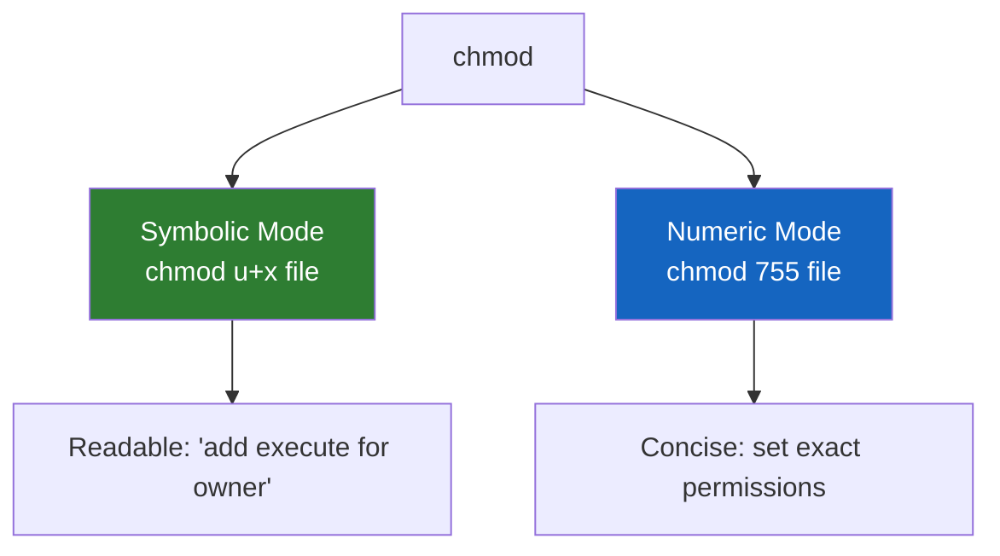
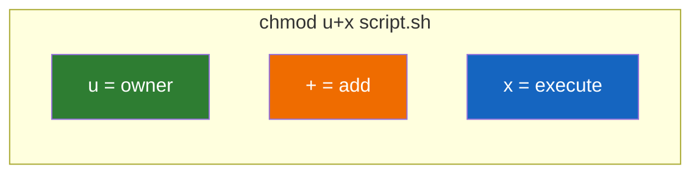
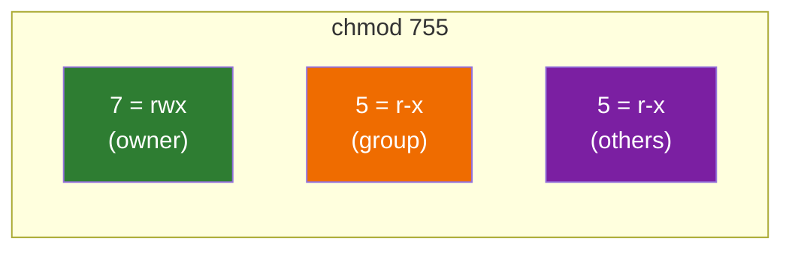
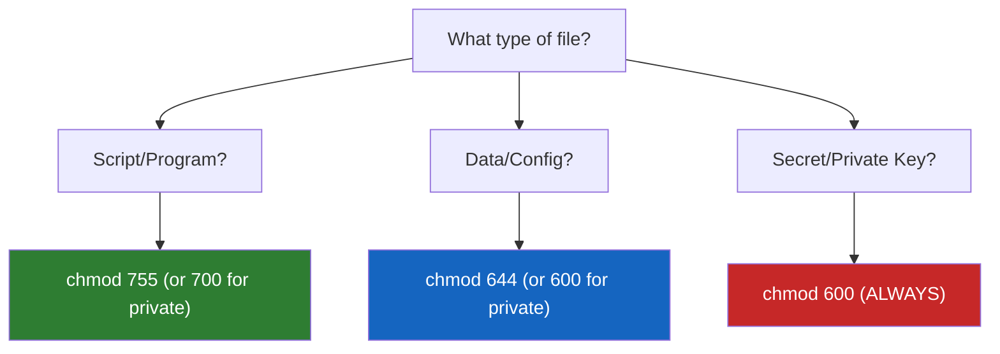

# Lesson 1.17: Changing Permissions with chmod

> **Duration**: 20 min | **Section**: C - Permissions & Ownership

## 🎯 The Problem (3-5 min)

You wrote a script. You need to run it:

```bash
./deploy.sh
# bash: ./deploy.sh: Permission denied
```

Or you need to protect a file with passwords:

```bash
ls -l secrets.txt
# -rw-r--r-- 1 alice alice 1234 Jan 1 10:00 secrets.txt
# EVERYONE can read this!
```

You need to **change** permissions.

> **Scenario**: You've just created `~/.ssh/id_rsa` (your SSH private key). It has permissions `644`. SSH refuses to use it because it's "too open." You need to make it `600` (owner read/write only).

## 🧪 Try It: The Naive Approach (5-10 min)

You might try:
- Right-click → Properties → Permissions (no GUI!)
- `edit permissions` command (doesn't exist)

The actual command is `chmod` (change mode):

```bash
chmod 755 script.sh
```

But what does `755` mean? What if you can't remember the numbers?

## 🔍 Under the Hood (10-15 min)

### chmod: Two Syntaxes

`chmod` has two ways to change permissions:



### Symbolic Mode (Human-Readable)

Format: `chmod WHO+/-PERMISSION file`

**WHO**:
| Symbol | Meaning |
|:-------|:--------|
| `u` | User (owner) |
| `g` | Group |
| `o` | Others |
| `a` | All (everyone) |

**OPERATOR**:
| Symbol | Meaning |
|:-------|:--------|
| `+` | Add permission |
| `-` | Remove permission |
| `=` | Set exact permission |

**PERMISSION**:
| Symbol | Meaning |
|:-------|:--------|
| `r` | Read |
| `w` | Write |
| `x` | Execute |

**Examples**:
```bash
chmod u+x script.sh      # Add execute for owner
chmod g-w file.txt       # Remove write from group
chmod o-rwx secret.txt   # Remove all permissions from others
chmod a+r readme.txt     # Add read for everyone
chmod u+rwx,g+rx,o+r f   # Multiple changes
chmod +x script.sh       # Same as a+x (add execute for all)
```



### Numeric Mode (Octal)

Set all permissions at once:

```bash
chmod 755 script.sh    # rwxr-xr-x
chmod 644 file.txt     # rw-r--r--
chmod 600 secret.txt   # rw-------
chmod 777 open.txt     # rwxrwxrwx (usually bad!)
```

**The math**:
```
r = 4, w = 2, x = 1

chmod ABC file
       │││
       ││└── Others (A = r+w+x for others)
       │└─── Group  (B = r+w+x for group)
       └──── Owner  (C = r+w+x for owner)
```

**Common numbers**:
| Octal | Symbolic | Meaning |
|:------|:---------|:--------|
| 7 | rwx | Full access |
| 6 | rw- | Read and write |
| 5 | r-x | Read and execute |
| 4 | r-- | Read only |
| 0 | --- | No access |



### Recursive Changes

For directories and all contents:

```bash
chmod -R 755 myproject/    # Apply to folder and all files inside
```

**Warning**: Be careful! This makes ALL files executable:

```bash
# Better approach for directories:
find myproject -type d -exec chmod 755 {} \;    # Directories: 755
find myproject -type f -exec chmod 644 {} \;    # Files: 644
```

## 💥 Where It Breaks (3-5 min)

| Mistake | What Happens | Fix |
|:--------|:-------------|:----|
| `chmod 777` everywhere | Security vulnerability | Use minimal permissions |
| `chmod -R 755 .` on files | All files become executable | Use find to separate files/dirs |
| Can't chmod a file | Not owner (need sudo) | `sudo chmod ...` |
| chmod typo: `chmod 75 file` | Wrong permissions (only 2 digits!) | Use all 3 digits: `chmod 755` |

### The 777 Problem

```bash
chmod 777 file.txt    # EVERYONE can read, write, execute!
```

This is almost never what you want:
- Anyone can modify your file
- Anyone can execute it (if it's malicious)
- Many programs refuse to work with 777 files (like SSH)

## ✅ The Fix (10-15 min)

### The Golden Rules



### Common Permission Recipes

```bash
# Make a script executable
chmod +x script.sh
# Or precisely:
chmod 755 script.sh

# Protect SSH keys (REQUIRED by SSH)
chmod 600 ~/.ssh/id_rsa
chmod 644 ~/.ssh/id_rsa.pub

# Protect a password file
chmod 600 passwords.txt

# Normal config file
chmod 644 config.json

# Web-accessible files (for web server)
chmod 644 index.html
chmod 755 images/    # Directories need execute

# Private directory
chmod 700 ~/private/
```

### Quick Reference

```bash
# Symbolic mode
chmod +x file          # Add execute for all
chmod u+x file         # Add execute for owner
chmod go-w file        # Remove write from group and others
chmod u=rwx,go=rx file # Explicit: owner=rwx, group&others=rx

# Numeric mode
chmod 755 file         # rwxr-xr-x (public executable)
chmod 644 file         # rw-r--r-- (public readable)
chmod 600 file         # rw------- (private)
chmod 700 dir          # rwx------ (private directory)

# Recursive
chmod -R 755 dir/      # All contents
chmod -R a+X dir/      # +X = execute only if already executable or directory
```

### The Capital X Trick

`X` (capital) means: add execute only if:
- It's a directory, OR
- It already has execute for someone

This is perfect for fixing a directory recursively:

```bash
chmod -R a+X myproject/    # Add execute to all directories
chmod -R a+r myproject/    # Add read to everything
```

## 🎯 Practice

1. Create a script:
   ```bash
   echo '#!/bin/bash' > test.sh
   echo 'echo "Hello!"' >> test.sh
   ```

2. Try to run it:
   ```bash
   ./test.sh
   # Permission denied
   ```

3. Check permissions:
   ```bash
   ls -l test.sh
   # -rw-r--r-- (no x!)
   ```

4. Add execute:
   ```bash
   chmod +x test.sh
   ls -l test.sh
   # -rwxr-xr-x
   ./test.sh
   # Hello!
   ```

5. Try numeric mode:
   ```bash
   chmod 644 test.sh
   ls -l test.sh
   # -rw-r--r-- (back to no execute)
   chmod 755 test.sh
   ls -l test.sh
   # -rwxr-xr-x
   ```

6. Protect a file:
   ```bash
   echo "secret" > private.txt
   chmod 600 private.txt
   ls -l private.txt
   # -rw------- (only you can read/write)
   ```

7. Clean up:
   ```bash
   rm test.sh private.txt
   ```

## 🔑 Key Takeaways

- `chmod` = change file mode (permissions)
- Symbolic: `chmod u+x file` (add execute for owner)
- Numeric: `chmod 755 file` (rwxr-xr-x)
- Common: 755 (scripts), 644 (files), 600 (secrets)
- `-R` for recursive, but be careful with files vs directories
- Use capital `X` for directories only: `chmod -R a+X dir/`

## ❓ Common Questions

| Question | Answer |
|----------|--------|
| When should I use symbolic vs numeric? | Symbolic for single changes, numeric for exact permissions. |
| Why does `chmod 77 file` give strange permissions? | It's interpreted as octal `077` (----rwxrwx). Always use 3 digits. |
| What's the difference between `chmod +x` and `chmod a+x`? | They're the same—`+x` defaults to all users. |
| Can I chmod files I don't own? | Only with `sudo`. |

## 🔗 Further Reading

- [chmod Manual](https://www.gnu.org/software/coreutils/manual/html_node/chmod-invocation.html)
- [Linux Permissions Calculator](https://chmod-calculator.com/)
