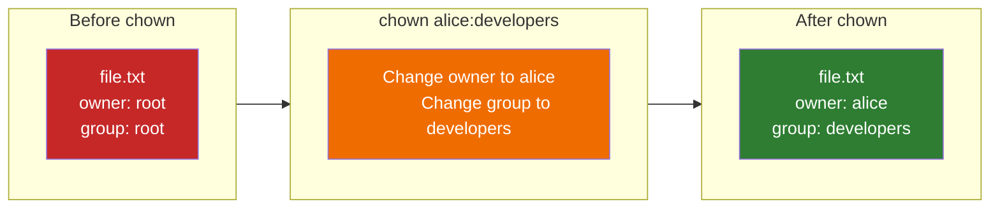
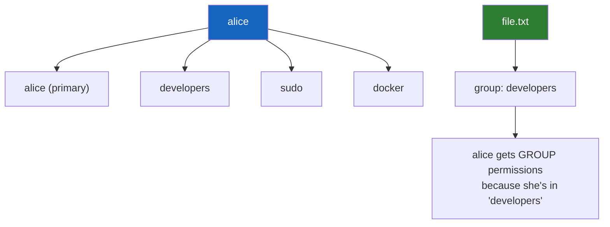
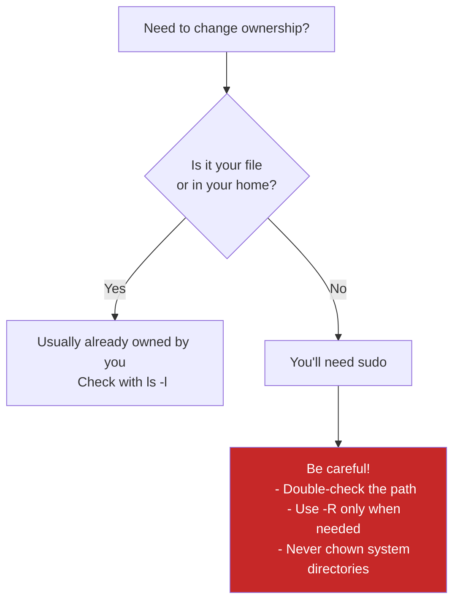

# Lesson 1.18: Changing Ownership with chown

> **Duration**: 15 min | **Section**: C - Permissions & Ownership

## 🎯 The Problem (3-5 min)

You download a project, and all the files are owned by `root`:

```bash
ls -l project/
# -rw-r--r-- 1 root root 1234 Jan 1 10:00 config.txt
# -rw-r--r-- 1 root root 5678 Jan 1 10:00 main.py
```

You try to edit them:
```bash
nano project/config.txt
# [Error writing: Permission denied]
```

The permissions are `rw-r--r--`. The owner (root) can write. You're not root. You can only read.

**You need to change who owns the file.**

> **Scenario**: You extracted an archive as root. Now your user can't modify the files. You need to take ownership of the entire project.

## 🧪 Try It: The Naive Approach (5-10 min)

You might try:
```bash
chmod 777 project/config.txt    # Let everyone write
```

This "works" but creates security issues. Anyone can modify your files.

Better approach: **Change ownership** instead of opening permissions.

## 🔍 Under the Hood (10-15 min)

### The chown Command

`chown` = **ch**ange **own**er

```bash
chown USER file           # Change owner
chown USER:GROUP file     # Change owner AND group
chown :GROUP file         # Change only group
```



### Why sudo Is Required

Only root can change file ownership. Why?

Think about it:
- If you could give files to other users, you could frame them
- If you could take files from other users, you could steal them

```bash
chown alice file.txt
# chown: changing ownership of 'file.txt': Operation not permitted

sudo chown alice file.txt
# Works!
```

### Understanding Groups

Users can belong to multiple groups:

```bash
# See your groups
groups
# alice developers sudo docker

# See groups of a file
ls -l file.txt
# -rw-r--r-- 1 alice developers 1234 Jan 1 10:00 file.txt
```



### chgrp: Change Group Only

There's also `chgrp` for changing just the group:

```bash
chgrp developers file.txt    # Change group to developers
# Same as:
chown :developers file.txt
```

## 💥 Where It Breaks (3-5 min)

| Mistake | What Happens | Fix |
|:--------|:-------------|:----|
| `chown user file` without sudo | "Operation not permitted" | Use `sudo chown` |
| Typo in username | "invalid user" error | Check spelling, use `id username` |
| Changing /etc files ownership | System breaks | Don't mess with system file ownership |
| `chown -R` on wrong directory | Catastrophic ownership changes | Double-check path first |

### The Dangerous Commands

```bash
# NEVER do this:
sudo chown -R alice /          # Changes ALL system files
sudo chown -R alice /etc       # Breaks system config
sudo chown alice /bin/ls       # Breaks system commands

# Be very careful with:
sudo chown -R alice ~          # OK, but verify path
sudo chown -R alice ./         # OK for project directories
```

## ✅ The Fix (10-15 min)

### Common Ownership Recipes

```bash
# Take ownership of a downloaded project
sudo chown -R $USER:$USER ~/project/

# Share a folder with a group
sudo chown -R alice:developers /shared/project/
chmod -R 775 /shared/project/

# Fix web server ownership (common issue)
sudo chown -R www-data:www-data /var/www/html/

# After extracting an archive as root
sudo chown -R $(whoami) extracted_folder/
```

### Best Practices



### Quick Reference

```bash
# Change owner (requires sudo)
sudo chown alice file.txt

# Change owner and group
sudo chown alice:developers file.txt

# Change only group
sudo chown :developers file.txt
# Or:
sudo chgrp developers file.txt

# Recursive (all contents)
sudo chown -R alice:developers project/

# Change to yourself (use $USER variable)
sudo chown -R $USER:$USER project/

# Check ownership
ls -l file.txt
ls -ld directory/

# Check available groups
groups                    # Your groups
getent group             # All groups on system
```

## 🎯 Practice

1. Create a file (as yourself):
   ```bash
   touch myfile.txt
   ls -l myfile.txt
   # Shows your username as owner
   ```

2. Check current ownership:
   ```bash
   whoami
   ls -l myfile.txt
   ```

3. See your groups:
   ```bash
   groups
   ```

4. Change group (you can do this without sudo if you're in the group):
   ```bash
   # Try with one of your groups:
   chgrp $(groups | awk '{print $1}') myfile.txt
   ls -l myfile.txt
   ```

5. Try changing owner without sudo:
   ```bash
   chown root myfile.txt
   # Operation not permitted (expected!)
   ```

6. Clean up:
   ```bash
   rm myfile.txt
   ```

## 🔑 Key Takeaways

- `chown` = change owner (requires sudo)
- `chown user:group file` changes both owner and group
- `chgrp group file` changes only group
- `-R` for recursive (entire directory tree)
- Use `$USER` variable for your username
- Never chown system directories (`/`, `/etc`, `/bin`, etc.)

## ❓ Common Questions

| Question | Answer |
|----------|--------|
| Why does chown need sudo? | Security: prevents users from giving away or taking files. |
| Can I change ownership of files I don't own? | Only with sudo. |
| What's the difference between chown and chmod? | chown changes WHO owns it, chmod changes WHAT they can do. |
| How do I give a file to another user? | `sudo chown other_user file` |

## 🔗 Further Reading

- [chown Manual](https://www.gnu.org/software/coreutils/manual/html_node/chown-invocation.html)
- [Linux Users and Groups](https://wiki.archlinux.org/title/Users_and_groups)
