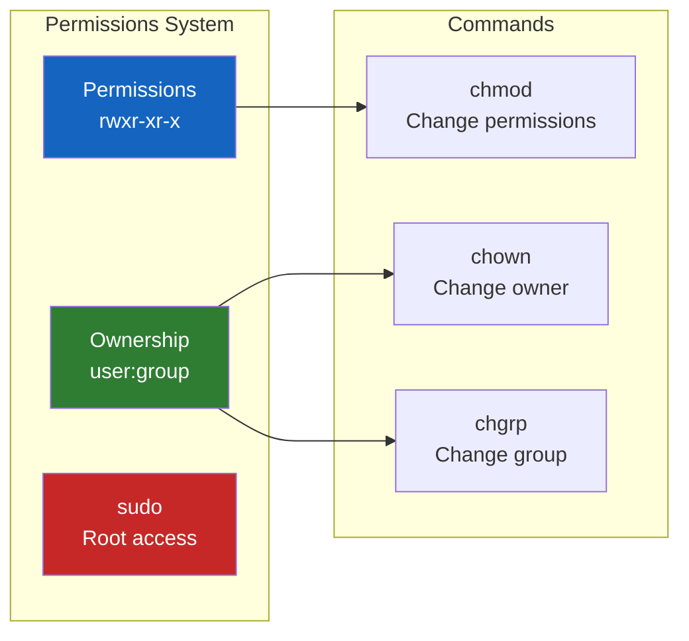
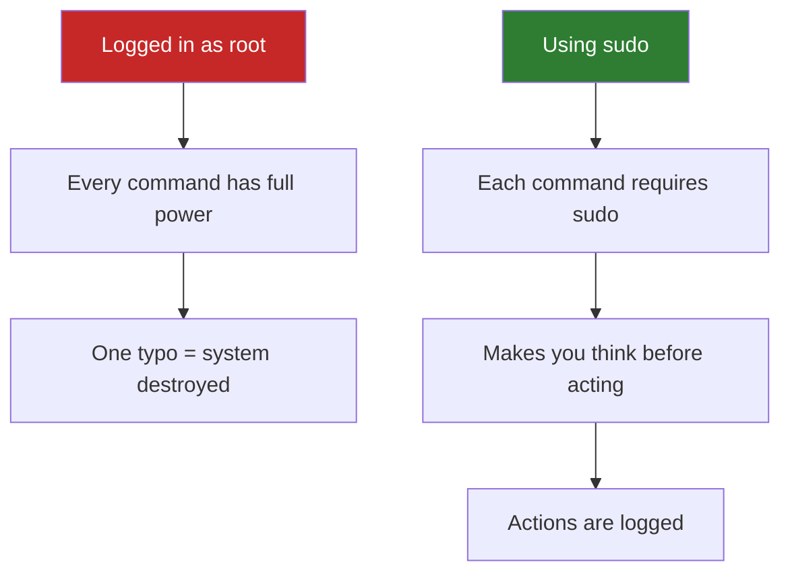

# Lesson 1.19: Permissions Q&A and sudo Deep Dive

> **Duration**: 15 min | **Section**: C - Permissions & Ownership (Wrap-up)

## 📋 Section C Summary



## 🔐 sudo: The Deep Dive

### What Is sudo?

`sudo` = **S**uper **U**ser **DO**

It lets you run commands as the root user (administrator).

```bash
sudo command          # Run as root
sudo -i               # Become root (interactive shell)
sudo -u alice command # Run as user 'alice'
```

### Why Not Just Be Root?



**The principle of least privilege**: Only use elevated permissions when necessary.

### Who Can sudo?

Users in the `sudo` group (or `wheel` on some systems):

```bash
# Check if you can sudo
groups
# alice developers sudo  ← 'sudo' means you can!

# Check the sudoers file
sudo cat /etc/sudoers
```

### sudo Gotchas

```bash
# This doesn't work:
sudo cd /root
# cd is a shell builtin, not a command

# Fix: become root first
sudo -i
cd /root
exit

# Or use a subshell:
sudo bash -c "cd /root && ls"
```

```bash
# This doesn't work:
sudo echo "text" > /etc/file
# Redirection happens in YOUR shell, not root's shell

# Fix:
echo "text" | sudo tee /etc/file
# Or:
sudo bash -c 'echo "text" > /etc/file'
```

## 🧠 Concept Check

| Concept | Question | Answer |
|:--------|:---------|:-------|
| Permissions | What does `rwxr-xr-x` mean? | Owner: read/write/execute, Group: read/execute, Others: read/execute |
| Numeric | What is 755? | rwxr-xr-x |
| Numeric | What is 644? | rw-r--r-- |
| Numeric | What is 600? | rw------- |
| chmod | How to make a script executable? | `chmod +x script.sh` or `chmod 755 script.sh` |
| chown | How to change owner to alice? | `sudo chown alice file` |
| chown | How to change owner AND group? | `sudo chown alice:group file` |
| sudo | Why use sudo instead of root login? | Security (least privilege), logging, intentionality |

## ❓ Frequently Asked Questions

### Permissions

| Question | Answer |
|----------|--------|
| What's the default permission for new files? | Usually 644 (controlled by `umask`) |
| What's the default permission for new directories? | Usually 755 |
| How do I set default permissions? | Set `umask` in `.bashrc`. `umask 022` → files=644, dirs=755 |
| Why does execute matter for directories? | Without `x`, you can't `cd` into the directory |
| What's the sticky bit (t)? | Files in that directory can only be deleted by owner. Used on `/tmp`. |

### Ownership

| Question | Answer |
|----------|--------|
| How do I see what groups exist? | `getent group` or `cat /etc/group` |
| How do I add a user to a group? | `sudo usermod -aG groupname username` (then re-login) |
| What's the difference between owner and group? | Owner is one user. Group is a collection of users. |

### sudo

| Question | Answer |
|----------|--------|
| How long does sudo password last? | Usually 15 minutes (configurable) |
| Can I run GUI apps with sudo? | `sudo -E app` preserves environment, but generally avoid GUI sudo |
| What's the difference between `sudo -i` and `sudo su`? | Similar, but `-i` is cleaner (loads root's environment properly) |
| How do I run as another user? | `sudo -u username command` |

## 🔗 Common Permission Patterns

### For Different File Types

```bash
# Private SSH key (MUST be this or SSH refuses)
chmod 600 ~/.ssh/id_rsa

# Public SSH key
chmod 644 ~/.ssh/id_rsa.pub

# SSH directory
chmod 700 ~/.ssh

# Script you want to run
chmod 755 script.sh

# Config file (readable by all, editable by owner)
chmod 644 config.json

# Sensitive config (only owner)
chmod 600 secrets.env

# Shared project directory
chmod 775 /shared/project/
```

### Web Server Setup

```bash
# Web files ownership
sudo chown -R www-data:www-data /var/www/html/

# Web files permissions
chmod -R 755 /var/www/html/         # Directories
find /var/www/html -type f -exec chmod 644 {} \;  # Files
```

### Developer Project

```bash
# Take ownership of downloaded project
sudo chown -R $USER:$USER ~/myproject/

# Make scripts executable
chmod +x ~/myproject/*.sh
chmod +x ~/myproject/bin/*

# Protect config files
chmod 600 ~/myproject/.env
```

## 🎯 Quick Reference Card

```bash
# === VIEWING ===
ls -l file.txt           # View permissions
ls -ld directory/        # View directory permissions
whoami                   # Current user
groups                   # Your groups
id                       # Detailed user/group info

# === PERMISSIONS ===
chmod +x file            # Add execute for all
chmod u+x file           # Add execute for owner
chmod 755 file           # rwxr-xr-x
chmod 644 file           # rw-r--r--
chmod 600 file           # rw-------
chmod -R 755 dir/        # Recursive

# === OWNERSHIP ===
sudo chown user file     # Change owner
sudo chown user:group f  # Change owner and group
sudo chown :group file   # Change group only
sudo chgrp group file    # Change group only
sudo chown -R user dir/  # Recursive

# === SUDO ===
sudo command             # Run as root
sudo -i                  # Interactive root shell
sudo -u user command     # Run as another user
```

## � Common Pitfalls

| Pitfall | What Happens | Fix |
|---------|--------------|-----|
| `chmod 777` on everything | Anyone can read/write/execute | Use 755 for executables, 644 for files |
| SSH key with wrong permissions | "Permissions too open" - key ignored | `chmod 600 ~/.ssh/id_rsa` |
| `sudo` for everything | Habit of running as root = danger | Only sudo when actually needed |
| `chown` without `-R` on directory | Only changes directory, not contents | Use `chown -R user:group dir/` |
| Editing system files without backup | Can't undo changes | Always `cp file file.bak` first |

## �🔑 Key Takeaways

- Permissions: `rwx` = read (4), write (2), execute (1)
- Three categories: Owner, Group, Others
- `chmod 755` = owner full, others read+execute
- `chmod 600` = owner only (use for private keys)
- `chown user:group file` changes ownership
- `sudo` = run as root, use sparingly
- Principle of least privilege: only elevate when necessary

## ✅ Section Complete!

You can now:
- Read and understand permission strings (rwxr-xr-x)
- Use numeric permissions (755, 644, 600)
- Change permissions with `chmod`
- Change ownership with `chown`
- Understand when and how to use `sudo`

**Next up**: Section D - Remote & Networking

We'll explore:
- Connecting to remote servers with SSH
- Secure file transfers
- Environment variables and PATH
- Downloading files from the web
- Process management
