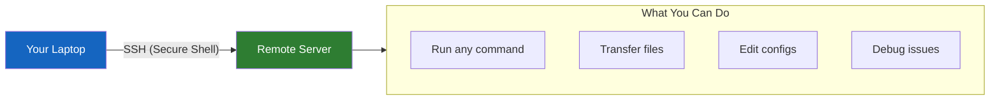

# Lesson 1.20: The Remote Problem

> **Duration**: 5 min | **Section**: D - Remote & Networking (Introduction)

## 🎯 The Problem

Your code works on your laptop. Now you need to:

- Deploy it to a server in the cloud
- Run it on a machine with a GPU
- Access files on your company's server
- Debug an issue on a production machine

The server has no monitor. No keyboard plugged in. It's in a data center somewhere, maybe another country.

**How do you control a computer you can't touch?**

## 🤔 The Questions

- How do I "log in" to a remote machine?
- How do I run commands there?
- How do I transfer files back and forth?
- How do I do this securely (without passwords being stolen)?

## 🔍 What We'll Discover

## 🎯 By the End of This Section

You will understand:
1. How SSH works (the secure tunnel)
2. How to connect to remote servers
3. How to use SSH keys (passwordless, more secure)
4. How to transfer files with scp and rsync
5. Environment variables and PATH
6. Downloading files and process management

## 🔗 The Real-World Stakes

| Without SSH Skills | What Happens |
|:-------------------|:-------------|
| Can't deploy code | Your app only runs on your laptop |
| Can't debug production | You're blind to real issues |
| Can't use cloud resources | Limited to your local machine |
| Can't collaborate | Can't share servers with team |

> **Reality Check**: Almost every professional developer needs to SSH into remote machines. Cloud servers (AWS, GCP, Azure), CI/CD systems, production debugging—all require SSH.

Let's learn the skill that connects you to the world's computers.
