# Lesson 1.21: SSH - The Secure Tunnel

> **Duration**: 25 min | **Section**: D - Remote & Networking

## 🎯 The Problem (3-5 min)

You have a server at IP address `192.168.1.100`. You need to:
- Run commands on it
- Check log files
- Install software
- Fix a bug in production

But you're at home. The server is in a data center. There's no physical way to type on that machine.

> **Scenario**: Your web app is down. The server is in AWS (Northern Virginia). You're in your apartment. You need to restart the web server NOW. How do you reach it?

## 🧪 Try It: The Naive Approach (5-10 min)

You might try:
- Remote desktop (slow, requires GUI)
- Telnet (ancient, insecure, passwords sent in plain text!)
- Share a password somehow (how? email? That's insecure too!)

The solution: **SSH** (Secure Shell)

```bash
ssh username@hostname
```

Simple. Secure. Universal.

## 🔍 Under the Hood (10-15 min)

### What SSH Does

SSH creates an **encrypted tunnel** between your computer and the remote server:

```mermaid
sequenceDiagram
    participant YOU as Your Laptop
    participant WIRE as The Internet
    participant SERVER as Remote Server
    
    YOU->>WIRE: Encrypted data 🔐
    Note over WIRE: Even if someone intercepts this,<br/>they can't read it
    WIRE->>SERVER: Encrypted data 🔐
    SERVER->>WIRE: Encrypted response 🔐
    WIRE->>YOU: Encrypted response 🔐
```



### The Basic Connection

```bash
ssh username@hostname
# or
ssh username@ip-address

# Examples:
ssh alice@192.168.1.100
ssh alice@myserver.com
ssh alice@ec2-12-34-56-78.compute.amazonaws.com
```

What happens:
1. Your computer contacts the server
2. They establish encryption (key exchange)
3. You authenticate (password or SSH key)
4. You get a shell on the remote machine
5. Every keystroke travels encrypted

```mermaid
flowchart LR
    subgraph LOCAL["Your Machine"]
        TERM["Terminal"]
    end
    
    subgraph TUNNEL["SSH Tunnel"]
        ENCRYPTED["🔐 Encrypted"]
    end
    
    subgraph REMOTE["Remote Server"]
        SHELL["Bash Shell
        (running there)"]
    end
    
    TERM --> ENCRYPTED --> SHELL
    SHELL --> ENCRYPTED --> TERM
    
    style ENCRYPTED fill:#2E7D32,color:#fff
```



### Non-Standard Ports

SSH defaults to port 22. But servers might use a different port:

```bash
ssh -p 2222 alice@server.com    # Connect on port 2222
```

### First Connection Warning

First time connecting to a server, you'll see:

```
The authenticity of host 'server.com (192.168.1.100)' can't be established.
ED25519 key fingerprint is SHA256:xxxxxxxxxxxxxxxxxxxxxxxxxxxxxxxxxxxxxxxxxxx.
Are you sure you want to continue connecting (yes/no/[fingerprint])?
```

This is SSH saying: "I've never seen this server before. Want to trust it?"

- Type `yes` to continue and save the server's fingerprint
- This fingerprint is stored in `~/.ssh/known_hosts`
- Next time, SSH verifies it's the same server

```mermaid
flowchart TD
    CONNECT["ssh user@server"] --> KNOWN{"Server in
    known_hosts?"}
    KNOWN -->|No| PROMPT["First connection warning
    'Are you sure?'"]
    PROMPT -->|yes| SAVE["Save fingerprint"]
    SAVE --> AUTH
    KNOWN -->|Yes| MATCH{"Fingerprint
    matches?"}
    MATCH -->|Yes| AUTH["Authenticate"]
    MATCH -->|No| DANGER["🚨 WARNING!
    Possible attack!"]
    
    style DANGER fill:#C62828,color:#fff
    style AUTH fill:#2E7D32,color:#fff
```



### Exiting SSH

When you're done:

```bash
exit        # or Ctrl+D
```

You're back on your local machine.

## 💥 Where It Breaks (3-5 min)

| Error | Cause | Fix |
|:------|:------|:----|
| `Connection refused` | SSH server not running, wrong port | Check server, try `-p PORT` |
| `Connection timed out` | Firewall, wrong IP | Check IP, check firewall |
| `Permission denied` | Wrong password, no SSH access | Check credentials, contact admin |
| `Host key verification failed` | Server changed or man-in-the-middle | Investigate (might be an attack!) |
| `No route to host` | Network issue | Check internet connection |

### The Terrifying Warning

```
@@@@@@@@@@@@@@@@@@@@@@@@@@@@@@@@@@@@@@@@@@@@@@@@@@@@@@@@@@@
@    WARNING: REMOTE HOST IDENTIFICATION HAS CHANGED!     @
@@@@@@@@@@@@@@@@@@@@@@@@@@@@@@@@@@@@@@@@@@@@@@@@@@@@@@@@@@@
```

This means the server's fingerprint changed. Possibilities:
1. **Benign**: Server was reinstalled, IP reassigned
2. **Dangerous**: Man-in-the-middle attack!

**Don't just delete the old key.** Investigate first.

If you're sure it's legitimate:
```bash
ssh-keygen -R hostname    # Remove old key
ssh hostname              # Connect fresh
```

## ✅ The Fix (10-15 min)

### Basic SSH Workflow

```bash
# Connect
ssh alice@server.com

# You're now on the remote machine!
pwd
ls
whoami

# Run commands...
# When done:
exit
```

### Run a Single Command

Don't need a full session? Run one command:

```bash
ssh alice@server.com "uptime"
# Shows server uptime, then exits

ssh alice@server.com "df -h"
# Shows disk usage, then exits

ssh alice@server.com "tail -100 /var/log/syslog"
# Shows last 100 log lines, then exits
```

### Keeping Connections Alive

Long SSH sessions might disconnect. Add to `~/.ssh/config`:

```
Host *
    ServerAliveInterval 60
    ServerAliveCountMax 3
```

### SSH Config File

Tired of typing long commands? Create `~/.ssh/config`:

```bash
nano ~/.ssh/config
```

```
Host myserver
    HostName 192.168.1.100
    User alice
    Port 22

Host work
    HostName work.company.com
    User asmith
    Port 2222
```

Now you can just type:

```bash
ssh myserver    # Instead of: ssh alice@192.168.1.100
ssh work        # Instead of: ssh -p 2222 asmith@work.company.com
```

### Quick Reference

```bash
# Basic connection
ssh user@host

# With port
ssh -p 2222 user@host

# Run single command
ssh user@host "command"

# Verbose (debugging)
ssh -v user@host

# Exit session
exit    # or Ctrl+D
```

## 🎯 Practice

If you have access to a remote server (or can use `localhost`):

1. Connect:
   ```bash
   ssh username@hostname
   ```

2. Explore:
   ```bash
   pwd
   ls
   whoami
   hostname
   ```

3. Run a remote command:
   ```bash
   exit
   ssh username@hostname "uname -a"
   ```

4. Create an SSH config entry:
   ```bash
   mkdir -p ~/.ssh
   nano ~/.ssh/config
   # Add:
   # Host myhost
   #     HostName hostname
   #     User username
   ```

5. Test the alias:
   ```bash
   ssh myhost
   ```

If you don't have a remote server, you can practice with:
```bash
ssh localhost    # Connect to your own machine (if SSH server is installed)
```

## 🔑 Key Takeaways

- SSH = Secure Shell (encrypted remote access)
- `ssh user@host` to connect
- First connection asks to verify server fingerprint
- `exit` or `Ctrl+D` to disconnect
- `~/.ssh/config` saves connection details
- SSH uses port 22 by default (change with `-p`)

## ❓ Common Questions

| Question | Answer |
|----------|--------|
| Is SSH encrypted? | Yes, everything is encrypted. |
| What's the difference between SSH and Telnet? | Telnet is unencrypted (obsolete). SSH is secure. |
| Can I run GUI apps over SSH? | Yes, with `-X` flag (X11 forwarding), but it's slow. |
| What's the fingerprint warning? | SSH verifying you're connecting to the right server. |

## 🔗 Further Reading

- [SSH Academy](https://www.ssh.com/academy/ssh)
- [OpenSSH Manual](https://man.openbsd.org/ssh)
- [SSH Config File](https://www.ssh.com/academy/ssh/config)
