# Lesson 1.22: SSH Keys - Passwordless and Secure

> **Duration**: 25 min | **Section**: D - Remote & Networking

## 🎯 The Problem (3-5 min)

You SSH into servers 50 times a day. Every time:

```bash
ssh alice@server.com
# Password: ********

ssh alice@server.com
# Password: ********

ssh alice@server.com
# Password: ********
```

Annoying. And passwords can be:
- Guessed (brute force attacks)
- Intercepted (if someone tricks you into a fake server)
- Shared accidentally

There's a better way: **SSH Keys**.

> **Scenario**: You're automating deployments. The script needs to SSH into the server. You can't type a password—there's no human there. You need passwordless, secure authentication.

## 🧪 Try It: The Naive Approach (5-10 min)

You might try:
- Store password in a script (TERRIBLE idea!)
- Use the same simple password everywhere (even worse!)
- Disable password requirement (insane!)

SSH keys solve this elegantly.

## 🔍 Under the Hood (10-15 min)

### How SSH Keys Work

SSH keys use **asymmetric cryptography**:

```mermaid
flowchart LR
    subgraph YOURS["Your Computer"]
        PRIVATE["🔐 Private Key
        (secret, never share!)
        ~/.ssh/id_rsa"]
    end
    
    subgraph SERVER["Remote Server"]
        PUBLIC["🔓 Public Key
        (okay to share)
        ~/.ssh/authorized_keys"]
    end
    
    PRIVATE <-->|"Match = Access Granted"| PUBLIC
    
    style PRIVATE fill:#C62828,color:#fff
    style PUBLIC fill:#2E7D32,color:#fff
```



1. **Private key**: Stays on YOUR computer. Never leaves. Never share.
2. **Public key**: Goes to servers you want to access. Can be shared freely.

It's like a lock and key:
- The **public key** is the lock (installed on servers)
- The **private key** is the key (only you have it)

```mermaid
sequenceDiagram
    participant YOU as Your Computer
    participant SERVER as Remote Server
    
    YOU->>SERVER: I want to connect (presents public key ID)
    SERVER->>YOU: Prove you have the private key (sends challenge)
    YOU->>YOU: Signs challenge with private key
    YOU->>SERVER: Here's the signed challenge
    SERVER->>SERVER: Verifies signature with public key
    SERVER->>YOU: ✓ Access granted!
    
    Note over YOU,SERVER: Private key NEVER leaves your computer
```



### Generating SSH Keys

```bash
ssh-keygen -t ed25519 -C "your_email@example.com"
```

- `-t ed25519` = Use Ed25519 algorithm (modern, secure, fast)
- `-C "email"` = Comment to identify the key

You'll see:
```
Generating public/private ed25519 key pair.
Enter file in which to save the key (/home/alice/.ssh/id_ed25519): 
Enter passphrase (empty for no passphrase): 
Enter same passphrase again: 
```

**Passphrase**: Encrypts your private key. Extra security layer. Optional but recommended.

Result:
```
~/.ssh/id_ed25519       # Private key (KEEP SECRET!)
~/.ssh/id_ed25519.pub   # Public key (share this)
```

### Installing Your Public Key

Get your public key on the server:

**Method 1**: `ssh-copy-id` (easiest)
```bash
ssh-copy-id alice@server.com
# Prompts for password one last time
# Then installs your public key
```

**Method 2**: Manual copy
```bash
# Copy public key content
cat ~/.ssh/id_ed25519.pub

# SSH to server (with password)
ssh alice@server.com

# Append to authorized_keys
mkdir -p ~/.ssh
nano ~/.ssh/authorized_keys
# Paste your public key

# Set permissions (CRITICAL!)
chmod 700 ~/.ssh
chmod 600 ~/.ssh/authorized_keys
exit
```

**Method 3**: One-liner
```bash
cat ~/.ssh/id_ed25519.pub | ssh alice@server.com "mkdir -p ~/.ssh && cat >> ~/.ssh/authorized_keys"
```

### Testing It

```bash
ssh alice@server.com
# No password prompt! 
```

If you set a passphrase, you'll be asked for that instead (one passphrase unlocks all servers).

## 💥 Where It Breaks (3-5 min)

| Error | Cause | Fix |
|:------|:------|:----|
| Still asking for password | Key not in authorized_keys | Re-run `ssh-copy-id` |
| `Permission denied (publickey)` | Key mismatch or permissions wrong | Check permissions |
| `UNPROTECTED PRIVATE KEY FILE` | Private key permissions too open | `chmod 600 ~/.ssh/id_*` |
| Agent refused | SSH agent not running or no key | `ssh-add ~/.ssh/id_ed25519` |

### The Permission Problem

SSH is VERY picky about permissions:

```bash
# Required permissions:
chmod 700 ~/.ssh                    # Directory: owner only
chmod 600 ~/.ssh/id_ed25519         # Private key: owner only
chmod 644 ~/.ssh/id_ed25519.pub     # Public key: readable
chmod 600 ~/.ssh/authorized_keys    # Server's list: owner only
chmod 600 ~/.ssh/config             # Config: owner only
```

If permissions are wrong, SSH refuses to use the key (security feature).

## ✅ The Fix (10-15 min)

### Complete SSH Key Setup

```bash
# 1. Generate key pair
ssh-keygen -t ed25519 -C "alice@example.com"

# 2. Set correct permissions
chmod 700 ~/.ssh
chmod 600 ~/.ssh/id_ed25519
chmod 644 ~/.ssh/id_ed25519.pub

# 3. Copy to server
ssh-copy-id alice@server.com

# 4. Test
ssh alice@server.com
# Should connect without password!
```

### Using the SSH Agent

The SSH agent remembers your passphrase:

```bash
# Start agent (usually automatic)
eval "$(ssh-agent -s)"

# Add your key
ssh-add ~/.ssh/id_ed25519
# Enter passphrase once

# Now you won't be asked again (until logout)
ssh alice@server.com
```

### Multiple Keys

For different services:

```bash
# Generate keys for different purposes
ssh-keygen -t ed25519 -f ~/.ssh/github -C "for GitHub"
ssh-keygen -t ed25519 -f ~/.ssh/work -C "for work servers"
```

Configure in `~/.ssh/config`:
```
Host github.com
    IdentityFile ~/.ssh/github

Host work.company.com
    IdentityFile ~/.ssh/work
    User asmith
```

### Quick Reference

```bash
# Generate key
ssh-keygen -t ed25519 -C "email@example.com"

# Copy to server
ssh-copy-id user@host

# Set permissions
chmod 700 ~/.ssh
chmod 600 ~/.ssh/id_ed25519
chmod 644 ~/.ssh/id_ed25519.pub

# Use SSH agent
eval "$(ssh-agent -s)"
ssh-add ~/.ssh/id_ed25519

# List added keys
ssh-add -l

# View public key
cat ~/.ssh/id_ed25519.pub
```

## 🎯 Practice

1. Generate an SSH key:
   ```bash
   ssh-keygen -t ed25519 -C "test@example.com"
   # Press Enter for default location
   # Enter a passphrase (or skip)
   ```

2. Check the files:
   ```bash
   ls -la ~/.ssh/
   # Should see id_ed25519 and id_ed25519.pub
   ```

3. View your public key:
   ```bash
   cat ~/.ssh/id_ed25519.pub
   # This is what you share!
   ```

4. Check permissions:
   ```bash
   ls -la ~/.ssh/
   # Private key should be -rw------- (600)
   ```

5. If you have a server, install the key:
   ```bash
   ssh-copy-id user@server
   ssh user@server
   # Should work without password!
   ```

## 🔑 Key Takeaways

- SSH keys = private key (secret) + public key (shareable)
- Generate with `ssh-keygen -t ed25519`
- Install with `ssh-copy-id user@host`
- Permissions are critical (600 for private key)
- Passphrase adds extra security
- SSH agent remembers your passphrase

## ❓ Common Questions

| Question | Answer |
|----------|--------|
| Which key type should I use? | Ed25519 (modern) or RSA 4096 (compatible). |
| Should I use a passphrase? | Yes, for security. SSH agent makes it convenient. |
| Can I use one key for everything? | Yes, but separate keys limit damage if one is compromised. |
| What if I lose my private key? | Generate new keys, reinstall public keys everywhere. |
| How do I add my key to GitHub? | Copy `~/.ssh/id_ed25519.pub` to GitHub Settings → SSH Keys. |

## 🔗 Further Reading

- [GitHub: Generating SSH Keys](https://docs.github.com/en/authentication/connecting-to-github-with-ssh)
- [SSH Key Best Practices](https://www.ssh.com/academy/ssh/keygen)
- [Ed25519 vs RSA](https://security.stackexchange.com/questions/90077/ssh-key-ed25519-vs-rsa)
