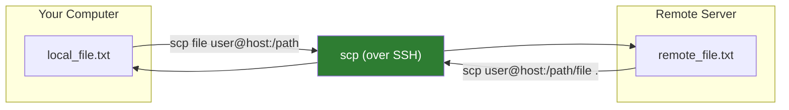
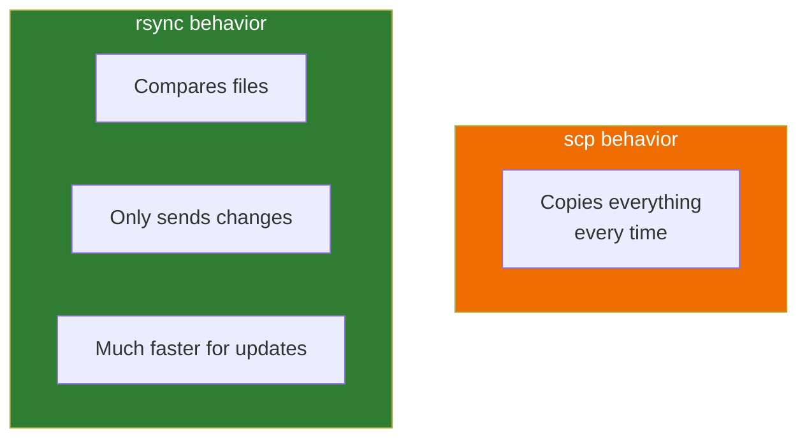
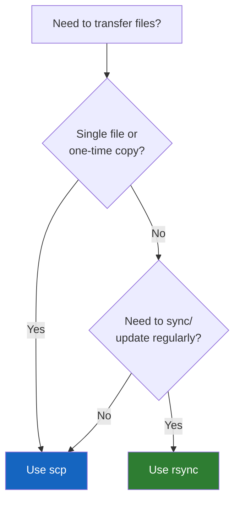

# Lesson 1.23: File Transfer - scp and rsync

> **Duration**: 20 min | **Section**: D - Remote & Networking

## 🎯 The Problem (3-5 min)

You need to:
- Copy code to a server
- Download logs from production
- Sync a folder to a remote backup
- Deploy your website files

You're connected via SSH. How do you move files between your computer and the server?

> **Scenario**: Your local code is ready. The server is waiting. You need to upload 500 files to `/var/www/html`. How do you do it without manually copying each file?

## 🧪 Try It: The Naive Approach (5-10 min)

You might try:
- Copy text from terminal and paste (doesn't work for binary files)
- Email files to yourself (ridiculous for code)
- Upload to Google Drive and download (slow and insecure)

The real tools: **scp** and **rsync** (both use SSH under the hood).

## 🔍 Under the Hood (10-15 min)

### scp: Secure Copy

`scp` = Secure Copy Protocol. Like `cp`, but over SSH.

```bash
# Copy local file to remote
scp file.txt user@host:/path/to/destination/

# Copy remote file to local
scp user@host:/path/to/file.txt ./local/

# Copy directory (recursive)
scp -r folder/ user@host:/path/
```



**scp syntax**:
```
scp [options] source destination

# Where source or destination can be:
# Local:   /path/to/file
# Remote:  user@host:/path/to/file
```

### Common scp Patterns

```bash
# Upload a file
scp script.py alice@server.com:~/

# Upload to specific directory
scp script.py alice@server.com:/var/www/

# Download a file
scp alice@server.com:~/data.csv ./

# Upload entire folder
scp -r project/ alice@server.com:~/

# Download entire folder
scp -r alice@server.com:~/project ./

# With non-standard port
scp -P 2222 file.txt alice@server.com:~/
```

### rsync: The Smart Sync

`rsync` is smarter than scp:
- Only transfers **changed** parts of files
- Shows progress
- Can resume interrupted transfers
- Can delete files that no longer exist locally

```bash
# Basic sync
rsync -av local_folder/ user@host:/remote_folder/

# With progress
rsync -avP local_folder/ user@host:/remote_folder/

# Delete files on remote that don't exist locally
rsync -av --delete local_folder/ user@host:/remote_folder/
```



### rsync Options Explained

| Option | Meaning |
|:-------|:--------|
| `-a` | Archive mode (preserves permissions, timestamps, etc.) |
| `-v` | Verbose (show what's being transferred) |
| `-P` | Show progress + allow partial resume |
| `-z` | Compress during transfer |
| `--delete` | Delete remote files not in source |
| `-n` | Dry run (show what WOULD happen) |

### The Trailing Slash Matters!

```bash
rsync -av source/ dest/    # Contents of source into dest
rsync -av source dest/     # source FOLDER into dest (creates dest/source/)
```

**Rule**: Include trailing slash on source to copy contents, not the folder itself.

## 💥 Where It Breaks (3-5 min)

| Mistake | What Happens | Fix |
|:--------|:-------------|:----|
| Wrong trailing slash | Copies folder instead of contents | Be consistent: `source/ dest/` |
| scp without -r | Can't copy directories | Add `-r` for directories |
| rsync --delete typo | Deletes wrong files! | Always `--dry-run` first |
| No write permission | Transfer fails | Check permissions, use sudo |

### Dangerous rsync

```bash
# NEVER run without checking first:
rsync -av --delete source/ dest/

# ALWAYS dry run first:
rsync -av --delete --dry-run source/ dest/
# Review what will be deleted, then run for real
```

## ✅ The Fix (10-15 min)

### When to Use Each



| Situation | Use |
|:----------|:----|
| Quick one-time copy | `scp` |
| Syncing folders regularly | `rsync` |
| Large files (might interrupt) | `rsync -avP` |
| Backing up | `rsync -av` |
| Deployment | `rsync -av --delete` |

### Deployment Workflow

```bash
# 1. Dry run first
rsync -avP --delete --dry-run ./build/ alice@server.com:/var/www/html/

# 2. Review the output
# 3. If it looks right, run for real
rsync -avP --delete ./build/ alice@server.com:/var/www/html/
```

### Backup Workflow

```bash
# Incremental backup (only copies changes)
rsync -av ~/documents/ alice@backup-server.com:~/backups/documents/

# Backup with timestamp
rsync -av ~/documents/ "alice@backup-server.com:~/backups/documents_$(date +%Y%m%d)/"
```

### Quick Reference

```bash
# === scp ===
scp file.txt user@host:~/           # Upload file
scp user@host:~/file.txt ./         # Download file
scp -r folder/ user@host:~/         # Upload folder
scp -r user@host:~/folder ./        # Download folder
scp -P 2222 file.txt user@host:~/   # Non-standard port

# === rsync ===
rsync -av source/ user@host:dest/   # Sync folder
rsync -avP source/ user@host:dest/  # With progress
rsync -avz source/ user@host:dest/  # With compression
rsync -av --delete src/ user@host:d/  # Sync + delete extras
rsync -avn --delete src/ user@host:d/ # Dry run first!
```

## 🎯 Practice

1. Create test files:
   ```bash
   mkdir -p ~/test_transfer
   echo "file 1" > ~/test_transfer/file1.txt
   echo "file 2" > ~/test_transfer/file2.txt
   ```

2. If you have a remote server, try scp:
   ```bash
   scp ~/test_transfer/file1.txt user@host:~/
   ```

3. Try rsync:
   ```bash
   rsync -avP ~/test_transfer/ user@host:~/test_transfer/
   ```

4. Modify a file and rsync again:
   ```bash
   echo "updated" >> ~/test_transfer/file1.txt
   rsync -avP ~/test_transfer/ user@host:~/test_transfer/
   # Notice: only the changed file is transferred!
   ```

5. Clean up:
   ```bash
   rm -rf ~/test_transfer
   ```

If you don't have a remote server, you can practice locally:
```bash
rsync -av ~/source/ ~/destination/
```

## 🔑 Key Takeaways

- `scp` = secure copy (like cp over SSH)
- `rsync` = smart sync (only transfers changes)
- Use `-r` with scp for directories
- Use `-av` with rsync for archive mode
- `-P` shows progress and allows resume
- `--delete` removes files on dest not in source
- **Always dry run** `rsync --delete` first!
- Trailing slash matters: `source/` copies contents

## ❓ Common Questions

| Question | Answer |
|----------|--------|
| Which is faster? | rsync for updates (only sends changes), similar for first transfer. |
| Can I use rsync locally? | Yes! It's great for local backups too. |
| How do I exclude files? | `rsync --exclude '*.log'` or `--exclude-from=file` |
| Is sftp the same? | Similar but interactive (like FTP). scp is command-line. |

## 🔗 Further Reading

- [rsync Manual](https://linux.die.net/man/1/rsync)
- [scp Manual](https://linux.die.net/man/1/scp)
- [rsync Examples](https://www.digitalocean.com/community/tutorials/how-to-use-rsync-to-sync-local-and-remote-directories)
