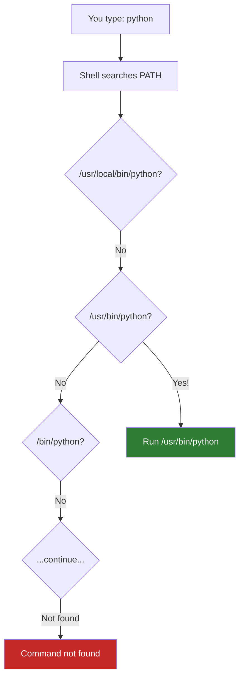

# Lesson 1.24: Environment Variables and PATH

> **Duration**: 25 min | **Section**: D - Remote & Networking

## 🎯 The Problem (3-5 min)

You install Python. You type `python`:

```bash
python
# Command 'python' not found
```

But it IS installed. You can run it with:

```bash
/usr/bin/python3
# Works!
```

**Why doesn't the short name work? What's going on?**

Or you download a tool, put it in `~/Downloads`. You try to run it:

```bash
mytool
# Command 'mytool' not found
```

But:
```bash
~/Downloads/mytool
# Works!
```

**How does the shell know where to find commands?**

## 🧪 Try It: The Naive Approach (5-10 min)

You might try:
- Always use full paths (annoying)
- Copy everything to the same folder (messy)

The answer is **environment variables**, specifically **PATH**.

## 🔍 Under the Hood (10-15 min)

### What Are Environment Variables?

Environment variables are **key-value pairs** that configure your shell and programs:

```bash
# View all environment variables
env

# View one variable
echo $HOME      # /home/alice
echo $USER      # alice
echo $SHELL     # /bin/bash
echo $PATH      # /usr/local/bin:/usr/bin:/bin...
```


### The PATH Variable

When you type a command like `python`, the shell searches for it in directories listed in `$PATH`:

```bash
echo $PATH
# /usr/local/bin:/usr/bin:/bin:/usr/local/games:/usr/games
```

That's a colon-separated list of directories:
1. `/usr/local/bin`
2. `/usr/bin`
3. `/bin`
4. `/usr/local/games`
5. `/usr/games`

The shell searches these **in order** until it finds the command.



### Finding Commands

```bash
# Where is a command?
which python
# /usr/bin/python

which ls
# /usr/bin/ls

# More detail
type python
# python is /usr/bin/python

# All locations
whereis python
# python: /usr/bin/python /usr/lib/python3.10 /usr/share/man/man1/python.1.gz
```

### Setting Environment Variables

```bash
# Set for current session only
export MY_VAR="hello"
echo $MY_VAR
# hello

# Close terminal, it's gone!
```

```bash
# Set permanently (add to ~/.bashrc or ~/.zshrc)
echo 'export MY_VAR="hello"' >> ~/.bashrc

# Reload to apply now
source ~/.bashrc
```

### Modifying PATH

To add a directory to PATH:

```bash
# Add to END of PATH (searched last)
export PATH="$PATH:/new/directory"

# Add to BEGINNING of PATH (searched first)
export PATH="/new/directory:$PATH"
```

**Important**: Always include `$PATH` to keep existing directories!

```bash
# WRONG: Replaces PATH entirely!
export PATH="/new/directory"
# Now NOTHING works! (ls, cd, etc.)

# Fix if you do this:
export PATH="/usr/local/bin:/usr/bin:/bin"
```

## 💥 Where It Breaks (3-5 min)

| Error | Cause | Fix |
|:------|:------|:----|
| `Command not found` | Not in PATH | Add directory to PATH or use full path |
| `PATH` empty | Accidentally replaced it | Set PATH back to defaults |
| Changes don't persist | Not in `.bashrc` | Add to `~/.bashrc` and `source` it |
| Wrong version runs | Earlier match in PATH | Check with `which`, reorder PATH |

### The "Wrong Python" Problem

```bash
which python
# /usr/bin/python (system Python 2.7!)

# But you installed Python 3.10 to /usr/local/bin
# Solution: put /usr/local/bin FIRST in PATH

export PATH="/usr/local/bin:$PATH"
which python
# /usr/local/bin/python (now finds your version first)
```

## ✅ The Fix (10-15 min)

### Adding Custom Scripts to PATH

You have scripts in `~/bin`. Make them accessible:

```bash
# Create the directory
mkdir -p ~/bin

# Add to PATH permanently
echo 'export PATH="$HOME/bin:$PATH"' >> ~/.bashrc
source ~/.bashrc

# Now any script in ~/bin works from anywhere
cp myscript.sh ~/bin/
chmod +x ~/bin/myscript.sh
myscript.sh     # Works!
```

### Common Environment Variables

| Variable | Purpose | Example |
|:---------|:--------|:--------|
| `PATH` | Where to find commands | `/usr/bin:/bin` |
| `HOME` | Your home directory | `/home/alice` |
| `USER` | Your username | `alice` |
| `SHELL` | Your shell | `/bin/bash` |
| `EDITOR` | Default text editor | `vim` or `nano` |
| `LANG` | Language/locale | `en_US.UTF-8` |
| `PWD` | Current directory | `/home/alice/project` |

### Configuration Files

Where to put permanent settings:

| File | When It Runs | Use For |
|:-----|:-------------|:--------|
| `~/.bashrc` | Every new terminal | Most settings |
| `~/.bash_profile` | Login shells | PATH, exported variables |
| `~/.zshrc` | Zsh shells | Same as bashrc for zsh |
| `/etc/environment` | System-wide | Shared settings |

```bash
# Add to ~/.bashrc for bash users:
export PATH="$HOME/bin:$PATH"
export EDITOR=nano

# After editing, reload:
source ~/.bashrc
```

### Quick Reference

```bash
# View all environment variables
env
printenv

# View one variable
echo $VARIABLE_NAME

# Set variable (current session)
export MY_VAR="value"

# Set variable (permanently - add to ~/.bashrc)
echo 'export MY_VAR="value"' >> ~/.bashrc
source ~/.bashrc

# Add to PATH
export PATH="$HOME/bin:$PATH"

# Find where command is
which command
type command
whereis command
```

## 🎯 Practice

1. View your PATH:
   ```bash
   echo $PATH
   ```

2. Find a command:
   ```bash
   which ls
   which python
   ```

3. Set a custom variable:
   ```bash
   export MY_NAME="Alice"
   echo "Hello, $MY_NAME"
   ```

4. Create a custom bin directory:
   ```bash
   mkdir -p ~/bin
   echo '#!/bin/bash
   echo "Hello from my script!"' > ~/bin/hello
   chmod +x ~/bin/hello
   ```

5. Add to PATH:
   ```bash
   export PATH="$HOME/bin:$PATH"
   hello
   # Hello from my script!
   ```

6. Make it permanent:
   ```bash
   echo 'export PATH="$HOME/bin:$PATH"' >> ~/.bashrc
   source ~/.bashrc
   ```

## 🔑 Key Takeaways

- Environment variables = key-value settings
- `$PATH` = where shell looks for commands (colon-separated directories)
- `export VAR="value"` sets a variable
- Add to `~/.bashrc` for permanent settings
- `source ~/.bashrc` to reload config
- `which command` to find where a command lives

## ❓ Common Questions

| Question | Answer |
|----------|--------|
| Why is my command not found? | Not in PATH. Find it with `locate` or `find`, then add directory to PATH. |
| What's the difference between `.bashrc` and `.bash_profile`? | `.bash_profile` runs once at login, `.bashrc` runs for each new terminal. |
| How do I use environment variables in scripts? | Just reference them: `echo $MY_VAR` |
| Can I see a process's environment? | `cat /proc/PID/environ \| tr '\0' '\n'` |

## 🔗 Further Reading

- [Bash Environment Variables](https://www.gnu.org/software/bash/manual/html_node/Bash-Variables.html)
- [How PATH Works](https://opensource.com/article/17/6/set-path-linux)
- [.bashrc vs .bash_profile](https://linuxize.com/post/bashrc-vs-bash-profile/)
