# Lesson 1.25: Essential Utilities - curl, wget, grep, ps, kill

> **Duration**: 25 min | **Section**: D - Remote & Networking (Final)

## 🎯 The Problem (3-5 min)

You need to:
- Download a file from the internet
- Check if an API is responding
- Search for text across many files
- Find a runaway process eating CPU
- Stop a frozen program

These are everyday tasks. Let's master the tools.

## 🔍 Under the Hood: Five Essential Tools

### 1. curl: Transfer Data from URLs

`curl` = Client URL. Fetches content from the web.

```bash
# Get a webpage
curl https://example.com

# Save to file
curl -o page.html https://example.com

# Follow redirects
curl -L https://bit.ly/some-link

# Download a file
curl -O https://example.com/file.zip

# Make an API request
curl https://api.github.com/users/octocat

# POST data
curl -X POST -d "name=alice" https://httpbin.org/post

# With headers
curl -H "Authorization: Bearer TOKEN" https://api.example.com
```


### 2. wget: Download Files

`wget` = Web Get. Better for downloading files.

```bash
# Download a file
wget https://example.com/file.zip

# Save with different name
wget -O myfile.zip https://example.com/file.zip

# Download in background
wget -b https://example.com/huge-file.zip

# Resume interrupted download
wget -c https://example.com/huge-file.zip

# Download entire website (recursively)
wget -r -l 2 https://example.com
```

**curl vs wget**:
| Task | Better Tool |
|:-----|:------------|
| API requests | curl |
| Simple download | wget |
| Complex requests (POST, headers) | curl |
| Resume downloads | wget |
| Recursive downloads | wget |

### 3. grep: Search Text

`grep` = Global Regular Expression Print. Finds text patterns.

```bash
# Search for text in file
grep "error" log.txt

# Case insensitive
grep -i "error" log.txt

# Show line numbers
grep -n "error" log.txt

# Recursive (all files in directory)
grep -r "TODO" ./project/

# Invert (lines NOT matching)
grep -v "success" log.txt

# Count matches
grep -c "error" log.txt

# Show context (2 lines before/after)
grep -B 2 -A 2 "error" log.txt
```


**Common grep patterns**:
```bash
# Search multiple files
grep "error" *.log

# Search with regex
grep -E "error|warning|critical" log.txt

# Find files containing text
grep -l "TODO" *.py    # Just filenames

# Exclude directories
grep -r --exclude-dir=node_modules "import" ./
```

### 4. ps: Process Status

`ps` shows running processes.

```bash
# Your processes
ps

# All processes (full format)
ps aux

# All processes (BSD style)
ps -ef

# Find specific process
ps aux | grep python
```

Output explanation:
```
USER       PID %CPU %MEM    VSZ   RSS TTY      STAT START   TIME COMMAND
alice     1234  0.5  1.2 123456  12345 pts/0   S    10:00   0:01 python server.py
```

| Column | Meaning |
|:-------|:--------|
| PID | Process ID (use this to kill) |
| %CPU | CPU usage |
| %MEM | Memory usage |
| STAT | State (S=sleeping, R=running) |
| COMMAND | What's running |

**Useful ps commands**:
```bash
# All processes, sorted by CPU
ps aux --sort=-%cpu | head

# All processes, sorted by memory
ps aux --sort=-%mem | head

# Tree view (shows parent-child)
ps auxf

# Find by name
pgrep python
```

### 5. kill: Stop Processes

```bash
# Graceful termination (SIGTERM)
kill PID

# Force kill (SIGKILL)
kill -9 PID

# Kill by name
pkill python

# Kill all matching
killall python
```



```mermaid
flowchart TD
    FIND["Find PID:
    ps aux | grep process"] --> PID["PID: 1234"]
    PID --> KILL["kill 1234"]
    KILL --> CHECK["Process gone?"]
    CHECK -->|No| FORCE["kill -9 1234"]
    CHECK -->|Yes| DONE["✓ Done"]
    
    style KILL fill:#EF6C00,color:#fff
    style FORCE fill:#C62828,color:#fff
```

**Signal types**:
| Signal | Number | Effect |
|:-------|:-------|:-------|
| SIGTERM | 15 | Graceful shutdown (default) |
| SIGKILL | 9 | Force kill (can't be ignored) |
| SIGHUP | 1 | Hangup (reload config) |
| SIGINT | 2 | Interrupt (like Ctrl+C) |

## 💥 Common Pitfalls

| Mistake | Result | Fix |
|:--------|:-------|:----|
| `kill -9` first | No cleanup, data loss | Try `kill` first, then `-9` |
| grep without quotes | Glob expansion | `grep "*.txt"` not `grep *.txt` |
| curl without `-L` | Stops at redirect | Add `-L` for redirects |
| ps shows grep itself | Confusing output | `ps aux \| grep [p]ython` |

## ✅ Quick Reference

```bash
# === curl ===
curl URL                    # Fetch URL
curl -o file URL            # Save to file
curl -O URL                 # Save with original name
curl -L URL                 # Follow redirects
curl -X POST -d "data" URL  # POST request
curl -H "Header: value" URL # Add header

# === wget ===
wget URL                    # Download
wget -O name URL            # Download as name
wget -c URL                 # Resume download
wget -q URL                 # Quiet mode

# === grep ===
grep "text" file            # Search in file
grep -i "text" file         # Case insensitive
grep -r "text" dir/         # Recursive
grep -n "text" file         # Show line numbers
grep -v "text" file         # Invert match
grep -E "a|b|c" file        # Extended regex

# === ps ===
ps aux                      # All processes
ps aux | grep name          # Find process
ps aux --sort=-%cpu         # Sort by CPU
pgrep name                  # Get PID by name

# === kill ===
kill PID                    # Graceful stop
kill -9 PID                 # Force kill
pkill name                  # Kill by name
killall name                # Kill all matching
```

## 🎯 Practice

1. Fetch a webpage:
   ```bash
   curl -s https://httpbin.org/get | head
   ```

2. Download a file:
   ```bash
   wget https://raw.githubusercontent.com/torvalds/linux/master/README
   cat README
   rm README
   ```

3. Search with grep:
   ```bash
   echo -e "line one\nline two\nline three" > test.txt
   grep "two" test.txt
   grep -n "line" test.txt
   rm test.txt
   ```

4. View processes:
   ```bash
   ps aux | head
   ps aux | grep bash
   ```

5. Start and kill a process:
   ```bash
   # Start a background process
   sleep 60 &
   
   # Find it
   ps aux | grep sleep
   
   # Kill it
   pkill sleep
   ```

## 🔑 Key Takeaways

- `curl` = fetch from URLs, great for APIs
- `wget` = download files, supports resume
- `grep` = search text in files or output
- `ps aux` = list all processes
- `kill PID` = stop a process (try normal first, then `-9`)
- Pipe them together: `ps aux | grep python`

## ❓ Common Questions

| Question | Answer |
|----------|--------|
| curl or wget for downloads? | wget (better resume, simpler). curl for APIs. |
| How do I search multiple patterns? | `grep -E "a\|b\|c"` or `grep -e "a" -e "b"` |
| Kill not working? | Try `kill -9`. If still stuck, check for zombie process. |
| How do I save curl output? | `curl -o file.txt URL` or `curl URL > file.txt` |

## 🔗 Further Reading

- [curl Manual](https://curl.se/docs/manpage.html)
- [wget Manual](https://www.gnu.org/software/wget/manual/wget.html)
- [grep Manual](https://www.gnu.org/software/grep/manual/grep.html)
- [ps Documentation](https://man7.org/linux/man-pages/man1/ps.1.html)

---

## 🎉 Module 1 Complete!

Congratulations! You've mastered the Linux command line:

- ✅ Shell basics and navigation
- ✅ File operations (create, view, edit, copy, move, delete)
- ✅ Permissions and ownership
- ✅ SSH and remote access
- ✅ File transfers
- ✅ Environment variables
- ✅ Essential utilities

**Next up**: Module 2 - Git & GitHub

You'll learn version control—the skill that lets teams collaborate on code without chaos.
