# Lesson 1.26: Shell Scripting for AI Pipelines

> **Duration**: 30 min | **Section**: E - Automation

## 🎯 The Problem

Your AI workflow involves repetitive tasks:
- Download model files from Hugging Face
- Convert data formats before training
- Run preprocessing → training → evaluation in sequence
- Set up development environments on new machines

You're typing the same 20 commands every time. One typo and you start over.

> **Scenario**: You SSH into a fresh EC2 instance. You need to install Python, clone the repo, download the model (2GB), set environment variables, and run the pipeline. You've done this 15 times this month. Each time takes 20 minutes of manual typing.

## 🧪 Try It: The Naive Approach

```bash
# Running commands manually, one by one...
python -m venv venv
source venv/bin/activate
pip install -r requirements.txt
export OPENAI_API_KEY="sk-..."
export MODEL_PATH="/models/llama"
python scripts/download_model.py
python scripts/preprocess.py
python scripts/train.py
python scripts/evaluate.py

# Problems:
# - Error-prone (typos, forgotten steps)
# - Not reproducible
# - Can't share with teammates
# - No error handling
```

## 🔍 Under the Hood: Shell Scripts

```mermaid
flowchart LR
    subgraph SCRIPT["SHELL SCRIPT (pipeline.sh)"]
        S1["#!/bin/bash"]
        S2["set -euo pipefail"]
        S3["Download model"]
        S4["Preprocess"]
        S5["Train"]
        S6["Evaluate"]
    end
    
    RUN["bash pipeline.sh"] --> S1 --> S2 --> S3 --> S4 --> S5 --> S6
    S6 --> DONE["✓ Complete"]
    
    style SCRIPT fill:#2b3137,color:#fff
```



A shell script is just a text file with commands that run in sequence. Add `#!/bin/bash` at the top, make it executable, and you have automation.

---

## ✅ The Fix: AI Pipeline Script

### Step 1: Basic Script Structure

```bash
#!/bin/bash
# setup_ai_env.sh - Set up AI development environment

# Exit on any error
set -e

# Exit on undefined variable
set -u

# Fail on pipe errors
set -o pipefail

echo "🚀 Setting up AI environment..."

# Variables
PROJECT_DIR="${HOME}/rag-project"
PYTHON_VERSION="3.11"
MODEL_NAME="all-MiniLM-L6-v2"

# Create project directory
mkdir -p "${PROJECT_DIR}"
cd "${PROJECT_DIR}"

# Set up Python virtual environment
python${PYTHON_VERSION} -m venv venv
source venv/bin/activate

# Install dependencies
pip install --upgrade pip
pip install -r requirements.txt

echo "✅ Environment ready!"
```

### Step 2: Model Download Script

```bash
#!/bin/bash
# download_models.sh - Download AI models with progress and verification

set -euo pipefail

# Configuration
MODELS_DIR="${HOME}/models"
HF_MODEL="sentence-transformers/all-MiniLM-L6-v2"

# Colors for output
RED='\033[0;31m'
GREEN='\033[0;32m'
YELLOW='\033[1;33m'
NC='\033[0m' # No Color

log_info() {
    echo -e "${GREEN}[INFO]${NC} $1"
}

log_warn() {
    echo -e "${YELLOW}[WARN]${NC} $1"
}

log_error() {
    echo -e "${RED}[ERROR]${NC} $1"
}

# Check if model already exists
check_model() {
    local model_path="$1"
    if [[ -d "${model_path}" ]] && [[ -f "${model_path}/config.json" ]]; then
        log_info "Model already exists at ${model_path}"
        return 0
    fi
    return 1
}

# Download from Hugging Face
download_hf_model() {
    local model_name="$1"
    local target_dir="$2"
    
    log_info "Downloading ${model_name}..."
    
    # Using huggingface-cli
    if command -v huggingface-cli &> /dev/null; then
        huggingface-cli download "${model_name}" --local-dir "${target_dir}"
    else
        # Fallback to Python
        python -c "
from huggingface_hub import snapshot_download
snapshot_download('${model_name}', local_dir='${target_dir}')
"
    fi
    
    log_info "Download complete!"
}

# Main
main() {
    mkdir -p "${MODELS_DIR}"
    
    local model_path="${MODELS_DIR}/$(basename ${HF_MODEL})"
    
    if check_model "${model_path}"; then
        log_warn "Skipping download, model exists"
    else
        download_hf_model "${HF_MODEL}" "${model_path}"
    fi
    
    # Verify
    if [[ -f "${model_path}/config.json" ]]; then
        log_info "✅ Model verified at ${model_path}"
    else
        log_error "❌ Model verification failed!"
        exit 1
    fi
}

main "$@"
```

### Step 3: Full Pipeline Script

```bash
#!/bin/bash
# run_pipeline.sh - Complete AI training/evaluation pipeline

set -euo pipefail

# Configuration (override with environment variables)
DATA_DIR="${DATA_DIR:-./data}"
OUTPUT_DIR="${OUTPUT_DIR:-./output}"
BATCH_SIZE="${BATCH_SIZE:-32}"
EPOCHS="${EPOCHS:-10}"

# Timestamps for logging
TIMESTAMP=$(date +"%Y%m%d_%H%M%S")
LOG_FILE="${OUTPUT_DIR}/pipeline_${TIMESTAMP}.log"

# Logging function
log() {
    echo "[$(date '+%Y-%m-%d %H:%M:%S')] $1" | tee -a "${LOG_FILE}"
}

# Error handler
error_handler() {
    log "❌ Pipeline failed at line $1"
    log "Check ${LOG_FILE} for details"
    exit 1
}

trap 'error_handler $LINENO' ERR

# Step functions
step_preprocess() {
    log "📊 Step 1: Preprocessing data..."
    python scripts/preprocess.py \
        --input "${DATA_DIR}/raw" \
        --output "${DATA_DIR}/processed" \
        2>&1 | tee -a "${LOG_FILE}"
    log "✅ Preprocessing complete"
}

step_train() {
    log "🎯 Step 2: Training model..."
    python scripts/train.py \
        --data "${DATA_DIR}/processed" \
        --output "${OUTPUT_DIR}/model" \
        --batch-size "${BATCH_SIZE}" \
        --epochs "${EPOCHS}" \
        2>&1 | tee -a "${LOG_FILE}"
    log "✅ Training complete"
}

step_evaluate() {
    log "📈 Step 3: Evaluating model..."
    python scripts/evaluate.py \
        --model "${OUTPUT_DIR}/model" \
        --test-data "${DATA_DIR}/test" \
        --output "${OUTPUT_DIR}/metrics.json" \
        2>&1 | tee -a "${LOG_FILE}"
    log "✅ Evaluation complete"
}

step_export() {
    log "📦 Step 4: Exporting model..."
    python scripts/export.py \
        --model "${OUTPUT_DIR}/model" \
        --format onnx \
        --output "${OUTPUT_DIR}/model.onnx" \
        2>&1 | tee -a "${LOG_FILE}"
    log "✅ Export complete"
}

# Main
main() {
    mkdir -p "${OUTPUT_DIR}"
    
    log "🚀 Starting pipeline (${TIMESTAMP})"
    log "Configuration:"
    log "  DATA_DIR: ${DATA_DIR}"
    log "  OUTPUT_DIR: ${OUTPUT_DIR}"
    log "  BATCH_SIZE: ${BATCH_SIZE}"
    log "  EPOCHS: ${EPOCHS}"
    
    step_preprocess
    step_train
    step_evaluate
    step_export
    
    log "🎉 Pipeline completed successfully!"
    log "Results saved to ${OUTPUT_DIR}"
}

main "$@"
```

---

## 🛠️ Useful Patterns

### Command-Line Arguments

```bash
#!/bin/bash
# With arguments

# Default values
MODEL="gpt-4"
TEMPERATURE=0.7

# Parse arguments
while [[ $# -gt 0 ]]; do
    case $1 in
        -m|--model)
            MODEL="$2"
            shift 2
            ;;
        -t|--temperature)
            TEMPERATURE="$2"
            shift 2
            ;;
        -h|--help)
            echo "Usage: $0 [-m model] [-t temperature]"
            exit 0
            ;;
        *)
            echo "Unknown option: $1"
            exit 1
            ;;
    esac
done

echo "Using model: ${MODEL}, temperature: ${TEMPERATURE}"
```

### Parallel Processing

```bash
#!/bin/bash
# Process files in parallel

process_file() {
    local file="$1"
    echo "Processing ${file}..."
    python embed.py --input "${file}" --output "${file}.json"
}

export -f process_file

# Process 4 files at a time
find data/ -name "*.txt" | xargs -P 4 -I {} bash -c 'process_file "$@"' _ {}
```

### Environment File Loading

```bash
#!/bin/bash
# Load .env file

if [[ -f .env ]]; then
    export $(grep -v '^#' .env | xargs)
    echo "Loaded environment from .env"
fi

# Now use variables
echo "API Key: ${OPENAI_API_KEY:0:10}..."
```

---

## 📊 Script Comparison

```mermaid
flowchart LR
    subgraph MANUAL["MANUAL (20 min)"]
        M1["Type command 1"]
        M2["Type command 2"]
        M3["Typo → fix"]
        M4["Forget step"]
        M5["Start over"]
    end
    
    subgraph SCRIPT["SCRIPT (30 sec)"]
        S1["bash pipeline.sh"]
        S2["✓ Done"]
    end
    
    style MANUAL fill:#FFCDD2,stroke:#C62828
    style SCRIPT fill:#C8E6C9,stroke:#2E7D32
```



| Aspect | Manual | Script |
|--------|--------|--------|
| Time | 20 min | 30 sec |
| Errors | Common | None (tested) |
| Reproducible | No | Yes |
| Shareable | No | Yes (commit to Git) |

---

## 🎯 Practice

1. **Create a setup script** that installs dependencies and downloads a model
2. **Add error handling** with `set -euo pipefail` and trap
3. **Add logging** with timestamps to a file
4. **Make it configurable** with environment variables
5. **Run it** on a fresh environment

```bash
# Quick starter
cat > my_pipeline.sh << 'EOF'
#!/bin/bash
set -euo pipefail

echo "Starting at $(date)"
# Your commands here
echo "Done at $(date)"
EOF

chmod +x my_pipeline.sh
./my_pipeline.sh
```

## 🔑 Key Takeaways

- **`set -euo pipefail`** = fail fast on any error
- **Functions** = organize steps, reuse code
- **Logging** = know what happened when
- **Variables** = make scripts configurable
- **trap** = handle errors gracefully
- **Git commit your scripts** = version-controlled automation

## ❓ Common Questions

| Question | Answer |
|----------|--------|
| bash vs sh? | bash has more features, use `#!/bin/bash` |
| How to debug? | Add `set -x` for command tracing |
| Windows? | Use Git Bash or WSL |
| Python vs Bash? | Bash for orchestration, Python for logic |

## 🔗 Further Reading

- [Bash Scripting Guide](https://tldp.org/LDP/abs/html/)
- [Shell Style Guide (Google)](https://google.github.io/styleguide/shellguide.html)
- [Hugging Face CLI](https://huggingface.co/docs/huggingface_hub/guides/cli)
- [GNU Parallel](https://www.gnu.org/software/parallel/)

---

**Previous**: [Lesson 25 - Essential Utilities](Lesson-01-25-Essential-Utilities.md) | **Up**: [Module 1 README](README.md)
