# Module 1: Linux & Terminal

> **Duration**: 1 Week | **Lessons**: 26

## 🎯 Module Overview

You need to control servers. Servers don't have mice, desktops, or buttons to click. They have a blinking cursor and nothing else. This module teaches you to navigate, manipulate, and control Linux systems through the command line—the fundamental skill every backend and AI engineer needs.

## 🧠 Mental Model

```mermaid
flowchart TD
    subgraph TERMINAL["THE TERMINAL = YOUR CONTROL PANEL"]
        SHELL["SHELL (bash/zsh)
        Interprets your commands"]
    end
    
    subgraph FILESYSTEM["FILESYSTEM = EVERYTHING IS A FILE"]
        ROOT["/"] --> HOME["home"]
        ROOT --> ETC["etc (configs)"]
        ROOT --> VAR["var (logs)"]
        ROOT --> USR["usr (programs)"]
        HOME --> YOU["your_username"]
        YOU --> CODE["code/"]
        YOU --> DOCS["Documents/"]
    end
    
    subgraph PERMISSIONS["PERMISSIONS = WHO CAN DO WHAT"]
        RWX["r = read | w = write | x = execute"]
        OGO["Owner | Group | Others"]
    end
    
    subgraph REMOTE["REMOTE = ENCRYPTED TUNNELS"]
        SSH["SSH = Secure Shell"]
        KEYS["🔑 Private + 🔓 Public Keys"]
    end
    
    SHELL --> FILESYSTEM
    SHELL --> PERMISSIONS
    SHELL --> REMOTE
    
    style TERMINAL fill:#1565C0,color:#fff
    style FILESYSTEM fill:#2E7D32,color:#fff
    style PERMISSIONS fill:#EF6C00,color:#fff
    style REMOTE fill:#7B1FA2,color:#fff
```

## 📋 Prerequisites

- A computer (Mac, Linux, or Windows with WSL)
- Curiosity about how things work "under the hood"
- No prior terminal experience required

## 🗂️ Module Structure

| Section | Lessons | Focus |
|---------|:-------:|-------|
| A: What IS a Terminal? | 1.0 - 1.7 | Shell basics, filesystem, navigation |
| B: File Operations | 1.8 - 1.14 | Create, delete, move, copy, edit files |
| C: Permissions | 1.15 - 1.19 | Read/write/execute, chmod, environment |
| D: Remote & Networking | 1.20 - 1.25 | SSH, file transfer, essential utilities |

## 📚 Lessons

### Section A: What IS a Terminal?

| # | Lesson | Duration | What We're Solving |
|:-:|--------|:--------:|-------------------|
| 1.0 | The Remote Server Problem | 10 min | You SSH into a server. All you see is a blinking cursor. Now what? |
| 1.1 | What IS a Shell? | 20 min | GUI = clicking. CLI = typing. Why servers use CLI. |
| 1.2 | The Filesystem Under the Hood | 20 min | Everything in Linux is a file. Your keyboard? A file. |
| 1.3 | Filesystem Diagram | 15 min | Draw the tree: `/` → `home` → `you` → files. |
| 1.4 | Navigation: Where Am I? | 15 min | `pwd` = print working directory. You're always SOMEWHERE. |
| 1.5 | Navigation: What's Here? | 15 min | `ls` = list. `ls -la` = see EVERYTHING including hidden. |
| 1.6 | Navigation: Moving Around | 20 min | `cd` = change directory. Absolute vs relative paths. |
| 1.7 | Terminal Q&A | 10 min | "I'm lost!" "What's `.`?" "What's `..`?" |

### Section B: File Operations

| # | Lesson | Duration | What We're Solving |
|:-:|--------|:--------:|-------------------|
| 1.8 | The File Problem | 5 min | Create folders, copy configs, delete logs—how? |
| 1.9 | Creating Things | 20 min | `touch` = create file. `mkdir -p` = create nested folders. |
| 1.10 | Destroying Things (Carefully!) | 20 min | `rm` = delete forever. NO RECYCLE BIN. |
| 1.11 | Moving & Copying Under the Hood | 20 min | `cp` = copy bytes. `mv` = update pointer (fast!). |
| 1.12 | Viewing Files | 20 min | `cat`, `less`, `head`, `tail`—different tools for different needs. |
| 1.13 | Editing Files | 20 min | `nano` = simple. `vim` = powerful. How to EXIT VIM. |
| 1.14 | File Operations Q&A | 10 min | Wildcards, recovering files, recursive operations. |

### Section C: Permissions

| # | Lesson | Duration | What We're Solving |
|:-:|--------|:--------:|-------------------|
| 1.15 | The Permission Problem | 5 min | "Permission denied"—WHY? |
| 1.16 | Permissions Under the Hood | 25 min | `rwx` = read/write/execute. It's a 9-bit number! |
| 1.17 | Changing Permissions with chmod | 20 min | `chmod` = change mode. Make scripts executable. |
| 1.18 | Changing Ownership with chown | 15 min | `chown` = change owner. Take ownership of files. |
| 1.19 | Permissions Q&A & sudo Deep Dive | 15 min | `sudo` = superuser do. When to use it (rarely!). |

### Section D: Remote & Networking

| # | Lesson | Duration | What We're Solving |
|:-:|--------|:--------:|-------------------|
| 1.20 | The Remote Problem | 5 min | Your code is local. The server is in Virginia. How to connect? |
| 1.21 | SSH Under the Hood | 25 min | Encrypted tunnel. Public/private keys. Why passwords are bad. |
| 1.22 | SSH in Practice | 25 min | `ssh user@host`, key generation, `~/.ssh/config`. |
| 1.23 | Transferring Files | 20 min | `scp` = secure copy. `rsync` = smart sync. |
| 1.24 | Essential Utilities | 25 min | `curl`, `grep`, `ps`, `kill`—your daily toolkit. |
| 1.25 | Module 1 Review | 15 min | Draw the full mental model from memory. |

## 🎯 Module Project

**Dev Environment Setup**: Set up your complete development environment on a fresh Linux/Mac system. Document every command you run in a shell script that could recreate your setup from scratch.

**Deliverables**:
- A working terminal environment
- SSH keys generated and added to GitHub
- A `setup.sh` script documenting your configuration

## ✅ Independence Check

After this module, you should be able to:

| Level | Question |
|-------|----------|
| **Know** | What is a shell? What does `chmod 755` mean? |
| **Understand** | Why do servers use CLI instead of GUI? Why are SSH keys safer than passwords? |
| **Apply** | SSH into a server, create folders, edit files, set permissions, transfer files. |
| **Analyze** | Why did you get "Permission denied"? Why is `rm -rf /` catastrophic? |
| **Create** | Write a shell script that sets up your dev environment from scratch. |

## 🔗 Next Module

→ [Module 2: Git & Version Control](../Module-02-Git-and-Version-Control/README.md)

## 🔗 References

- [Linux Command Line Basics - Ubuntu](https://ubuntu.com/tutorials/command-line-for-beginners)
- [The Linux Documentation Project](https://tldp.org/)
- [Bash Reference Manual - GNU](https://www.gnu.org/software/bash/manual/bash.html)
- [SSH Academy - SSH.com](https://www.ssh.com/academy/ssh)
- [Chmod Calculator](https://chmod-calculator.com/)
- [ExplainShell - Explain any shell command](https://explainshell.com/)
