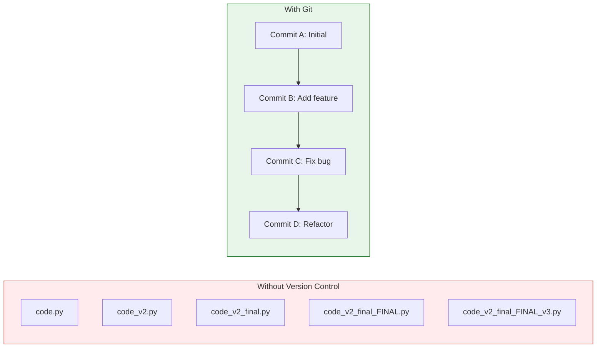

# Lesson 2.0: The Disaster Problem

> **Duration**: 10 min | **Section**: Introduction

## 🎯 The Problem

You've been coding for 3 hours. The app was working. You decided to "clean up" the code.

```python
# Before (working)
def calculate_total(items):
    total = 0
    for item in items:
        total += item.price * item.quantity
    return total
```

You refactor it:

```python
# After (broken, but you don't know why)
def calculate_total(items):
    return sum(i.price * i.qty for i in items)  # Oops: .qty doesn't exist
```

Now nothing works. You can't remember what the original looked like. You saved over the file. **The working version is gone.**

You try:
- `Ctrl+Z` — only goes back 10 changes, not enough
- Close without saving — too late, you already saved
- Look in recycle bin — files aren't there (you edited, not deleted)
- Email yourself the file — you didn't

**You wish you had a time machine.**

## 💀 Real-World Disasters

| Disaster | What Happened |
|:---------|:--------------|
| Junior dev pushes to production | Entire site goes down, no way to rollback |
| "I'll just quickly fix this" | 2 hours later, everything is broken |
| Merge everyone's code on Friday | Conflicts everywhere, nobody knows what's correct |
| Client wants last month's version | "Uh... we don't have that anymore" |
| Laptop gets stolen | All your code is gone forever |

## 🤔 What We Need

A system that:

1. **Saves every version** of your code (not just the latest)
2. **Labels versions** so you know what each one contains
3. **Lets you go back** to any previous version instantly
4. **Works offline** (doesn't need internet)
5. **Syncs with the cloud** so your code is backed up
6. **Allows experimentation** without breaking the main code
7. **Lets teams collaborate** without overwriting each other's work

## 🔍 The Solution Preview



With Git:
- Every save is a "commit" (a snapshot in time)
- Every commit has a message explaining what changed
- You can go back to ANY commit instantly
- You can experiment on branches without affecting the main code
- You can sync with GitHub so your code is never truly lost

## 🎯 What You'll Learn

By the end of this module, you'll be able to:

| Problem | Solution |
|:--------|:---------|
| "I broke the code and can't go back" | `git checkout` to previous commit |
| "I want to try something risky" | Create a branch, experiment safely |
| "My teammate and I edited the same file" | Merge changes, resolve conflicts |
| "I need this code on another computer" | Push to GitHub, clone anywhere |
| "What did I change yesterday?" | `git log` and `git diff` |

## 💡 The Mental Model

Think of Git as:

> **A time machine + parallel universes for your code**

- **Commits** = snapshots (saved moments in time)
- **Branches** = parallel universes (experiment without affecting reality)
- **Merge** = bringing a parallel universe back into reality
- **Remote** = a backup of your time machine in the cloud

Let's build this mental model, step by step.
