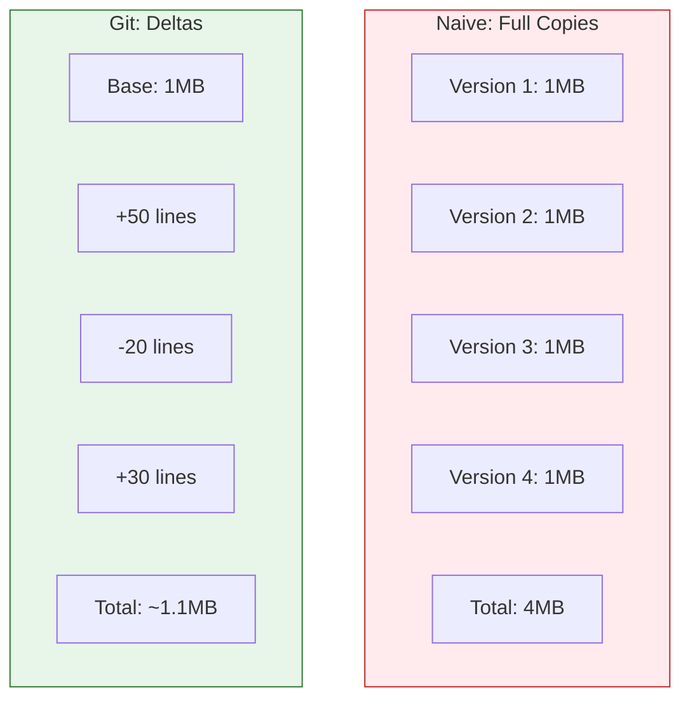
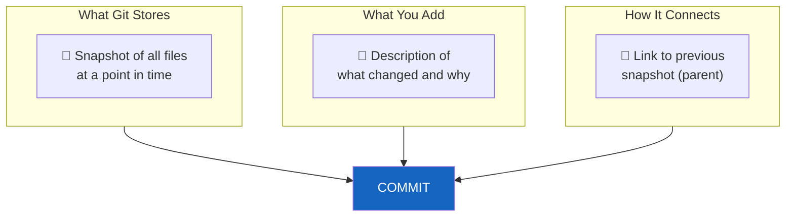
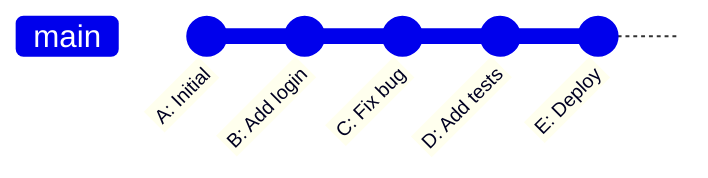
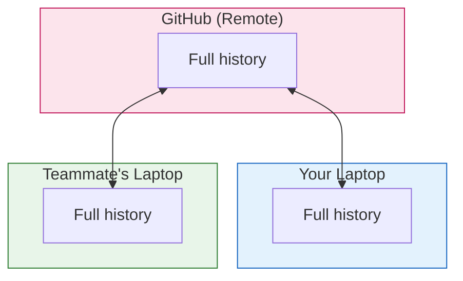
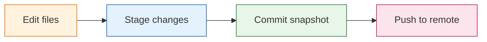

# Lesson 2.1: Version Control: The Time Machine

> **Duration**: 20 min | **Section**: A - What IS Git?

## 🎯 The Problem (3-5 min)

You're working on a project. You make changes. Some are good. Some are bad.

Without version control:
- You can't see what you changed
- You can't undo specific changes
- You can't collaborate without chaos

**Version control** is a system that records changes to files over time so you can recall specific versions later.

> **Scenario**: You're writing a novel. After Chapter 5, you delete Chapter 3 because it "doesn't fit." Two weeks later, you realize Chapter 3 was actually important. But you saved over it. It's gone.

## 🧪 Try It: The Naive Approach (5-10 min)

Without Git, people try:

```
novel.docx
novel_v2.docx
novel_v2_final.docx
novel_v2_final_FINAL.docx
novel_v2_final_FINAL_fixed.docx
novel_v2_final_FINAL_fixed_NEW.docx
```

Or:
```
project/
project_backup/
project_backup_2024_01_15/
project_backup_2024_01_15_before_changes/
project_OLD_DONT_DELETE/
```

**Problems**:
- Which version is actually newest?
- What changed between versions?
- Your disk fills up with copies
- Collaboration? Impossible.

## 🔍 Under the Hood (10-15 min)

### What Git Actually Does

Git tracks **changes** (deltas), not full copies:



### The Three Core Concepts



A **commit** is:
1. A snapshot of your files at that moment
2. A message explaining what you did
3. A pointer to the previous commit

### The Timeline



Each commit knows its parent. You can travel back in time to any point.

### Why "Distributed"?

Git is a **distributed** version control system:



Everyone has the **complete history**. If GitHub goes down, you still have everything.

### Git vs. Other Systems

| Feature | Git | Dropbox/Google Drive |
|:--------|:----|:---------------------|
| Tracks individual changes | ✅ Yes | ❌ Just syncs files |
| Messages for each change | ✅ Yes | ❌ No context |
| Branches for experiments | ✅ Yes | ❌ No |
| Works offline | ✅ Yes | ⚠️ Limited |
| Merge changes intelligently | ✅ Yes | ❌ Last save wins |

## 💥 Where It Breaks (3-5 min)

Git isn't magic. It has limits:

| Situation | Problem | Solution |
|:----------|:--------|:---------|
| Binary files (images, videos) | Git stores full copies, not deltas | Use Git LFS or avoid large binaries |
| Conflicts | Two people edit same line | Manual resolution (you decide) |
| Large repos | Clone takes forever | Shallow clone or Git LFS |
| Learning curve | Commands are confusing | Build the mental model first (this course!) |

## ✅ The Fix (10-15 min)

### The Git Workflow



1. **Edit** your files normally
2. **Stage** the changes you want to save
3. **Commit** with a message explaining what you did
4. **Push** to share with others (optional)

### Key Terms to Know

| Term | Meaning |
|:-----|:--------|
| **Repository (repo)** | A project tracked by Git |
| **Commit** | A saved snapshot |
| **Branch** | A parallel timeline |
| **Remote** | A copy of the repo on a server (like GitHub) |
| **Clone** | Copy a remote repo to your computer |
| **Push** | Upload commits to remote |
| **Pull** | Download commits from remote |

## 🎯 Practice

Think about your own projects:

1. **Identify a disaster**: When did you wish you could go back?
2. **Spot the pattern**: How do you currently "backup" code?
3. **Anticipate the benefit**: What would change if you could see every version?

## 🔑 Key Takeaways

- Version control = time machine for code
- Git tracks **changes**, not full copies
- Every commit is a snapshot + message + link to parent
- Git is **distributed**: everyone has the full history
- Git works offline; you sync when you're ready

## ❓ Common Questions

| Question | Answer |
|----------|--------|
| Is Git only for code? | No, it works for any text files (docs, configs, data). |
| Do I need GitHub to use Git? | No, Git works entirely locally. GitHub is just a remote. |
| How is Git different from saving files? | Git tracks history, shows diffs, enables branching. Saving just overwrites. |
| Is Git hard to learn? | The commands are simple. The mental model takes time. |

## 🔗 Further Reading

- [Git - About Version Control](https://git-scm.com/book/en/v2/Getting-Started-About-Version-Control)
- [Visual Git Guide](https://marklodato.github.io/visual-git-guide/index-en.html)
