# Lesson 2.2: Git Under the Hood

> **Duration**: 25 min | **Section**: A - What IS Git?

## 🎯 The Problem (3-5 min)

You type `git commit`. Something happens. But what?

Where does the code go? How does Git "remember" every version? What's inside that mysterious `.git` folder?

Understanding what's happening under the hood transforms Git from magic into a tool you truly control.

> **Scenario**: Your `.git` folder is 50MB, but your project files are only 5MB. What's in there? Why is it so big?

## 🧪 Try It: The Naive Approach (5-10 min)

People often think:
- "Git uploads my code somewhere" (it doesn't, until you push)
- "Git copies my files each commit" (it doesn't, it stores deltas)
- "Git is just a backup system" (it's much more)

Let's look inside:

```bash
ls -la .git/
```

```
drwxr-xr-x  HEAD
drwxr-xr-x  config
drwxr-xr-x  hooks/
drwxr-xr-x  objects/
drwxr-xr-x  refs/
...
```

This is Git's database. Everything it knows is in here.

## 🔍 Under the Hood (10-15 min)

### The Four Git Objects

Git stores everything as one of four object types:

```mermaid
flowchart TD
    subgraph OBJECTS["Git Objects"]
        BLOB["📄 Blob
        (file contents)"]
        TREE["📁 Tree
        (directory listing)"]
        COMMIT["📸 Commit
        (snapshot + metadata)"]
        TAG["🏷️ Tag
        (named reference)"]
    end
    
    COMMIT --> TREE
    TREE --> BLOB
    TREE --> TREE2["📁 Subtree"]
    
    style BLOB fill:#FFF3E0,stroke:#EF6C00
    style TREE fill:#E3F2FD,stroke:#1565C0
    style COMMIT fill:#E8F5E9,stroke:#2E7D32
    style TAG fill:#FCE4EC,stroke:#C2185B
```



| Object | What It Stores |
|:-------|:---------------|
| **Blob** | The contents of a file (not the name!) |
| **Tree** | A directory: maps names to blobs/trees |
| **Commit** | A snapshot: tree + parent + author + message |
| **Tag** | A named pointer to a commit |

### How a Commit Works

When you commit:

```mermaid
flowchart TD
    subgraph WORKDIR["Your Files"]
        W1["app.py"]
        W2["README.md"]
        W3["utils/
        └── helper.py"]
    end
    
    subgraph COMMIT["Commit Object"]
        C["tree: abc123
        parent: def456
        author: Alice
        message: 'Add feature'"]
    end
    
    subgraph TREE["Tree (abc123)"]
        T["app.py → blob1
        README.md → blob2
        utils → tree2"]
    end
    
    subgraph BLOBS["Blobs"]
        B1["blob1: print('hi')"]
        B2["blob2: # Readme"]
        B3["blob3: def help()..."]
    end
    
    WORKDIR -->|"git commit"| COMMIT
    COMMIT --> TREE
    TREE --> BLOBS
```



### Content-Addressable Storage

Every object is named by its **SHA-1 hash** (40 characters):

```bash
git log --oneline
# a1b2c3d Add login feature
# e4f5g6h Initial commit
```

That `a1b2c3d` isn't just an ID—it's a checksum of the content:

```bash
echo "hello" | git hash-object --stdin
# ce013625030ba8dba906f756967f9e9ca394464a
```

**Same content = same hash**. Always.

This means:
- Git knows if anything changed (hash would be different)
- Identical files are stored only once
- Data integrity is guaranteed

### The .git Directory Structure

```
.git/
├── HEAD              # Points to current branch
├── config            # Repository settings
├── index             # The staging area
├── objects/          # All blobs, trees, commits
│   ├── a1/          # First 2 chars of hash
│   │   └── b2c3d... # Rest of hash (the actual object)
│   └── pack/        # Compressed objects
└── refs/             # Branch and tag pointers
    ├── heads/       # Local branches
    │   └── main     # Points to latest commit on main
    └── remotes/     # Remote-tracking branches
        └── origin/
            └── main
```

### What is HEAD?

**HEAD** = "Where you are right now"

```bash
cat .git/HEAD
# ref: refs/heads/main
```

HEAD usually points to a branch, which points to a commit:


### Branches Are Just Pointers

A branch is just a file containing a commit hash:

```bash
cat .git/refs/heads/main
# a1b2c3d4e5f6g7h8i9j0k1l2m3n4o5p6q7r8s9t0
```

That's it! Creating a branch is instant because you're just creating a tiny file.

## 💥 Where It Breaks (3-5 min)

| Situation | Why It Happens |
|:----------|:---------------|
| `.git` folder huge | Large binary files stored as blobs |
| Can't find old commit | It was garbage collected (unreferenced) |
| "Detached HEAD" scary message | HEAD points to commit, not branch |
| Slow clone | Many objects to download |

### Detached HEAD

Normally:
```
HEAD → main → commit
```

Detached HEAD:
```
HEAD → commit (no branch!)
```

This happens when you `checkout` a specific commit. Any new commits won't be on a branch!

## ✅ The Fix (10-15 min)

### Exploring Your Repository

```bash
# See what HEAD points to
cat .git/HEAD

# See where a branch points
cat .git/refs/heads/main

# See object contents (blob, tree, or commit)
git cat-file -p <hash>

# See object type
git cat-file -t <hash>

# See all objects
find .git/objects -type f
```

### Example Exploration

```bash
# Get the current commit hash
git rev-parse HEAD
# a1b2c3d...

# See commit details
git cat-file -p a1b2c3d
# tree abc123...
# parent def456...
# author Alice <alice@example.com> 1234567890 -0500
# 
# Add login feature

# See the tree (directory listing)
git cat-file -p abc123
# 100644 blob 111... app.py
# 100644 blob 222... README.md
# 040000 tree 333... utils

# See a file's contents
git cat-file -p 111
# print('hello world')
```

### Quick Reference

```bash
# View object contents
git cat-file -p <hash>

# View object type
git cat-file -t <hash>

# Show where HEAD points
git symbolic-ref HEAD

# Show commit hash of HEAD
git rev-parse HEAD

# Show all branches and their commits
git branch -v
```

## 🎯 Practice

1. Look at your HEAD:
   ```bash
   cat .git/HEAD
   ```

2. Find a commit hash:
   ```bash
   git log --oneline -1
   ```

3. Examine the commit:
   ```bash
   git cat-file -p <hash>
   ```

4. Look at the tree:
   ```bash
   git cat-file -p <tree-hash>
   ```

5. Look at a blob:
   ```bash
   git cat-file -p <blob-hash>
   ```

## 🔑 Key Takeaways

- Git stores 4 object types: blob, tree, commit, tag
- Everything is named by its SHA-1 hash (content-addressable)
- `.git/objects/` contains all the data
- Branches are just files containing commit hashes
- HEAD points to your current position (usually a branch)
- Same content = same hash (deduplication for free)

## ❓ Common Questions

| Question | Answer |
|----------|--------|
| What happens if I delete `.git`? | You lose ALL history. Just the current files remain. |
| Can two different files have the same hash? | Theoretically possible (collision), practically never happens. |
| Why SHA-1? Is it secure? | Git uses SHA-1 for integrity, not security. Collision attacks exist but don't affect normal use. |
| What's `git gc`? | Garbage collection—cleans up unreferenced objects, compresses data. |

## 🔗 Further Reading

- [Pro Git: Git Internals](https://git-scm.com/book/en/v2/Git-Internals-Plumbing-and-Porcelain)
- [Git Object Model](https://git-scm.com/book/en/v2/Git-Internals-Git-Objects)
