# Lesson 2.3: Your First Repository

> **Duration**: 20 min | **Section**: A - What IS Git?

## 🎯 The Problem (3-5 min)

You have a project folder. You want Git to track it. How do you turn a regular folder into a Git repository?

> **Scenario**: You've been writing code for a week. No version control. You realize you should have been using Git from the start. How do you add Git to an existing project?

## 🧪 Try It: The Naive Approach (5-10 min)

You might think you need to:
- Create a GitHub account first (you don't)
- Upload somewhere (you don't)
- Install something special (just Git)

The truth: Git works entirely locally. One command creates a repository.

## 🔍 Under the Hood (10-15 min)

### Creating a Repository

```bash
mkdir my-project
cd my-project
git init
```

Output:
```
Initialized empty Git repository in /home/alice/my-project/.git/
```

**That's it.** You now have a Git repository.

### What Just Happened?

```mermaid
flowchart LR
    subgraph BEFORE["Before git init"]
        B1["my-project/
        └── (empty)"]
    end
    
    subgraph AFTER["After git init"]
        A1["my-project/
        ├── .git/
        │   ├── HEAD
        │   ├── config
        │   ├── objects/
        │   └── refs/
        └── (your files)"]
    end
    
    BEFORE -->|"git init"| AFTER
    
    style BEFORE fill:#FFEBEE,stroke:#C62828
    style AFTER fill:#E8F5E9,stroke:#2E7D32
```



Git created a `.git` folder containing:
- The object database (empty for now)
- Configuration for this repo
- A HEAD pointing to a branch that doesn't exist yet

### The Empty Commit Situation

Right after `git init`:

```bash
git status
```

```
On branch main

No commits yet

nothing to commit (create/copy files and use "git add" to track)
```

You're on branch `main` (or `master`), but there are no commits. The branch doesn't really exist yet—it will be created with your first commit.

### Checking Repository Status

```bash
git status
```

This is your most-used command. It tells you:
- What branch you're on
- What's staged (ready to commit)
- What's modified (changed but not staged)
- What's untracked (new files Git doesn't know about)

### Adding Files

```bash
# Create a file
echo "# My Project" > README.md

# Check status
git status
```

```
On branch main

No commits yet

Untracked files:
  (use "git add <file>..." to include in what will be committed)
        README.md

nothing added to commit but untracked files present
```

**Untracked** = Git sees the file but isn't tracking changes to it.

### For Existing Projects

Already have code? Same process:

```bash
cd existing-project
git init
git add .
git commit -m "Initial commit"
```

Now Git tracks everything.

## 💥 Where It Breaks (3-5 min)

| Mistake | What Happens | Fix |
|:--------|:-------------|:----|
| `git init` in home directory | Tracks ALL your files (bad!) | `rm -rf ~/.git` |
| `git init` in existing repo | Reinitializes (usually harmless) | No action needed |
| Forgot you're in a repo | Nested repos get confusing | Check with `git status` |

### The Accidental Home Directory Repo

```bash
cd ~
git init    # DISASTER: now tracking all your files!
```

Fix:
```bash
rm -rf ~/.git
```

Always `pwd` first and be in a project-specific folder.

## ✅ The Fix (10-15 min)

### The Proper Setup Flow

```bash
# 1. Create and enter project directory
mkdir my-project
cd my-project

# 2. Initialize Git
git init

# 3. Create initial files
echo "# My Project" > README.md
echo "*.log" > .gitignore

# 4. Stage everything
git add .

# 5. First commit
git commit -m "Initial commit"

# 6. Verify
git log --oneline
```

### Setting Your Identity

Git needs to know who you are (for commit authorship):

```bash
# Set globally (for all repos)
git config --global user.name "Your Name"
git config --global user.email "your.email@example.com"

# Or per-repo (in the repo directory)
git config user.name "Your Name"
git config user.email "your.email@example.com"
```

Check your config:
```bash
git config --list
```

### Quick Reference

```bash
# Create new repository
git init

# Check status
git status

# Configure identity
git config --global user.name "Name"
git config --global user.email "email"

# View config
git config --list
```

## 🎯 Practice

1. Create a new project:
   ```bash
   mkdir git-practice
   cd git-practice
   ```

2. Initialize Git:
   ```bash
   git init
   ```

3. Explore what was created:
   ```bash
   ls -la
   ls -la .git/
   ```

4. Check status:
   ```bash
   git status
   ```

5. Add a file:
   ```bash
   echo "# Git Practice" > README.md
   git status
   ```

6. Verify you're set up for commits:
   ```bash
   git config user.name
   git config user.email
   ```

## 🔑 Key Takeaways

- `git init` creates a repository (adds `.git` folder)
- Repository is local—no internet needed
- `git status` shows current state
- New files are "untracked" until added
- Set `user.name` and `user.email` before committing
- Don't `git init` in home directory!

## ❓ Common Questions

| Question | Answer |
|----------|--------|
| Do I need GitHub to use Git? | No, Git works entirely offline. GitHub is optional. |
| What's the difference between Git and GitHub? | Git is the tool. GitHub is a website that hosts Git repos. |
| Can I undo `git init`? | Yes, just delete the `.git` folder. |
| What's `.gitignore`? | A file listing patterns of files Git should ignore (logs, secrets, etc.). |

## 🔗 Further Reading

- [git init documentation](https://git-scm.com/docs/git-init)
- [Setting up Git](https://git-scm.com/book/en/v2/Getting-Started-First-Time-Git-Setup)
