# Lesson 2.4: Making Snapshots

> **Duration**: 25 min | **Section**: A - What IS Git?

## 🎯 The Problem (3-5 min)

You've made changes. You want to save them as a checkpoint. How do you tell Git "remember this moment"?

> **Scenario**: You fixed three bugs and added a feature. You want to save your progress so you can always come back to this exact state. How?

## 🧪 Try It: The Naive Approach (5-10 min)

You might try:
```bash
git save        # Doesn't exist
git checkpoint  # Doesn't exist
git backup      # Doesn't exist
```

Git uses a two-step process:
1. **Stage** the changes you want to save
2. **Commit** to create the snapshot

Why two steps? Control. You might not want to save ALL changes at once.

## 🔍 Under the Hood (10-15 min)

### The Three States


| State | Location | Meaning |
|:------|:---------|:--------|
| **Modified** | Working Dir | You changed a file |
| **Staged** | Staging Area | You marked it for next commit |
| **Committed** | Repository | It's saved forever |

### Step 1: Stage Changes with `git add`

```bash
# Stage specific file
git add filename.py

# Stage multiple files
git add file1.py file2.py

# Stage all changes in current directory
git add .

# Stage all changes everywhere
git add -A

# Stage parts of a file (interactive)
git add -p filename.py
```

After `git add`, check status:
```bash
git status
```

```
Changes to be committed:
  (use "git restore --staged <file>..." to unstage)
        modified:   app.py
        new file:   utils.py
```

### Step 2: Commit with `git commit`

```bash
# Commit with message (preferred)
git commit -m "Add login feature"

# Commit with multi-line message (opens editor)
git commit

# Stage and commit in one step (only tracked files)
git commit -am "Fix bug in calculation"
```

### What Makes a Good Commit Message?

**Bad messages**:
```
git commit -m "stuff"
git commit -m "fix"
git commit -m "update"
git commit -m "asdfasdf"
```

**Good messages**:
```
git commit -m "Add user authentication with JWT tokens"
git commit -m "Fix division by zero in calculate_average"
git commit -m "Update README with installation instructions"
```

**Conventional commits** (used in professional projects):
```
feat: add login functionality
fix: prevent crash when input is empty
docs: update API documentation
refactor: simplify validation logic
test: add unit tests for User class
```

### The Staging Area: Why?

Why not just `git commit` directly?

```mermaid
flowchart TD
    subgraph SCENARIO["You changed 5 files"]
        F1["app.py - bug fix"]
        F2["styles.css - UI tweak"]
        F3["debug.log - garbage"]
        F4["config.py - new feature"]
        F5["config.py.bak - accident"]
    end
    
    subgraph STAGING["Staging lets you choose"]
        ADD1["git add app.py
        → Commit 1: 'Fix bug'"]
        ADD2["git add styles.css
        → Commit 2: 'Update UI'"]
        SKIP["Don't add logs or backups"]
    end
    
    SCENARIO --> STAGING
    
    style SKIP fill:#FFEBEE,stroke:#C62828
```



The staging area lets you:
- Split changes into logical commits
- Review what you're about to commit
- Leave some changes for later

### Viewing Staged Changes

```bash
# What's staged vs not staged
git status

# Diff of unstaged changes
git diff

# Diff of staged changes
git diff --staged
```

## 💥 Where It Breaks (3-5 min)

| Mistake | What Happens | Fix |
|:--------|:-------------|:----|
| Committed wrong file | File is in history | `git reset HEAD~1` to undo |
| Typo in commit message | Message is permanent | `git commit --amend` |
| Forgot to add a file | Commit is incomplete | Add and `--amend` |
| Added secrets | Secrets in history! | Use `git filter-branch` or BFG |

### Unstaging Files

```bash
# Unstage a file (keep changes)
git restore --staged filename.py
# Or older syntax:
git reset HEAD filename.py

# Discard changes entirely (DANGER)
git restore filename.py
# Or older syntax:
git checkout -- filename.py
```

### Amending the Last Commit

```bash
# Fix the message
git commit --amend -m "Better message"

# Add forgotten files
git add forgotten_file.py
git commit --amend --no-edit
```

⚠️ **Warning**: Only amend commits you haven't pushed yet!

## ✅ The Fix (10-15 min)

### The Complete Workflow

```bash
# 1. Make changes to files
echo "print('hello')" >> app.py

# 2. Check what changed
git status
git diff

# 3. Stage changes
git add app.py

# 4. Verify staged changes
git status
git diff --staged

# 5. Commit
git commit -m "Add greeting to app"

# 6. Verify commit
git log --oneline
```

### Quick Reference

```bash
# Stage files
git add <file>           # Stage specific file
git add .                # Stage all in current directory
git add -A               # Stage everything

# Unstage files
git restore --staged <file>

# Commit
git commit -m "message"  # Commit with message
git commit               # Opens editor for message
git commit -am "msg"     # Stage tracked + commit

# View changes
git diff                 # Unstaged changes
git diff --staged        # Staged changes
git status               # Overview

# Fix mistakes
git commit --amend       # Modify last commit
git restore <file>       # Discard changes
```

## 🎯 Practice

1. Create a new file:
   ```bash
   echo "line 1" > practice.txt
   ```

2. Check status (untracked):
   ```bash
   git status
   ```

3. Stage it:
   ```bash
   git add practice.txt
   git status  # Now shows as "new file"
   ```

4. Commit:
   ```bash
   git commit -m "Add practice file"
   ```

5. Make a change:
   ```bash
   echo "line 2" >> practice.txt
   git status  # Shows as modified
   git diff    # Shows the change
   ```

6. Stage and commit:
   ```bash
   git add practice.txt
   git commit -m "Add second line"
   ```

7. View history:
   ```bash
   git log --oneline
   ```

## 🔑 Key Takeaways

- **Staging** (`git add`) = marking changes for commit
- **Commit** = saving a snapshot with a message
- Use the staging area to create logical, focused commits
- Write clear, descriptive commit messages
- `git status` is your friend—use it constantly
- `git diff` shows what changed, `git diff --staged` shows what's staged

## ❓ Common Questions

| Question | Answer |
|----------|--------|
| Why stage then commit? | Control—you can pick which changes to include. |
| Can I undo a commit? | Yes, `git reset` or `git revert` (covered later). |
| How often should I commit? | Often! Whenever you complete a logical unit of work. |
| What if I commit secrets? | They're in history forever. Use tools like BFG to remove them. |

## 🔗 Further Reading

- [git add documentation](https://git-scm.com/docs/git-add)
- [git commit documentation](https://git-scm.com/docs/git-commit)
- [Conventional Commits](https://www.conventionalcommits.org/)
