# Lesson 2.5: Viewing History

> **Duration**: 20 min | **Section**: A - What IS Git?

## 🎯 The Problem (3-5 min)

You've been committing for days. Now you need to:
- See what you did last week
- Find when a bug was introduced
- Understand what changed between versions
- Find a specific commit to go back to

**How do you explore Git's history?**

> **Scenario**: The login feature was working yesterday. Today it's broken. Somewhere in the last 10 commits, something changed. How do you find it?

## 🧪 Try It: The Naive Approach (5-10 min)

You might try:
```bash
git history     # Doesn't exist
git show-all    # Doesn't exist
```

The command is `git log`:
```bash
git log
```

But the default output is overwhelming:
```
commit a1b2c3d4e5f6g7h8i9j0k1l2m3n4o5p6q7r8s9t0
Author: Alice <alice@example.com>
Date:   Mon Jan 15 14:30:00 2024 -0500

    Add login feature

commit b2c3d4e5f6g7h8i9j0k1l2m3n4o5p6q7r8s9t0u1
Author: Alice <alice@example.com>
Date:   Mon Jan 15 12:00:00 2024 -0500

    Initial commit
```

Pages and pages of this. There are better ways.

## 🔍 Under the Hood (10-15 min)

### git log Variations

```bash
# One line per commit
git log --oneline

# With graph showing branches
git log --oneline --graph

# Last 5 commits
git log -5

# Commits by author
git log --author="Alice"

# Commits in date range
git log --since="2024-01-01" --until="2024-01-31"

# Commits affecting a file
git log -- path/to/file.py

# Search commit messages
git log --grep="fix"
```


### Viewing Specific Commits

```bash
# Show a specific commit
git show abc1234

# Show commit with stats
git show abc1234 --stat

# Show just the message
git log -1 abc1234 --format="%s"
```

### Comparing Changes with git diff

```bash
# Changes in working directory (unstaged)
git diff

# Changes that are staged
git diff --staged

# Changes between commits
git diff abc1234 def5678

# Changes between branches
git diff main feature

# Changes in a specific file
git diff abc1234 def5678 -- file.py
```



```mermaid
flowchart LR
    subgraph DIFF["git diff scenarios"]
        D1["git diff
        → working vs staged"]
        D2["git diff --staged
        → staged vs last commit"]
        D3["git diff A B
        → commit A vs commit B"]
    end
    
    style DIFF fill:#2E7D32,color:#fff
```

### Understanding Diff Output

```diff
diff --git a/app.py b/app.py
index 1234567..abcdefg 100644
--- a/app.py
+++ b/app.py
@@ -1,5 +1,6 @@
 def main():
-    print("hello")
+    print("hello world")
+    print("welcome!")
     return 0
```

| Line | Meaning |
|:-----|:--------|
| `---` | Old version |
| `+++` | New version |
| `-` | Line removed |
| `+` | Line added |
| `@@` | Line numbers (old, new) |

### Useful Log Formats

```bash
# Compact with decoration
git log --oneline --decorate --graph --all

# Custom format
git log --format="%h %an %ar %s"
# abc1234 Alice 2 hours ago Add feature

# Statistics
git log --stat

# Show changed files only
git log --name-only

# Show what changed in each file
git log -p
```

### git blame: Who Changed What?

```bash
git blame file.py
```

```
a1b2c3d4 (Alice 2024-01-15 10:00:00 +0000  1) def main():
b2c3d4e5 (Bob   2024-01-16 14:30:00 +0000  2)     print("hello")
a1b2c3d4 (Alice 2024-01-15 10:00:00 +0000  3)     return 0
```

Each line shows who last modified it and when.

## 💥 Where It Breaks (3-5 min)

| Problem | Cause | Solution |
|:--------|:------|:---------|
| Log too long | Many commits | Use `-n 10` or `--oneline` |
| Can't find commit | Wrong branch | Add `--all` |
| Merge commits confusing | Complex history | Use `--first-parent` |
| Diff unreadable | Too many changes | Diff specific files |

## ✅ The Fix (10-15 min)

### Common History Workflows

**Find when something changed**:
```bash
# Search commit messages
git log --oneline --grep="login"

# Find commits changing a file
git log --oneline -- src/auth.py

# Blame a specific line
git blame -L 10,20 src/auth.py
```

**Compare versions**:
```bash
# What changed in the last commit?
git show HEAD

# What changed between yesterday and today?
git log --since="yesterday"

# Diff between two branches
git diff main feature
```

**Get a quick overview**:
```bash
# My most-used log command
git log --oneline --graph --all --decorate
```

### Quick Reference

```bash
# === View History ===
git log                      # Full log
git log --oneline           # Compact
git log -n 5                # Last 5
git log --graph             # Show branches
git log --all               # All branches
git log -- file.py          # Specific file
git log --author="name"     # By author
git log --grep="text"       # Search messages

# === Show Specific Commits ===
git show <commit>           # Details of commit
git show HEAD               # Latest commit
git show HEAD~1             # Previous commit

# === Compare Changes ===
git diff                    # Working vs staged
git diff --staged           # Staged vs committed
git diff A B                # Between commits
git diff A B -- file        # For specific file

# === Who Changed What ===
git blame file.py           # Line-by-line authorship
git blame -L 10,20 file.py  # Specific lines
```

## 🎯 Practice

1. View your log:
   ```bash
   git log --oneline
   ```

2. See details of a commit:
   ```bash
   git show HEAD
   ```

3. Compare commits:
   ```bash
   git diff HEAD~1 HEAD
   ```

4. Check who wrote what:
   ```bash
   git blame README.md
   ```

5. Search history:
   ```bash
   git log --grep="add"
   ```

6. Create an alias for common log format:
   ```bash
   git config --global alias.lg "log --oneline --graph --all --decorate"
   git lg
   ```

## 🔑 Key Takeaways

- `git log` shows commit history
- `--oneline --graph` makes it readable
- `git diff` shows what changed between versions
- `git show <commit>` shows details of a specific commit
- `git blame` shows who changed each line
- Use filters (`--author`, `--grep`, `-- file`) to find specific commits

## ❓ Common Questions

| Question | Answer |
|----------|--------|
| How do I find a deleted file? | `git log --all -- path/to/file` |
| How do I see changes from 2 weeks ago? | `git log --since="2 weeks ago"` |
| What's HEAD~1? | The commit before HEAD (parent). HEAD~2 is grandparent. |
| How do I exit git log? | Press `q` (it uses a pager like `less`) |

## 🔗 Further Reading

- [git log documentation](https://git-scm.com/docs/git-log)
- [git diff documentation](https://git-scm.com/docs/git-diff)
- [Git Log Formatting](https://git-scm.com/docs/pretty-formats)
