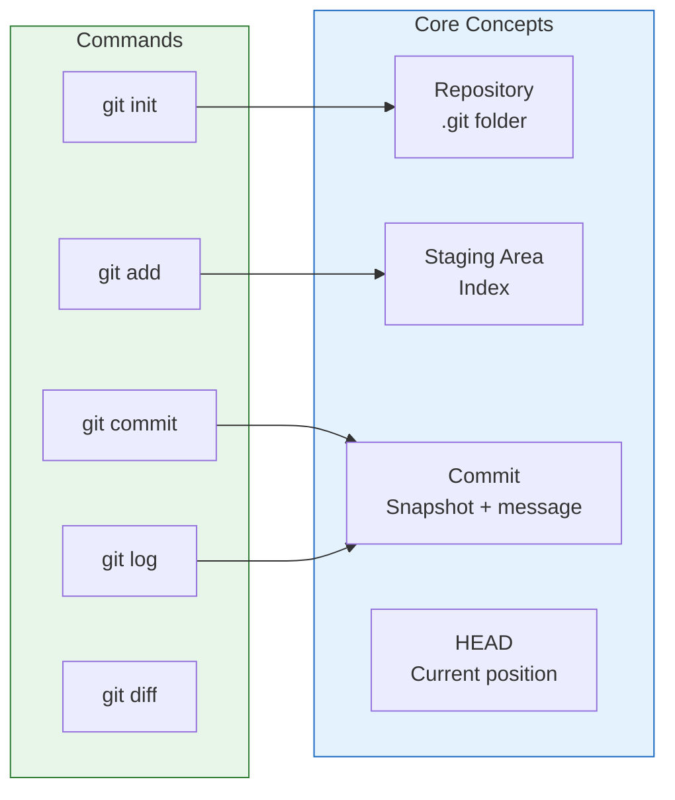
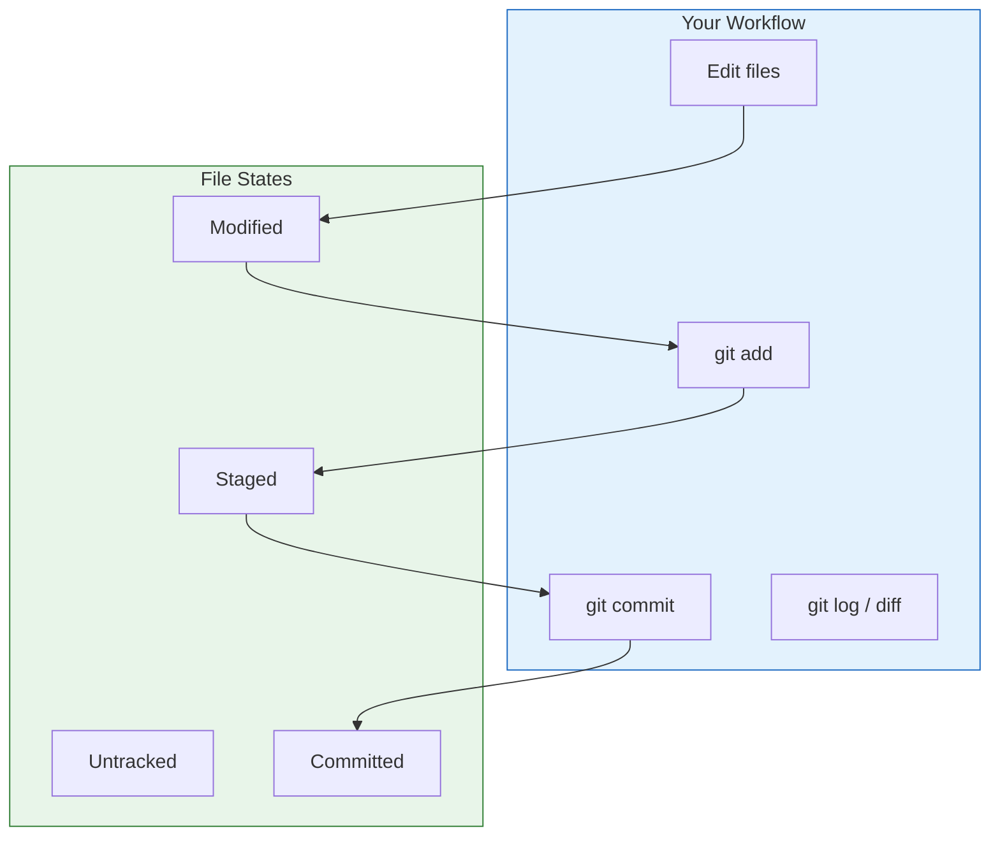

# Lesson 2.6: Git Basics Q&A

> **Duration**: 10 min | **Section**: A - What IS Git? (Wrap-up)

## 📋 Section A Summary



## 🧠 Concept Check

| Concept | Question | Answer |
|:--------|:---------|:-------|
| Repository | What creates a repo? | `git init` (creates `.git` folder) |
| Staging | What's the point of staging? | Control what goes in each commit |
| Commit | What's in a commit? | Snapshot + message + parent pointer |
| HEAD | What is HEAD? | Pointer to current commit/branch |
| History | How do you see history? | `git log` |
| Changes | How do you see what changed? | `git diff` |

## ❓ Frequently Asked Questions

### Repository Basics

| Question | Answer |
|----------|--------|
| Can I have nested Git repos? | Technically yes (submodules), but usually avoid it. |
| What if I init in wrong folder? | `rm -rf .git` to remove Git. |
| Can I move a Git repo? | Yes, just move the whole folder. The `.git` stays inside. |
| What files should I NOT commit? | Secrets, build outputs, dependencies, large binaries. Use `.gitignore`. |

### Staging and Committing

| Question | Answer |
|----------|--------|
| Can I unstage a file? | `git restore --staged file` |
| Can I commit some changes from a file, not all? | `git add -p file` (interactive) |
| What if I commit the wrong thing? | `git reset HEAD~1` (undo last commit, keep changes) |
| How do I change my last commit message? | `git commit --amend -m "new message"` |

### History and Navigation

| Question | Answer |
|----------|--------|
| What's HEAD? | A pointer to your current position (usually a branch) |
| What's HEAD~1? | The commit before HEAD (parent) |
| What's HEAD^? | Same as HEAD~1 (first parent) |
| How do I go back to a previous commit? | `git checkout abc1234` (detached HEAD—be careful!) |
| What's "detached HEAD"? | HEAD points to a commit, not a branch. New commits won't be on any branch. |

### Common Mistakes

| Mistake | Fix |
|:--------|:----|
| Committed secrets | `git reset HEAD~1`, remove secret, commit again. For pushed commits, use BFG Repo Cleaner. |
| Typo in commit message | `git commit --amend -m "fixed message"` |
| Forgot to add a file | `git add file && git commit --amend --no-edit` |
| Committed to wrong branch | `git reset HEAD~1`, `git stash`, `git checkout correct-branch`, `git stash pop` |

## 🔗 Command Quick Reference

```bash
# === SETUP ===
git init                    # Create repository
git config user.name "N"    # Set your name
git config user.email "E"   # Set your email

# === STAGING ===
git status                  # What's changed?
git add <file>             # Stage a file
git add .                   # Stage everything
git add -p <file>          # Stage interactively
git restore --staged <f>    # Unstage

# === COMMITTING ===
git commit -m "message"     # Commit staged changes
git commit -am "msg"        # Stage tracked + commit
git commit --amend         # Modify last commit

# === HISTORY ===
git log                     # Full history
git log --oneline          # Compact history
git log --graph            # Visual branches
git show <commit>          # Commit details

# === COMPARING ===
git diff                    # Unstaged changes
git diff --staged          # Staged changes
git diff A B               # Between commits
git blame <file>           # Line authorship

# === UNDO ===
git restore <file>         # Discard changes
git reset HEAD~1           # Undo last commit (keep changes)
git reset --hard HEAD~1    # Undo last commit (LOSE changes)
```

## 📊 The Git Mental Model So Far



## 💥 Common Pitfalls

| Pitfall | What Happens | Fix |
|---------|--------------|-----|
| `git add .` in wrong directory | Stages files from parent folders | Always check `git status` first |
| Committing without `-m` | Opens vim/nano unexpectedly | Learn to exit (`:wq` for vim) or use `git commit -m "msg"` |
| `git reset --hard` without thinking | Loses uncommitted work forever | Use `git stash` first to save work |
| Committing secrets/passwords | Exposed in history forever | Use `.gitignore`, check before commit |
| Giant commit with vague message | Can't find changes later | Small commits, descriptive messages |

## 🔑 Key Takeaways

1. **Git is local first** - Everything happens on your machine until you push
2. **Staging is intentional** - You control exactly what goes in each commit
3. **Commits are snapshots** - Each commit captures your entire project state
4. **History is searchable** - `git log` and `git diff` are your investigation tools
5. **Mistakes are fixable** - `git reset`, `git restore`, and `git commit --amend` save the day
6. **HEAD points to now** - Always know where you are with `git status`

## ✅ Section Complete!

You now understand:
- What Git is and why it exists
- How commits, staging, and the repository work
- How to create repos, make commits, and view history
- The three states: working directory, staging, committed

**Next up**: Section B - Branching

We'll explore:
- Parallel timelines for your code
- Safe experimentation
- Merging changes
- Resolving conflicts
