# Lesson 2.7: The Feature Problem

> **Duration**: 5 min | **Section**: B - Branching (Introduction)

## 🎯 The Problem

You have a working app. Your boss says: "Add a dark mode feature."

You start coding. Halfway through, dark mode is broken—styles are messed up, nothing renders correctly.

Then: "Emergency! There's a bug in production. Fix it NOW."

But your codebase is half-dark-mode, half-broken. You can't ship this. And you can't just "undo" the dark mode work—you've been at it for two days.

**You're stuck.**

## 💀 The Scenarios

| Situation | Problem |
|:----------|:--------|
| Experimenting with risky code | One mistake breaks everything |
| Working on feature while bug appears | Can't switch context cleanly |
| Multiple people editing same files | Chaos when combining work |
| Client wants to see "old" version | Which commit? How to run it? |

## 🤔 What We Need

A way to:

1. **Experiment safely** without breaking the main code
2. **Switch context** instantly between tasks
3. **Work in parallel** on multiple features
4. **Merge work** back together when ready

## 🔍 The Solution: Branches

With branches:
- **Main** stays stable (always deployable)
- **Feature** is your experimental playground
- When emergency comes, switch to main, fix, ship
- When feature is ready, merge it in

## 🎯 What You'll Learn

| Problem | Solution |
|:--------|:---------|
| "I want to try something risky" | Create a branch |
| "I need to fix a bug, but I'm mid-feature" | Switch branches |
| "My feature is done" | Merge the branch |
| "We both changed the same line" | Resolve the conflict |

## 💡 The Mental Model

Think of branches as **parallel universes**:

> In Universe A (main), the app works.  
> In Universe B (feature), you're experimenting.  
> Universe A is unaffected by Universe B.  
> When Universe B is stable, you merge it into A.

```mermaid
flowchart LR
    subgraph MAIN["🌍 Main Universe"]
        M1["Stable"]
        M2["Bug fixes go here"]
        M3["Always deployable"]
    end
    
    subgraph FEATURE["🔬 Feature Universe"]
        F1["Experiments"]
        F2["Can be broken"]
        F3["Isolated from main"]
    end
    
    MAIN -.->|"branch"| FEATURE
    FEATURE -.->|"merge"| MAIN
    
    style MAIN fill:#E8F5E9,stroke:#2E7D32
    style FEATURE fill:#E3F2FD,stroke:#1565C0
```

Let's learn how to create these parallel universes.
