# Lesson 2.8: Branches Under the Hood

> **Duration**: 25 min | **Section**: B - Branching

## 🎯 The Problem (3-5 min)

You hear "branches" and think:
- Copies of the entire codebase?
- Expensive to create?
- Complicated to manage?

Actually, branches are shockingly simple. Let's see how they really work.

> **Scenario**: Your team creates 20 feature branches per week. If each was a full copy, your disk would explode. How does Git handle this?

## 🧪 Try It: The Naive Approach (5-10 min)

Without Git branches, you might:
```
project/
project-feature-a/
project-feature-b/
project-feature-a-backup/
```

Full copies everywhere. Slow to create. Hard to merge.

Git branches are fundamentally different.

## 🔍 Under the Hood (10-15 min)

### A Branch Is Just a Pointer

A branch is literally a file containing a commit hash:

```bash
cat .git/refs/heads/main
# a1b2c3d4e5f6g7h8i9j0k1l2m3n4o5p6q7r8s9t0
```

That's it. **41 bytes.** Creating a branch is instant.

```mermaid
flowchart LR
    subgraph REFS["Branch Pointers"]
        MAIN["main → abc123"]
        FEATURE["feature → def456"]
    end
    
    subgraph COMMITS["Commits"]
        C1["abc123"]
        C2["def456"]
        C3["ghi789"]
    end
    
    MAIN --> C1
    FEATURE --> C2
    C2 --> C1
    C3 --> C1
    
    style REFS fill:#E3F2FD,stroke:#1565C0
    style COMMITS fill:#E8F5E9,stroke:#2E7D32
```



### Creating a Branch

```bash
git branch feature
```

What this does:
1. Creates file `.git/refs/heads/feature`
2. Writes current commit hash to it
3. **That's it.** No files copied.

```mermaid
flowchart TD
    subgraph BEFORE["Before: git branch feature"]
        B1["main → C"]
        B2["HEAD → main"]
    end
    
    subgraph AFTER["After"]
        A1["main → C"]
        A2["feature → C"]
        A3["HEAD → main (still!)"]
    end
    
    BEFORE --> AFTER
    
    style BEFORE fill:#FFF3E0,stroke:#EF6C00
    style AFTER fill:#E8F5E9,stroke:#2E7D32
```



Notice: `git branch` creates the branch but **doesn't switch to it**.

### Switching Branches

```bash
git checkout feature
# or modern syntax:
git switch feature
```

What this does:
1. Updates `.git/HEAD` to point to `feature`
2. Updates working directory to match that commit

```mermaid
flowchart TD
    subgraph BEFORE["Before: git checkout feature"]
        B1["HEAD → main"]
        B2["main → C"]
        B3["feature → C"]
    end
    
    subgraph AFTER["After"]
        A1["HEAD → feature"]
        A2["main → C"]
        A3["feature → C"]
    end
    
    BEFORE --> AFTER
    
    style BEFORE fill:#FFF3E0,stroke:#EF6C00
    style AFTER fill:#E8F5E9,stroke:#2E7D32
```



### Making Commits on a Branch

When you commit on a branch:
1. New commit is created with current commit as parent
2. Branch pointer moves forward
3. Other branches stay where they are


After creating `feature` and making commits D and E:
- `main` still points to C
- `feature` points to E
- E's parent is D, D's parent is C

### The HEAD Pointer

HEAD = "Where you are now"

```bash
cat .git/HEAD
# ref: refs/heads/feature
```

HEAD usually points to a branch name, and that branch points to a commit:

```
HEAD → feature → abc123
```

When you commit, the branch moves. HEAD stays pointing to the branch.

### Why Branches Are Fast

| Operation | What Happens | Speed |
|:----------|:-------------|:------|
| Create branch | Write 41-byte file | Instant |
| Switch branch | Update HEAD, swap files | Fast |
| Delete branch | Delete 41-byte file | Instant |

No copying. No network. Just pointer manipulation.

## 💥 Where It Breaks (3-5 min)

| Problem | Cause | Fix |
|:--------|:------|:----|
| "You have uncommitted changes" | Can't switch with dirty work | Commit or stash first |
| Detached HEAD | Checked out a commit, not branch | `git checkout -b new-branch` |
| Lost commits | Branch deleted without merging | `git reflog` to find them |

### Detached HEAD State

```bash
git checkout abc123    # Checkout specific commit
# You are in 'detached HEAD' state...
```

Now HEAD points directly to a commit, not a branch:
```
HEAD → abc123  (no branch!)
```

Any commits you make won't be on a branch. If you switch away, you might lose them!

**Fix**: Create a branch before committing:
```bash
git checkout -b recovery-branch
```

## ✅ The Fix (10-15 min)

### Complete Branch Workflow

```bash
# Create and switch in one command
git checkout -b feature
# or:
git switch -c feature

# Work on your feature
echo "new code" >> feature.py
git add feature.py
git commit -m "Add feature"

# Switch back to main
git checkout main
# or:
git switch main

# Your feature work is on 'feature' branch
# Main is unchanged
```

### Listing Branches

```bash
# List local branches
git branch

# List with more info
git branch -v

# List remote branches
git branch -r

# List all branches
git branch -a
```

### Quick Reference

```bash
# Create branch
git branch <name>

# Switch to branch
git checkout <name>
git switch <name>          # Modern

# Create and switch
git checkout -b <name>
git switch -c <name>       # Modern

# List branches
git branch                 # Local
git branch -a              # All

# Delete branch
git branch -d <name>       # Safe (won't delete unmerged)
git branch -D <name>       # Force delete

# Rename branch
git branch -m <new-name>   # Rename current
git branch -m <old> <new>  # Rename specific
```

## 🎯 Practice

1. Create a branch:
   ```bash
   git branch experiment
   git branch        # See it listed
   ```

2. Switch to it:
   ```bash
   git checkout experiment
   git branch        # * marks current
   ```

3. Make a commit:
   ```bash
   echo "test" > experiment.txt
   git add experiment.txt
   git commit -m "Experiment commit"
   ```

4. Switch back:
   ```bash
   git checkout main
   ls                # experiment.txt is gone!
   ```

5. Compare branches:
   ```bash
   git log --oneline main
   git log --oneline experiment
   ```

6. See the pointer files:
   ```bash
   cat .git/refs/heads/main
   cat .git/refs/heads/experiment
   ```

## 🔑 Key Takeaways

- A branch is just a pointer (41 bytes!)
- Creating/switching branches is instant
- HEAD points to your current branch
- Commits move the current branch forward
- Other branches stay where they are
- Detached HEAD = HEAD points to commit, not branch

## ❓ Common Questions

| Question | Answer |
|----------|--------|
| Are branches copies of my code? | No, they're just pointers to commits. |
| How much space does a branch use? | 41 bytes for the pointer file. |
| What happens to my files when I switch? | Git swaps them to match the target commit. |
| Can I have uncommitted changes when switching? | Only if they don't conflict with the target branch. |

## 🔗 Further Reading

- [Git Branching - Branches in a Nutshell](https://git-scm.com/book/en/v2/Git-Branching-Branches-in-a-Nutshell)
- [Understanding Git Branches](https://www.atlassian.com/git/tutorials/using-branches)
