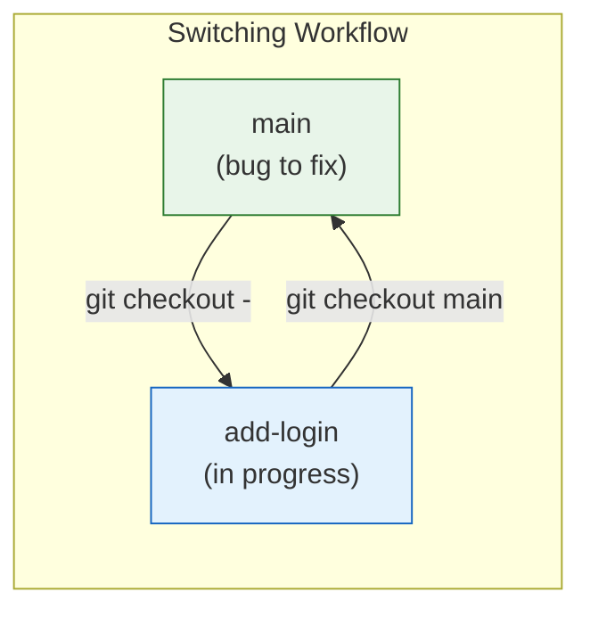
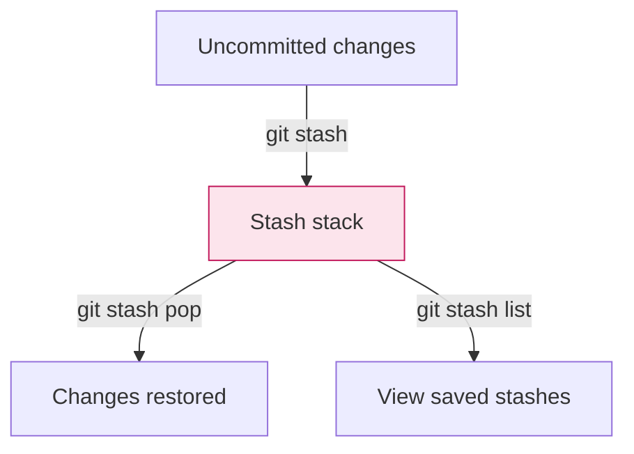

# Lesson 2.9: Creating & Switching Branches

> **Duration**: 25 min | **Section**: B - Branching

## 🎯 The Problem (3-5 min)

You need to:
- Start working on a new feature
- Switch between tasks
- Keep your main branch clean

This means creating branches, switching between them, and managing your workflow.

> **Scenario**: You're working on "add-login" feature. Suddenly, a bug report comes in. You need to fix it on main, then return to your feature. How?

## 🧪 Try It: The Naive Approach (5-10 min)

You might try to switch without committing:

```bash
# On 'add-login' branch, files modified
git checkout main
# error: Your local changes would be overwritten...
```

Git protects you from losing work. You have options:
1. Commit your work
2. Stash it temporarily
3. Discard it (rarely what you want)

## 🔍 Under the Hood (10-15 min)

### Creating Branches

```bash
# Create branch (stay on current)
git branch feature-name

# Create and switch (one command)
git checkout -b feature-name
# Modern syntax:
git switch -c feature-name

# Create from specific commit
git branch feature-name abc1234

# Create from another branch
git checkout -b feature-name origin/main
```

### Switching Branches

```bash
# Switch to existing branch
git checkout branch-name
# Modern syntax:
git switch branch-name

# Switch to previous branch
git checkout -
git switch -
```



### Handling Uncommitted Work

**Option 1: Commit it**
```bash
git add .
git commit -m "WIP: login progress"
git checkout main
```

**Option 2: Stash it** (temporary storage)
```bash
git stash           # Save work temporarily
git checkout main   # Switch freely
# ... fix bug ...
git checkout add-login
git stash pop       # Restore work
```

**Option 3: Discard it** (dangerous!)
```bash
git checkout --force main  # LOSES uncommitted changes!
```

### The Stash Deep Dive

```bash
# Save current work
git stash

# Save with a message
git stash push -m "Login form halfway done"

# List stashes
git stash list
# stash@{0}: On add-login: Login form halfway done
# stash@{1}: WIP on main: abc1234 Previous stash

# Apply most recent stash (keep in stash)
git stash apply

# Apply and remove from stash
git stash pop

# Apply specific stash
git stash apply stash@{1}

# Delete a stash
git stash drop stash@{0}

# Clear all stashes
git stash clear
```



### Visualizing Branches

```bash
# See all branches with last commit
git branch -v

# See branches and tracking info
git branch -vv

# Visual graph of all branches
git log --oneline --graph --all

# Just show branch points
git log --oneline --graph --all --simplify-by-decoration
```

### Deleting Branches

```bash
# Delete merged branch
git branch -d feature-name

# Force delete (even if not merged)
git branch -D feature-name

# Delete remote branch
git push origin --delete feature-name
```

## 💥 Where It Breaks (3-5 min)

| Problem | Cause | Fix |
|:--------|:------|:----|
| Can't switch | Uncommitted changes | Commit or stash |
| Branch not found | Typo or not created | `git branch -a` to see all |
| Stash conflicts | Changes conflict with current state | Resolve manually |
| Deleted wrong branch | Oops | `git reflog` to find commits |

### Recovering a Deleted Branch

```bash
# Find the commit hash
git reflog
# abc1234 HEAD@{5}: commit: Last commit on deleted-branch

# Recreate the branch
git branch recovered-branch abc1234
```

## ✅ The Fix (10-15 min)

### The Recommended Workflow

```bash
# 1. Start new feature
git checkout main
git pull                    # Get latest
git checkout -b feature-xyz

# 2. Work on feature
# ... edit files ...
git add .
git commit -m "Progress on feature"

# 3. Emergency! Bug on main
git stash                   # Save feature work
git checkout main
git checkout -b hotfix-bug
# ... fix bug ...
git add .
git commit -m "Fix critical bug"

# 4. Return to feature
git checkout feature-xyz
git stash pop               # Restore work
# ... continue ...
```

### Branch Naming Conventions

```
feature/add-login
feature/dark-mode
bugfix/header-crash
hotfix/security-patch
release/v2.0
experiment/new-architecture
```

Use prefixes to organize branches:
- `feature/` - New functionality
- `bugfix/` - Non-critical fixes
- `hotfix/` - Critical production fixes
- `release/` - Preparing a release
- `experiment/` - Trying things out

### Quick Reference

```bash
# === CREATE ===
git branch <name>           # Create
git checkout -b <name>      # Create + switch
git switch -c <name>        # Create + switch (modern)

# === SWITCH ===
git checkout <name>         # Switch
git switch <name>           # Switch (modern)
git checkout -              # Previous branch

# === LIST ===
git branch                  # Local branches
git branch -a               # All branches
git branch -v               # With last commit

# === DELETE ===
git branch -d <name>        # Safe delete
git branch -D <name>        # Force delete

# === STASH ===
git stash                   # Save changes
git stash pop               # Restore changes
git stash list              # List stashes
git stash drop              # Delete stash
```

## 🎯 Practice

1. Create and switch to feature branch:
   ```bash
   git checkout -b practice-feature
   ```

2. Make changes:
   ```bash
   echo "feature work" > feature.txt
   git add . && git commit -m "Add feature"
   ```

3. Switch back to main:
   ```bash
   git checkout main
   ls  # feature.txt not here!
   ```

4. Practice stashing:
   ```bash
   git checkout practice-feature
   echo "more work" >> feature.txt
   git stash
   git checkout main
   git checkout practice-feature
   git stash pop
   cat feature.txt  # Work restored!
   ```

5. Clean up:
   ```bash
   git checkout main
   git branch -D practice-feature
   ```

## 🔑 Key Takeaways

- `git checkout -b name` creates and switches in one command
- `git stash` saves uncommitted work temporarily
- `git checkout -` returns to previous branch
- Branch names should be descriptive (`feature/add-login`)
- Always commit or stash before switching
- `git reflog` can recover deleted branches

## ❓ Common Questions

| Question | Answer |
|----------|--------|
| Can I rename a branch? | `git branch -m old-name new-name` |
| What happens to stash when I switch branches? | Stash is global—you can apply it on any branch. |
| How many branches can I have? | Unlimited, practically. They're just pointers. |
| Should I delete merged branches? | Yes, keep your branch list clean. |

## 🔗 Further Reading

- [git checkout documentation](https://git-scm.com/docs/git-checkout)
- [git stash documentation](https://git-scm.com/docs/git-stash)
- [Git Branching Workflows](https://git-scm.com/book/en/v2/Git-Branching-Branching-Workflows)
