# Lesson 2.10: Merging Branches

> **Duration**: 25 min | **Section**: B - Branching

## 🎯 The Problem (3-5 min)

Your feature branch is complete. The code works. Tests pass. Now you need to get those changes into main.

**How do you combine branches?**

> **Scenario**: You've been working on `feature/dark-mode` for a week. It's ready. How do you bring those commits into `main`?

## 🧪 Try It: The Naive Approach (5-10 min)

You might think:
- Copy files manually? (No! You'd lose history)
- Create new commits on main? (No! Duplicated work)

Git's answer: **merge**.

```bash
git checkout main       # Go to target branch
git merge feature       # Bring feature into main
```

But what actually happens? There are different types of merges.

## 🔍 Under the Hood (10-15 min)

### Two Types of Merges

#### 1. Fast-Forward Merge

When main hasn't changed since you branched:

```mermaid
flowchart LR
    subgraph BEFORE["Before merge"]
        M1["main → B"]
        F1["feature → D"]
        A1["A"] --> B1["B"] --> C1["C"] --> D1["D"]
    end
    
    subgraph AFTER["After fast-forward"]
        M2["main → D"]
        F2["feature → D"]
        A2["A"] --> B2["B"] --> C2["C"] --> D2["D"]
    end
    
    BEFORE -->|"git merge feature"| AFTER
    
    style M1 fill:#E8F5E9,stroke:#2E7D32
    style M2 fill:#E8F5E9,stroke:#2E7D32
```



Git just moves the main pointer forward. No new commit needed.

```bash
git checkout main
git merge feature
# Updating abc123..def456
# Fast-forward
```

#### 2. Three-Way Merge

When main HAS changed since you branched:


Git creates a **merge commit** that combines both histories:
- Commit M has TWO parents (E and D)
- Both branches' changes are combined

```bash
git checkout main
git merge feature
# Merge made by the 'ort' strategy.
```

### The Merge Commit

A merge commit is special:
- Has two parent pointers
- Shows where branches joined
- Contains the combined result

```bash
git cat-file -p <merge-commit>
# tree abc123
# parent def456    ← First parent (main)
# parent ghi789    ← Second parent (feature)
# author ...
# Merge branch 'feature'
```

### Merge Strategies

```bash
# Regular merge (creates merge commit if needed)
git merge feature

# Force a merge commit even if fast-forward possible
git merge --no-ff feature

# Fast-forward only (fail if not possible)
git merge --ff-only feature

# Squash all commits into one (no merge commit)
git merge --squash feature
git commit -m "Add feature"
```


### The --no-ff Option

Some teams always use `--no-ff` to preserve branch history:


With `--no-ff`, you can always see that a feature branch existed.

## 💥 Where It Breaks (3-5 min)

| Problem | Cause | Fix |
|:--------|:------|:----|
| CONFLICT | Both branches changed same line | Resolve manually (next lesson!) |
| Merge refused | Uncommitted changes | Commit or stash first |
| Already merged | Branch already in history | Nothing to do |
| Wrong branch merged | Merged wrong thing | `git reset --hard HEAD~1` |

### Aborting a Merge

If a merge goes wrong (conflicts, wrong branch, etc.):

```bash
git merge --abort
```

This returns you to the state before the merge.

## ✅ The Fix (10-15 min)

### The Standard Merge Workflow

```bash
# 1. Make sure you're up to date
git checkout main
git pull origin main

# 2. Switch to feature and rebase (optional, cleaner history)
git checkout feature
git rebase main

# 3. Switch back to main
git checkout main

# 4. Merge the feature
git merge feature
# Or for explicit history:
git merge --no-ff feature -m "Merge feature: add dark mode"

# 5. Push the result
git push origin main

# 6. Clean up
git branch -d feature
```

### Viewing Merge History

```bash
# See merge commits
git log --merges

# See graph of merges
git log --oneline --graph

# See what branches are merged into main
git branch --merged main

# See unmerged branches
git branch --no-merged main
```

### Quick Reference

```bash
# Basic merge
git checkout main
git merge feature

# Merge with explicit commit
git merge --no-ff feature

# Squash merge (combine commits)
git merge --squash feature
git commit -m "Add feature"

# Abort merge
git merge --abort

# See merged branches
git branch --merged

# Delete merged branch
git branch -d feature
```

## 🎯 Practice

1. Create a feature branch:
   ```bash
   git checkout -b practice-merge
   echo "feature" > feature.txt
   git add . && git commit -m "Add feature"
   ```

2. Switch to main and make a change:
   ```bash
   git checkout main
   echo "main change" > main.txt
   git add . && git commit -m "Main update"
   ```

3. Merge the feature:
   ```bash
   git merge practice-merge
   # Creates a merge commit
   ```

4. View the result:
   ```bash
   git log --oneline --graph
   ls  # Both feature.txt and main.txt exist
   ```

5. Try --no-ff (create another branch first):
   ```bash
   git checkout -b another-feature
   echo "another" > another.txt
   git add . && git commit -m "Another feature"
   git checkout main
   git merge --no-ff another-feature -m "Merge another feature"
   git log --oneline --graph
   ```

6. Clean up:
   ```bash
   git branch -d practice-merge another-feature
   ```

## 🔑 Key Takeaways

- Merge combines branches into one
- Fast-forward: just moves pointer (when possible)
- Three-way merge: creates merge commit with two parents
- `--no-ff` forces merge commit for clearer history
- `--squash` combines commits into one
- `git merge --abort` cancels a problematic merge

## ❓ Common Questions

| Question | Answer |
|----------|--------|
| When should I use --no-ff? | When you want to preserve feature branch history. Many teams require it. |
| What's the difference between merge and rebase? | Merge preserves history, rebase rewrites it. Rebase is covered later. |
| Can I undo a merge? | Yes: `git reset --hard HEAD~1` if not pushed. |
| What if I merge the wrong branch? | `git merge --abort` during merge, or `git reset` after. |

## 🔗 Further Reading

- [Git Merge Documentation](https://git-scm.com/docs/git-merge)
- [Git Branching - Basic Branching and Merging](https://git-scm.com/book/en/v2/Git-Branching-Basic-Branching-and-Merging)
