# Lesson 2.11: Merge Conflicts

> **Duration**: 30 min | **Section**: B - Branching

## 🎯 The Problem (3-5 min)

You merge a branch. Git says:

```
CONFLICT (content): Merge conflict in app.py
Automatic merge failed; fix conflicts and then commit the result.
```

**What happened? How do you fix it?**

> **Scenario**: Alice and Bob both edited line 42 of `app.py`. Alice's version says `timeout=30`. Bob's says `timeout=60`. Git can't know which is correct. A human must decide.

## 🧪 Try It: The Naive Approach (5-10 min)

When you see CONFLICT, you might:
- Panic and `git merge --abort` (escape, but doesn't solve anything)
- Randomly delete conflict markers (breaks code)
- Ask someone else to fix it (not sustainable)

Conflicts aren't scary. They're just Git asking for your decision.

## 🔍 Under the Hood (10-15 min)

### When Conflicts Happen

```mermaid
flowchart TD
    MERGE["git merge"] --> CHECK{"Same lines changed?"}
    CHECK -->|No| AUTO["Automatic merge ✓"]
    CHECK -->|Yes| CONFLICT["CONFLICT ✗
    Manual resolution needed"]
    
    style AUTO fill:#E8F5E9,stroke:#2E7D32
    style CONFLICT fill:#FFEBEE,stroke:#C62828
```



Conflicts occur when:
- Both branches modified the **same line** in a file
- One branch deleted a file, another modified it
- Both branches added a file with the same name

Git handles these automatically:
- Changes to different files
- Changes to different parts of the same file
- Adding new files (with different names)

### What Conflict Markers Look Like

```python
def get_timeout():
<<<<<<< HEAD
    return 30  # main's version
=======
    return 60  # feature's version
>>>>>>> feature
```

| Marker | Meaning |
|:-------|:--------|
| `<<<<<<< HEAD` | Start of your current branch's version |
| `=======` | Separator between versions |
| `>>>>>>> feature` | End of the incoming branch's version |

### The Conflicted State

During a conflict, your repository is in a special state:

```bash
git status
```

```
You have unmerged paths.
  (fix conflicts and run "git commit")

Unmerged paths:
  (use "git add <file>..." to mark resolution)
        both modified:   app.py
```

You cannot commit until you resolve all conflicts.

### Resolving Conflicts

**Step 1**: Open the conflicted file

**Step 2**: Choose what to keep:
- Keep HEAD's version
- Keep feature's version
- Keep both
- Write something completely new

**Step 3**: Remove ALL conflict markers (`<<<<<<<`, `=======`, `>>>>>>>`)

**Step 4**: Stage the resolved file:
```bash
git add app.py
```

**Step 5**: Complete the merge:
```bash
git commit
# Git provides a default merge message
```

### Resolution Examples

**Keep HEAD's version**:
```python
def get_timeout():
    return 30
```

**Keep feature's version**:
```python
def get_timeout():
    return 60
```

**Keep both (if it makes sense)**:
```python
def get_timeout():
    return 30  # default

def get_extended_timeout():
    return 60  # for long operations
```

**Write something new**:
```python
def get_timeout(extended=False):
    return 60 if extended else 30
```

## 💥 Where It Breaks (3-5 min)

| Mistake | Consequence | Fix |
|:--------|:------------|:----|
| Left conflict markers in code | Syntax error, code won't run | Search for `<<<<<<<` |
| Only removed some markers | Still have conflicts | Search for all markers |
| Added but didn't commit | Merge not complete | `git commit` |
| Resolved wrong | Wrong code merged | Fix and `git commit --amend` |

### Common Conflict Mistakes

```python
# BAD: Left markers in!
def get_timeout():
<<<<<<< HEAD
    return 30
=======
    return 60
>>>>>>> feature

# BAD: Incomplete resolution
def get_timeout():
    return 30
>>>>>>> feature

# GOOD: Clean resolution
def get_timeout():
    return 45  # Compromise!
```

## ✅ The Fix (10-15 min)

### The Conflict Resolution Workflow

```bash
# 1. Start the merge
git checkout main
git merge feature
# CONFLICT!

# 2. See what's conflicted
git status

# 3. Open conflicted files, resolve them
# (edit files, remove markers, choose correct code)

# 4. Mark as resolved
git add app.py

# 5. Check everything is resolved
git status
# All conflicts fixed? 

# 6. Complete the merge
git commit
```

### Using Tools to Help

**Visual diff tools**:
```bash
git mergetool
# Opens configured visual merge tool
```

**See all conflict markers**:
```bash
grep -rn "<<<<<<" .
grep -rn "=======" .
grep -rn ">>>>>>" .
```

**VS Code**:
When you open a conflicted file, VS Code shows:
- "Accept Current Change" (HEAD)
- "Accept Incoming Change" (feature)
- "Accept Both Changes"
- "Compare Changes"

### Aborting a Merge

If you want to start over:
```bash
git merge --abort
```

This restores your branch to before the merge attempt.

### Preventing Conflicts


### Quick Reference

```bash
# Start merge (might conflict)
git merge feature

# See conflicted files
git status

# After resolving conflicts
git add <resolved-file>
git commit

# Abort merge
git merge --abort

# Use visual tool
git mergetool

# Search for conflict markers
grep -rn "<<<<<<" .
```

## 🎯 Practice

1. Create a conflict:
   ```bash
   # Create file on main
   echo "line 1" > conflict.txt
   git add . && git commit -m "Add file"
   
   # Create branch and modify
   git checkout -b branch-a
   echo "branch a content" > conflict.txt
   git add . && git commit -m "Branch A change"
   
   # Go back to main and modify same line
   git checkout main
   echo "main content" > conflict.txt
   git add . && git commit -m "Main change"
   ```

2. Try to merge (will conflict):
   ```bash
   git merge branch-a
   # CONFLICT!
   ```

3. See the conflict:
   ```bash
   cat conflict.txt
   # Shows conflict markers
   ```

4. Resolve it:
   ```bash
   echo "resolved content" > conflict.txt
   git add conflict.txt
   git commit -m "Resolve conflict"
   ```

5. Verify:
   ```bash
   git log --oneline --graph
   cat conflict.txt
   ```

6. Clean up:
   ```bash
   git branch -d branch-a
   ```

## 🔑 Key Takeaways

- Conflicts happen when same lines are modified in both branches
- Conflict markers: `<<<<<<<`, `=======`, `>>>>>>>`
- YOU must decide what the correct code is
- Remove ALL markers, then `git add` and `git commit`
- `git merge --abort` to cancel and start over
- Prevention: small branches, frequent merges, communication

## ❓ Common Questions

| Question | Answer |
|----------|--------|
| Can Git automatically resolve conflicts? | No, if it could decide, it would. Conflicts need human judgment. |
| What if I make a mistake resolving? | Fix the file and `git commit --amend`. |
| How do I know I got all markers? | `grep -rn "<<<<<<" .` should return nothing. |
| Why do I get conflicts on whitespace? | Different formatting. Use `.editorconfig` and linters. |

## 🔗 Further Reading

- [Git Merge Conflicts](https://www.atlassian.com/git/tutorials/using-branches/merge-conflicts)
- [Resolving Merge Conflicts](https://git-scm.com/book/en/v2/Git-Branching-Basic-Branching-and-Merging#_basic_merge_conflicts)
