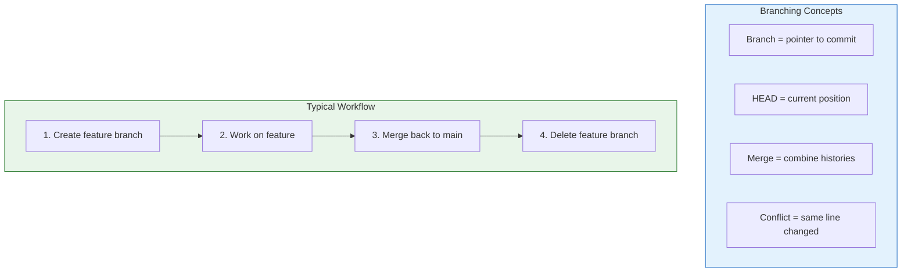
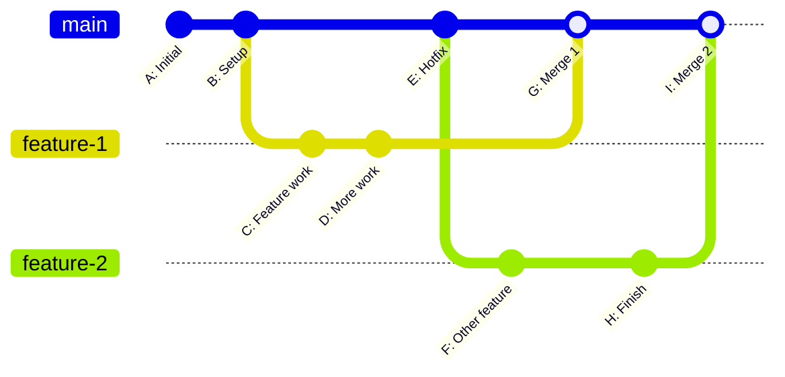

# Lesson 2.12: Branching Q&A

> **Duration**: 10 min | **Section**: B - Branching (Wrap-up)

## 📋 Section B Summary



## 🧠 Concept Check

| Concept | Question | Answer |
|:--------|:---------|:-------|
| Branch | What IS a branch? | A pointer to a commit (41 bytes) |
| Create | How to create and switch? | `git checkout -b name` |
| Switch | How to switch branches? | `git checkout name` or `git switch name` |
| Merge | How to combine branches? | `git checkout main && git merge feature` |
| Fast-forward | When does it happen? | When target hasn't changed since branching |
| Conflict | When does it happen? | When same lines changed in both branches |
| Resolve | How to resolve conflicts? | Edit file, remove markers, `git add`, `git commit` |

## ❓ Frequently Asked Questions

### Branch Basics

| Question | Answer |
|----------|--------|
| How many branches should I have? | As many as you need. They're cheap. |
| Should I delete merged branches? | Yes, keep branch list clean. Use `git branch -d name`. |
| What's a good branch naming convention? | `feature/thing`, `bugfix/thing`, `hotfix/thing` |
| Can I rename a branch? | `git branch -m old-name new-name` |

### Switching and Stashing

| Question | Answer |
|----------|--------|
| Can I switch with uncommitted changes? | Only if they don't conflict. Otherwise stash or commit. |
| Is stash per-branch? | No, stash is global. You can apply on any branch. |
| Can I have multiple stashes? | Yes, they stack. Use `git stash list`. |
| How do I stash only some files? | `git stash push -m "msg" file1 file2` |

### Merging

| Question | Answer |
|----------|--------|
| What's the difference between merge and rebase? | Merge preserves history. Rebase rewrites it to be linear. |
| When should I use --no-ff? | When you want to preserve branch history. Many teams require it. |
| Can I undo a merge? | If not pushed: `git reset --hard HEAD~1`. If pushed: `git revert -m 1 <merge-commit>`. |
| Why do I get conflicts in binary files? | Git can't merge binaries. Choose one version manually. |

### Common Problems

| Problem | Solution |
|:--------|:---------|
| "I committed to wrong branch!" | `git reset HEAD~1`, `git stash`, `git checkout right-branch`, `git stash pop`, `git commit` |
| "I want to copy a commit to another branch" | `git cherry-pick <commit-hash>` |
| "I deleted a branch with unmerged work!" | `git reflog` to find commit, `git branch recovered <hash>` |
| "I want to see what branches exist" | `git branch -a` |

## 🔗 Command Quick Reference

```bash
# === BRANCHES ===
git branch                   # List local branches
git branch -a                # List all branches
git branch -v                # List with last commit
git branch name              # Create branch
git branch -d name           # Delete (safe)
git branch -D name           # Delete (force)
git branch -m old new        # Rename

# === SWITCHING ===
git checkout name            # Switch to branch
git checkout -b name         # Create + switch
git checkout -               # Previous branch
git switch name              # Switch (modern)
git switch -c name           # Create + switch (modern)

# === STASHING ===
git stash                    # Save work
git stash pop                # Restore work
git stash list               # List stashes
git stash drop               # Delete stash
git stash apply stash@{n}    # Apply specific stash

# === MERGING ===
git merge feature            # Merge feature into current
git merge --no-ff feature    # Force merge commit
git merge --squash feature   # Squash commits
git merge --abort            # Cancel merge

# === CONFLICTS ===
git status                   # See conflicted files
git add <file>               # Mark resolved
git commit                   # Complete merge
grep -rn "<<<<<<" .          # Find conflict markers
```

## 📊 The Branching Mental Model



**Key insight**: Branches let you work in parallel without affecting each other until you're ready to merge.

## 💥 Common Pitfalls

| Pitfall | What Happens | Fix |
|---------|--------------|-----|
| Forgetting which branch you're on | Commits go to wrong branch | Check `git branch` before committing |
| Merging without pulling first | Conflicts with remote changes | `git pull` before `git merge` |
| Deleting unmerged branch with `-d` | Git refuses (safety) | Use `-D` only if you're SURE |
| Leaving conflict markers in code | Syntax errors, broken app | Search for `<<<<<<<` before committing |
| Never deleting old branches | Hundreds of stale branches | Clean up after merge: `git branch -d name` |

## 🔑 Key Takeaways

1. **Branches are cheap** - They're just 41-byte pointers, create freely
2. **Feature branches isolate work** - Experiment without breaking main
3. **Merge brings timelines together** - Fast-forward when possible, merge commit when needed
4. **Conflicts are decisions** - Git asks you to choose, not guess
5. **Stash saves uncommitted work** - Switch branches without losing changes
6. **Branch names matter** - Use `feature/`, `bugfix/`, `hotfix/` prefixes

## ✅ Section Complete!

You now understand:
- Branches are just pointers (instant to create)
- How to create, switch, and delete branches
- How merging combines histories
- How to resolve merge conflicts

**Next up**: Section C - Remote Repositories

We'll explore:
- Pushing code to GitHub
- Pulling changes from teammates
- Cloning repositories
- Pull requests and collaboration
