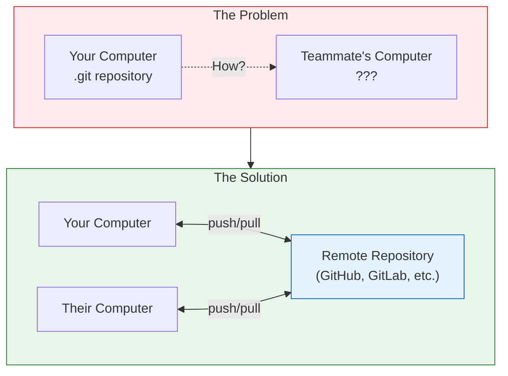

# Lesson 2.13: The Team Problem

> **Duration**: 5 min | **Section**: C - Remote Repositories

## 🎯 The Problem

You've mastered Git locally. Your version control is excellent. But then:

> "Share this code with the team."
> "I need to work from my laptop AND desktop."
> "Let's collaborate on this project."

**Your Git repository is trapped on YOUR computer.**

How do you:
- Share code with teammates?
- Work from multiple machines?
- Not lose everything if your laptop dies?
- Collaborate without emailing zip files?

## 💭 What We Need



We need:
1. **A central location** to store the repository
2. **A way to upload** (push) our changes
3. **A way to download** (pull) others' changes
4. **A way to copy** (clone) repositories

## 🌐 Enter: Remote Repositories

A **remote** is a copy of your repository hosted somewhere else—usually on the internet.

| Service | Description |
|:--------|:------------|
| GitHub | Most popular. Where open source lives. |
| GitLab | Self-hostable. Popular in enterprise. |
| Bitbucket | Atlassian's offering. Integrates with Jira. |
| Self-hosted | Your own server running Git. |

**Key insight**: These aren't special. They're just Git repositories on someone else's computer that you can access over the network.

## 📍 What You'll Learn

In this section, you'll learn to:
1. Connect your local repo to a remote
2. Push your code to GitHub
3. Pull changes from others
4. Clone existing repositories
5. Fork and contribute to projects
6. Create pull requests

## 🤔 Quick Preview

```bash
# Connect to a remote
git remote add origin https://github.com/you/project.git

# Upload your code
git push -u origin main

# Download changes
git pull origin main

# Copy a repository
git clone https://github.com/someone/project.git
```

**Next lesson**: We'll look under the hood at how remotes work.
