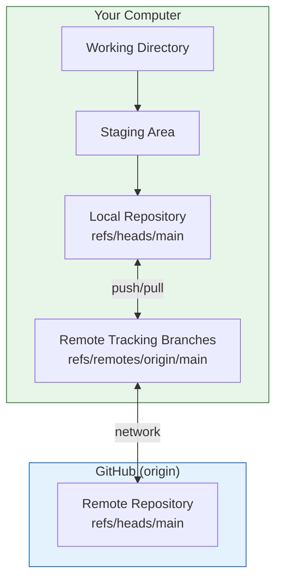
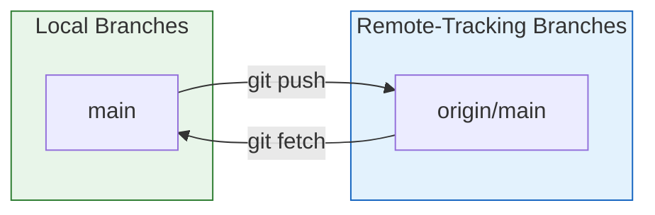
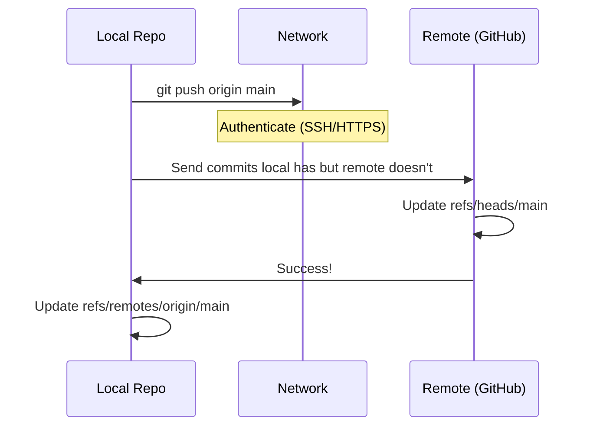
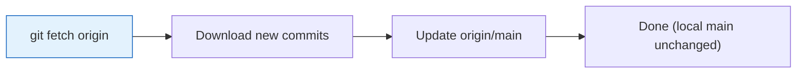
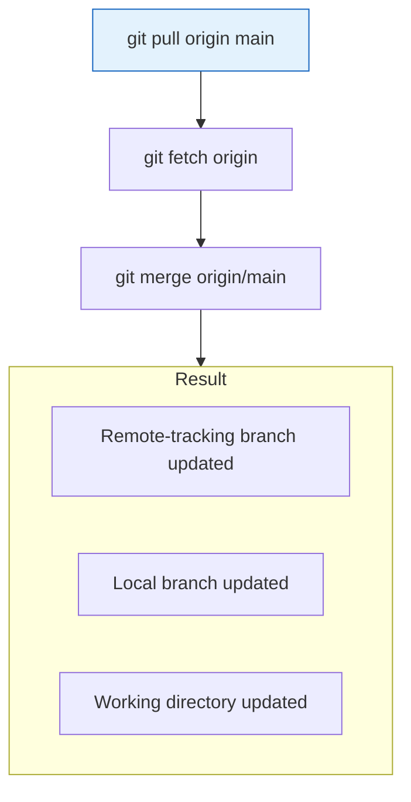

# Lesson 2.14: Remotes Under the Hood

> **Duration**: 20 min | **Section**: C - Remote Repositories

## 🎯 The Problem (3-5 min)

You type `git push origin main`. What's `origin`? What actually happens?

> **Scenario**: Your teammate asks "Where did you push that to?" and you realize you have no idea what `origin` actually means.

## 🧪 Try It: The Naive Approach (5-10 min)

You might think:
- "Origin is GitHub" (Not exactly—origin is just a name)
- "Git syncs everything automatically" (No—you control what syncs)
- "Remote is the same as my local" (They can differ!)

Let's see what's really happening.

## 🔍 Under the Hood (10-15 min)

### What is a Remote?

A remote is a **named URL** pointing to another Git repository.

```bash
git remote -v
```

```
origin  https://github.com/you/project.git (fetch)
origin  https://github.com/you/project.git (push)
```

**`origin`** isn't magic—it's just the default name for the first remote. You could name it anything:

```bash
git remote add upstream https://github.com/original/project.git
git remote add backup https://gitlab.com/you/project.git
```

### Remote Architecture



### Remote-Tracking Branches

When you push or fetch, Git creates **remote-tracking branches** locally:

```bash
git branch -a
```

```
* main                  # Local branch
  remotes/origin/main   # Tracking branch
  remotes/origin/dev    # Tracking branch
```

These are read-only snapshots showing where the remote's branches were last time you connected.



### The .git/config File

Remotes are configured in `.git/config`:

```ini
[remote "origin"]
    url = https://github.com/you/project.git
    fetch = +refs/heads/*:refs/remotes/origin/*

[branch "main"]
    remote = origin
    merge = refs/heads/main
```

This tells Git:
- `origin` points to that URL
- When fetching, map their branches to `origin/*`
- `main` tracks `origin/main`

### How Push Works



### How Fetch Works

```bash
git fetch origin
```

1. Downloads new commits from remote
2. Updates remote-tracking branches (`origin/main`)
3. Does NOT touch your working directory
4. Does NOT touch your local branches



### How Pull Works

`git pull` = `git fetch` + `git merge`:



### HTTPS vs SSH

```bash
# HTTPS (username/password or token)
https://github.com/you/project.git

# SSH (key-based)
git@github.com:you/project.git
```

| Method | Auth | Pros | Cons |
|:-------|:-----|:-----|:-----|
| HTTPS | Token/Password | Works everywhere | Need to enter credentials |
| SSH | Key pair | No password prompts | Initial setup required |

### Remote Commands

```bash
# List remotes
git remote -v

# Add remote
git remote add name url

# Remove remote
git remote remove name

# Rename remote
git remote rename old new

# Change URL
git remote set-url origin new-url

# Show remote details
git remote show origin
```

## 💥 Where It Breaks (3-5 min)

| Problem | Cause | Fix |
|:--------|:------|:----|
| "remote origin already exists" | Already added | `git remote set-url origin <url>` |
| "Permission denied" | Auth failed | Check SSH keys or token |
| "Updates were rejected" | Remote has commits you don't | `git pull` first |
| "no tracking information" | Branch not set to track | `git push -u origin main` |

## ✅ The Fix (5-10 min)

### Set Up a Remote

```bash
# If starting fresh
git remote add origin https://github.com/you/project.git

# If using SSH
git remote add origin git@github.com:you/project.git

# Verify
git remote -v
```

### Set Up Tracking

```bash
# First push: set up tracking
git push -u origin main

# After that, just:
git push
git pull
```

The `-u` flag sets up tracking so you don't need to specify `origin main` every time.

### Check Remote Status

```bash
# See what would be pushed/pulled
git fetch origin
git status

# See commits ahead/behind
git log origin/main..main   # Ahead (to push)
git log main..origin/main   # Behind (to pull)
```

## 🔑 Key Takeaways

- A remote is just a named URL to another repository
- `origin` is the default name (not magic)
- Remote-tracking branches (`origin/main`) are local snapshots
- `fetch` downloads; `pull` downloads AND merges
- Use `-u` on first push to set up tracking
- You can have multiple remotes

## ❓ Common Questions

| Question | Answer |
|----------|--------|
| Can I have multiple remotes? | Yes! Common for forks: `origin` (yours) + `upstream` (original). |
| What's the difference between fetch and pull? | Fetch downloads. Pull downloads AND merges. |
| Why use SSH over HTTPS? | No password prompts. More convenient once set up. |
| What does -u mean? | Sets up tracking between local and remote branch. |

## 🔗 Further Reading

- [Git Remote Documentation](https://git-scm.com/docs/git-remote)
- [About Remote Repositories](https://docs.github.com/en/get-started/getting-started-with-git/about-remote-repositories)
