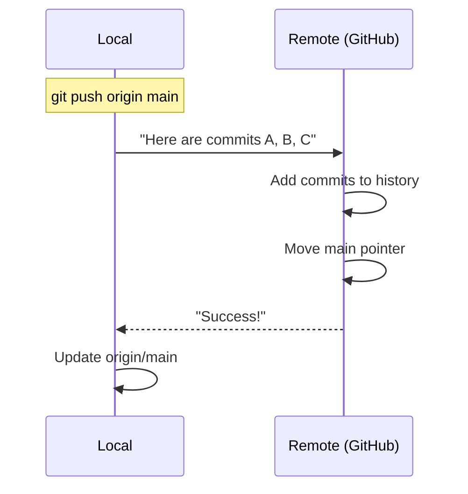
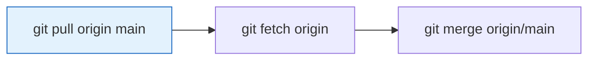
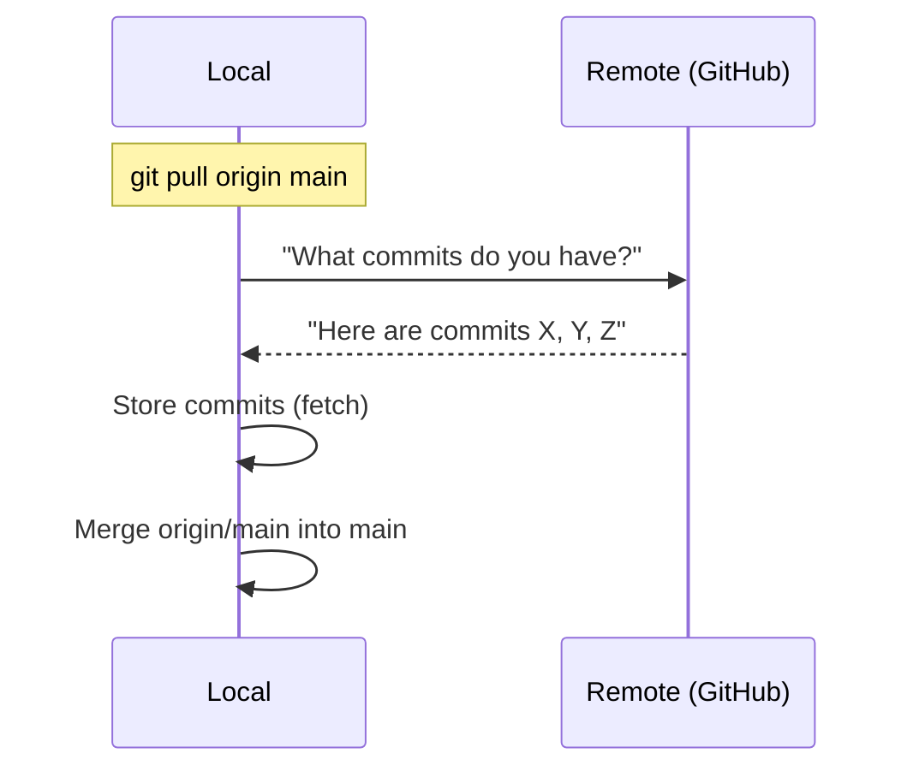
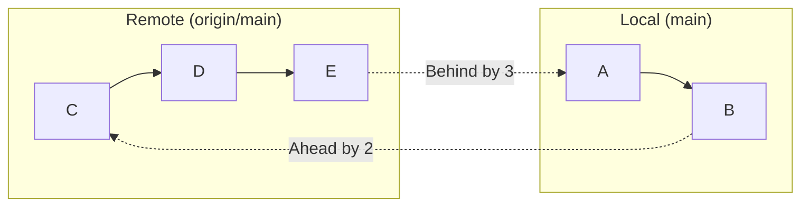
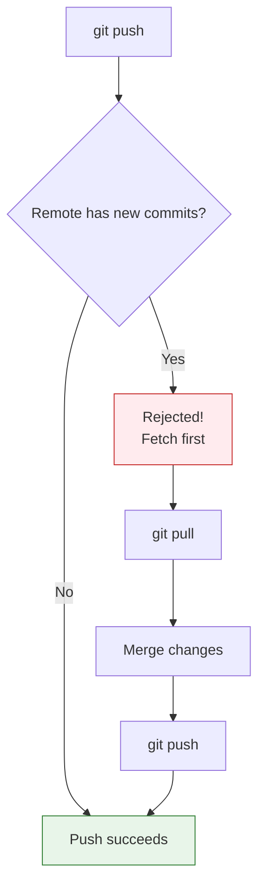
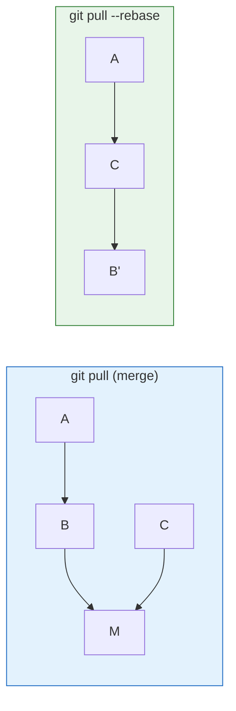

# Lesson 2.15: Push and Pull

> **Duration**: 25 min | **Section**: C - Remote Repositories

## 🎯 The Problem (3-5 min)

You've connected to a remote. Now you need to:
- Upload your code
- Download your teammate's changes
- Keep everything in sync

> **Scenario**: You finished a feature at home. Tomorrow at the office, you need that code. How do you get it there?

## 🧪 Try It: The Naive Approach (5-10 min)

The most basic workflow:

```bash
# Upload your code
git push origin main

# Download their code
git pull origin main
```

But what happens when things go wrong?

```
! [rejected] main -> main (fetch first)
error: failed to push some refs
```

## 🔍 Under the Hood (10-15 min)

### Push: Uploading Commits

```bash
git push <remote> <branch>
git push origin main
```



**What gets pushed**:
- Only commits (not working directory or staged files)
- Only commits on the specified branch
- Only commits the remote doesn't have

### Pull: Downloading Commits

```bash
git pull <remote> <branch>
git pull origin main
```

This is actually **two commands**:





### The Tracking Relationship

With tracking set up (via `-u`), you can simplify:

```bash
# Without tracking
git push origin main
git pull origin main

# With tracking
git push
git pull
```

To set up tracking:
```bash
git push -u origin main   # First time
git branch --set-upstream-to=origin/main main  # Later
```

### Ahead and Behind

```bash
git status
# Your branch is ahead of 'origin/main' by 2 commits.
# Your branch is behind 'origin/main' by 3 commits.
```



- **Ahead**: You have commits not on remote (need to push)
- **Behind**: Remote has commits you don't (need to pull)

### Fetch vs Pull

| Command | Downloads? | Merges? | Safe? |
|:--------|:-----------|:--------|:------|
| `git fetch` | ✅ Yes | ❌ No | Totally safe |
| `git pull` | ✅ Yes | ✅ Yes | Can cause conflicts |

**Safer workflow**:
```bash
git fetch origin          # Download
git log origin/main..main # See what you'll push
git log main..origin/main # See what you'll pull
git merge origin/main     # Merge when ready
```

### Push Rejection

If the remote has commits you don't have:

```
! [rejected] main -> main (fetch first)
```

Git refuses to push because you'd lose the remote's commits.



**Solution**:
```bash
git pull origin main   # Get their changes
# Resolve conflicts if any
git push origin main   # Now push yours
```

## 💥 Where It Breaks (3-5 min)

| Problem | Cause | Fix |
|:--------|:------|:----|
| "rejected" | Remote has new commits | `git pull` first |
| CONFLICT | Pull has merge conflict | Resolve conflict, commit |
| "no upstream branch" | No tracking set | `git push -u origin main` |
| Permission denied | Auth failed | Check credentials |
| "diverged" | Both have unique commits | `git pull` then `git push` |

### Force Push (Dangerous!)

```bash
git push --force origin main
# OVERWRITES remote history!
```

⚠️ **Never force push to shared branches** unless you know what you're doing. This overwrites remote history and affects everyone.

## ✅ The Fix (10-15 min)

### The Safe Workflow

```bash
# Before starting work
git pull origin main

# Work on code...
git add .
git commit -m "My changes"

# Before pushing
git fetch origin
git status  # Check if behind

# If behind, pull first
git pull origin main

# Now push
git push origin main
```

### Handling "Rejected"

```bash
# Step 1: Get their changes
git pull origin main

# Step 2: If conflict, resolve it
# Edit files, remove markers
git add .
git commit -m "Merge conflict resolution"

# Step 3: Push
git push origin main
```

### Pull with Rebase (Cleaner History)

```bash
git pull --rebase origin main
```

Instead of creating a merge commit, this replays your commits on top of the remote's:



### Quick Reference

```bash
# === PUSH ===
git push                     # Push to tracked remote
git push origin main         # Explicit push
git push -u origin main      # Set up tracking
git push --force             # Overwrite (DANGEROUS)

# === PULL ===
git pull                     # Pull from tracked remote
git pull origin main         # Explicit pull
git pull --rebase            # Rebase instead of merge

# === FETCH (safe) ===
git fetch origin             # Download without merging
git fetch --all              # Fetch all remotes

# === STATUS ===
git status                   # Shows ahead/behind
git log origin/main..main    # Commits to push
git log main..origin/main    # Commits to pull
```

## 🎯 Practice

> **Note**: This requires a GitHub account. Create one if needed.

1. Create a GitHub repository (through github.com)

2. Connect your local repository:
   ```bash
   git remote add origin https://github.com/YOUR_USERNAME/test-repo.git
   ```

3. Push your code:
   ```bash
   git push -u origin main
   ```

4. Make a change on GitHub (edit a file in the web interface)

5. Pull the change:
   ```bash
   git pull origin main
   cat <edited-file>
   ```

6. Make a local change and push:
   ```bash
   echo "local change" >> README.md
   git add . && git commit -m "Local update"
   git push
   ```

## 🔑 Key Takeaways

- `push` uploads commits to remote
- `pull` = `fetch` + `merge` (downloads AND merges)
- Use `-u` on first push to set up tracking
- If push is rejected, pull first
- `git fetch` is always safe
- Never force push to shared branches

## ❓ Common Questions

| Question | Answer |
|----------|--------|
| Why was my push rejected? | Remote has commits you don't. Pull first. |
| What's the difference between fetch and pull? | Fetch only downloads. Pull downloads AND merges. |
| Can I push uncommitted changes? | No, only committed changes can be pushed. |
| How do I know what will be pushed? | `git log origin/main..main` |

## 🔗 Further Reading

- [Git Push Documentation](https://git-scm.com/docs/git-push)
- [Git Pull Documentation](https://git-scm.com/docs/git-pull)
- [Syncing](https://www.atlassian.com/git/tutorials/syncing)
