# Lesson 2.16: Clone and Fork

> **Duration**: 20 min | **Section**: C - Remote Repositories

## 🎯 The Problem (3-5 min)

You find an amazing project on GitHub. You want to:
1. Get a copy on your computer
2. Maybe contribute to it

> **Scenario**: You want to contribute to an open-source project. How do you get the code and set yourself up to make changes?

## 🧪 Try It: The Naive Approach (5-10 min)

You might think:
- Download as ZIP? (No git history!)
- Just `git init` and copy files? (No connection to original!)
- Directly push to the original? (You don't have permission!)

Git has better tools: **clone** and **fork**.

## 🔍 Under the Hood (10-15 min)

### Clone: Copy a Repository

```bash
git clone https://github.com/someone/project.git
```

This:
1. Creates a new folder with the project name
2. Copies ALL history (every commit ever)
3. Sets up `origin` pointing to the source
4. Checks out the default branch

```mermaid
flowchart LR
    subgraph GITHUB["GitHub"]
        REMOTE["someone/project"]
    end
    
    subgraph LOCAL["Your Computer"]
        CLONE["project/
        .git (full history)
        origin → GitHub"]
    end
    
    REMOTE -->|"git clone"| CLONE
    
    style GITHUB fill:#E3F2FD,stroke:#1565C0
    style LOCAL fill:#E8F5E9,stroke:#2E7D32
```



### Clone Options

```bash
# Clone into specific folder
git clone https://github.com/user/project.git my-folder

# Clone specific branch
git clone -b develop https://github.com/user/project.git

# Shallow clone (only recent history)
git clone --depth 1 https://github.com/user/project.git

# Clone with submodules
git clone --recursive https://github.com/user/project.git
```

### Fork: Your Own Copy on GitHub

A **fork** is a copy of a repository on GitHub (not your computer).

```mermaid
flowchart TD
    subgraph GITHUB["GitHub"]
        ORIGINAL["someone/project
        (original)"]
        FORK["your-name/project
        (your fork)"]
    end
    
    subgraph LOCAL["Your Computer"]
        CLONE["project/
        origin → your fork
        upstream → original"]
    end
    
    ORIGINAL -->|"Fork button"| FORK
    FORK -->|"git clone"| CLONE
    
    style ORIGINAL fill:#E3F2FD,stroke:#1565C0
    style FORK fill:#FFF3E0,stroke:#EF6C00
    style LOCAL fill:#E8F5E9,stroke:#2E7D32
```



**Why fork?**
- You can't push to someone else's repository
- Fork gives you your OWN copy you can push to
- You can later propose changes via Pull Request

### The Fork Workflow

```bash
# 1. Fork on GitHub (click Fork button)

# 2. Clone YOUR fork
git clone https://github.com/YOU/project.git

# 3. Add original as "upstream"
cd project
git remote add upstream https://github.com/ORIGINAL/project.git

# 4. Verify remotes
git remote -v
# origin    https://github.com/YOU/project.git (your fork)
# upstream  https://github.com/ORIGINAL/project.git (original)
```

### Staying Updated

The original project keeps moving. You need to sync:

```bash
# Get latest from original
git fetch upstream

# Merge into your branch
git checkout main
git merge upstream/main

# Push to your fork
git push origin main
```


### Clone vs Fork

| Aspect | Clone | Fork |
|:-------|:------|:-----|
| Where | Your computer | GitHub |
| What | Copy of repo | Your own repo |
| Can push? | Only if you have access | Yes (it's yours) |
| For | Getting code to work on | Contributing to others' projects |

## 💥 Where It Breaks (3-5 min)

| Problem | Cause | Fix |
|:--------|:------|:----|
| "Permission denied" pushing | Cloned original, not fork | Fork, then clone the fork |
| Out of sync with original | Original moved ahead | `git fetch upstream && git merge` |
| Massive download | Full history | Use `--depth 1` for shallow |
| Submodules empty | Didn't clone recursively | `git submodule update --init` |

## ✅ The Fix (10-15 min)

### Contributing to Open Source (Full Workflow)

```bash
# 1. Fork the repo on GitHub (click button)

# 2. Clone your fork
git clone https://github.com/YOUR_USERNAME/project.git
cd project

# 3. Add upstream remote
git remote add upstream https://github.com/ORIGINAL_OWNER/project.git

# 4. Create a feature branch
git checkout -b fix-bug

# 5. Make changes
# edit files...
git add .
git commit -m "Fix the bug"

# 6. Push to your fork
git push origin fix-bug

# 7. Create Pull Request on GitHub (click button)

# 8. Keep in sync (before more work)
git fetch upstream
git checkout main
git merge upstream/main
git push origin main
```

### Quick Reference

```bash
# === CLONE ===
git clone <url>                    # Basic clone
git clone <url> folder             # Into specific folder
git clone -b branch <url>          # Specific branch
git clone --depth 1 <url>          # Shallow (recent only)
git clone --recursive <url>        # With submodules

# === FORK WORKFLOW ===
git remote add upstream <url>      # Add original
git fetch upstream                 # Get original's updates
git merge upstream/main            # Merge into your branch
git push origin main               # Update your fork

# === REMOTES ===
git remote -v                      # List remotes
git remote show origin             # Details about remote
```

## 🎯 Practice

1. Find a project on GitHub (try `https://github.com/octocat/Spoon-Knife` - it's designed for practice)

2. Fork it (click Fork button on GitHub)

3. Clone your fork:
   ```bash
   git clone https://github.com/YOUR_USERNAME/Spoon-Knife.git
   cd Spoon-Knife
   ```

4. Add upstream:
   ```bash
   git remote add upstream https://github.com/octocat/Spoon-Knife.git
   git remote -v
   ```

5. Create a branch and make a change:
   ```bash
   git checkout -b my-change
   echo "My contribution" >> README.md
   git add . && git commit -m "Add my contribution"
   ```

6. Push to your fork:
   ```bash
   git push origin my-change
   ```

7. On GitHub, you'd now create a Pull Request!

## 🔑 Key Takeaways

- `clone` copies a repo to your computer
- `fork` creates your own copy on GitHub
- Fork + Clone = contribution workflow
- Use `upstream` to track the original
- Keep your fork synced with `fetch upstream && merge`
- Can't push to others' repos without permission

## ❓ Common Questions

| Question | Answer |
|----------|--------|
| Do I need to fork to clone? | No, you can clone without forking. But you can't push. |
| What's the point of forking? | You get your own copy you CAN push to. |
| How do I get updates from original? | `git fetch upstream && git merge upstream/main` |
| Can I clone a private repo? | Only if you have access. |

## 🔗 Further Reading

- [Git Clone Documentation](https://git-scm.com/docs/git-clone)
- [Fork a Repo - GitHub](https://docs.github.com/en/get-started/quickstart/fork-a-repo)
- [Syncing a Fork](https://docs.github.com/en/github/collaborating-with-pull-requests/working-with-forks/syncing-a-fork)
