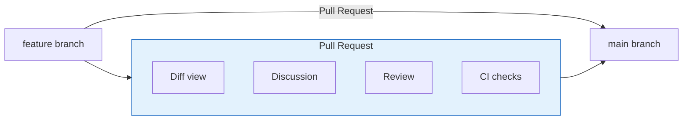

# Lesson 2.17: Pull Requests

> **Duration**: 25 min | **Section**: C - Remote Repositories

## 🎯 The Problem (3-5 min)

You've made changes on your branch. Now you want to:
- Get those changes into the main branch
- Have someone review your code
- Not break anything for the team

> **Scenario**: You fixed a critical bug. But you can't just push to main—the team needs to review it first. How?

## 🧪 Try It: The Naive Approach (5-10 min)

You might think:
- Just merge yourself? (Risky—no review!)
- Email the diff? (Clunky, loses context)
- Screen share your code? (Doesn't scale)

Enter: **Pull Requests** (PRs)—or "Merge Requests" on GitLab.

## 🔍 Under the Hood (10-15 min)

### What IS a Pull Request?

A Pull Request is a **proposal to merge** one branch into another, with:
- Code changes visible
- Discussion thread
- Review/approval process
- CI/CD checks



### The PR Workflow


### PR Components

| Component | Purpose |
|:----------|:--------|
| **Title** | Brief description of changes |
| **Description** | Detailed explanation, context |
| **Commits** | List of commits in the PR |
| **Files Changed** | Diff view of all changes |
| **Reviewers** | People who need to approve |
| **Labels** | Categorization (bug, feature, etc.) |
| **Checks** | Automated test results |

### Creating a Pull Request

1. **Push your branch**:
   ```bash
   git push origin feature-branch
   ```

2. **On GitHub**:
   - Go to repository
   - Click "Compare & pull request"
   - Fill in title and description
   - Select reviewers
   - Click "Create pull request"

### Writing Good PR Descriptions

```markdown
## What does this PR do?
Adds dark mode toggle to the settings page.

## Why is this needed?
Users have requested dark mode (#123, #456).

## How to test
1. Go to Settings
2. Toggle "Dark Mode"
3. Verify colors change

## Screenshots
[Before/After images]

## Checklist
- [ ] Tests pass
- [ ] Documentation updated
- [ ] No console errors
```

### Code Review

Reviewers can:
- **Comment**: Ask questions or suggest improvements
- **Approve**: Ready to merge
- **Request Changes**: Must be fixed before merge

```mermaid
flowchart TD
    SUBMIT["PR Submitted"]
    SUBMIT --> REVIEW["Under Review"]
    REVIEW --> APPROVED["Approved ✓"]
    REVIEW --> CHANGES["Changes Requested"]
    CHANGES -->|"Push fixes"| REVIEW
    APPROVED --> MERGE["Merged!"]
    
    style APPROVED fill:#E8F5E9,stroke:#2E7D32
    style CHANGES fill:#FFEBEE,stroke:#C62828
    style MERGE fill:#E3F2FD,stroke:#1565C0
```



### Merge Options

GitHub offers three ways to merge:

| Option | What it does | Result |
|:-------|:-------------|:-------|
| **Merge commit** | Creates merge commit | Preserves all history |
| **Squash and merge** | Combines all commits | Clean, single commit |
| **Rebase and merge** | Replays commits | Linear history |


## 💥 Where It Breaks (3-5 min)

| Problem | Cause | Fix |
|:--------|:------|:----|
| Merge conflicts | Main changed | Update branch: `git merge main` |
| Checks failing | Tests or lint fail | Fix issues, push again |
| PR too big | Too many changes | Split into smaller PRs |
| Stale review | Branch is old | Rebase or merge main |
| Blocked by review | Waiting for approval | Ping reviewers |

### Resolving Conflicts in PRs

```bash
# Update your branch with main
git checkout feature-branch
git fetch origin
git merge origin/main

# Resolve conflicts
# Edit files, remove markers
git add .
git commit -m "Merge main into feature"

# Push updated branch
git push origin feature-branch
# PR automatically updates!
```

## ✅ The Fix (10-15 min)

### The Complete PR Workflow

```bash
# 1. Create feature branch
git checkout -b feature/dark-mode

# 2. Make changes and commit
git add .
git commit -m "Add dark mode toggle"
git commit -m "Add dark mode styles"

# 3. Push branch
git push -u origin feature/dark-mode

# 4. Create PR on GitHub
# (via web interface or GitHub CLI)

# 5. After review, if conflicts:
git fetch origin
git merge origin/main
# resolve conflicts
git push origin feature/dark-mode

# 6. After merge, clean up
git checkout main
git pull origin main
git branch -d feature/dark-mode
```

### GitHub CLI for PRs

```bash
# Install: https://cli.github.com

# Create PR from command line
gh pr create --title "Add dark mode" --body "Adds dark mode feature"

# List PRs
gh pr list

# Check out a PR locally
gh pr checkout 123

# Merge a PR
gh pr merge 123

# View PR in browser
gh pr view --web
```

### Best Practices


## 🎯 Practice

1. If you forked Spoon-Knife earlier:
   - Go to your fork on GitHub
   - Click "Contribute" → "Open pull request"
   - Review the diff
   - Click "Create pull request"
   
2. Explore an existing PR:
   - Go to any popular repo (try facebook/react or microsoft/vscode)
   - Click "Pull requests"
   - Click on any open PR
   - Explore: Files changed, Conversation, Checks

3. Using GitHub CLI (if installed):
   ```bash
   gh pr list
   gh pr status
   ```

## 🔑 Key Takeaways

- Pull Requests propose merging branches
- PRs enable code review before merging
- Write clear titles and descriptions
- Keep PRs small and focused
- Resolve conflicts by merging main into your branch
- Three merge options: merge, squash, rebase

## ❓ Common Questions

| Question | Answer |
|----------|--------|
| Who can create PRs? | Anyone with read access (or fork). |
| Who can merge PRs? | Anyone with write access (may require reviews). |
| What's the difference from GitLab? | Same concept, called "Merge Request" there. |
| Do I need PRs for solo projects? | Not required, but good for self-review. |

## 🔗 Further Reading

- [About Pull Requests - GitHub](https://docs.github.com/en/pull-requests/collaborating-with-pull-requests/proposing-changes-to-your-work-with-pull-requests/about-pull-requests)
- [Creating a Pull Request](https://docs.github.com/en/pull-requests/collaborating-with-pull-requests/proposing-changes-to-your-work-with-pull-requests/creating-a-pull-request)
- [GitHub CLI Manual](https://cli.github.com/manual/)
