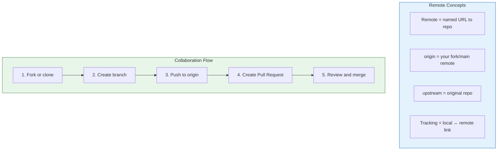
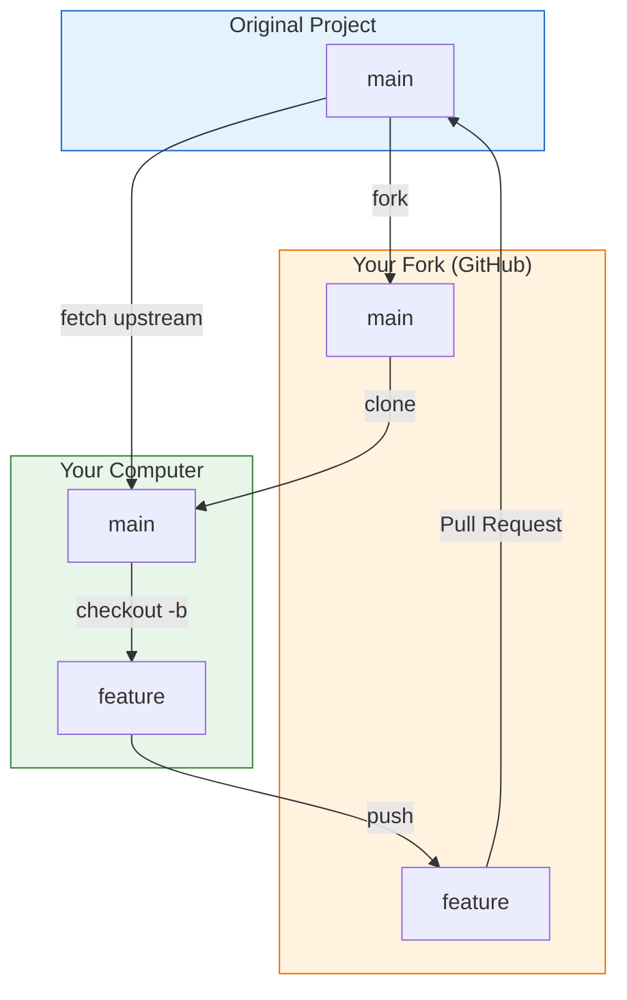

# Lesson 2.18: Git Workflow Q&A

> **Duration**: 15 min | **Section**: C - Remote Repositories (Wrap-up)

## 📋 Section C Summary



## 🧠 Concept Check

| Concept | Question | Answer |
|:--------|:---------|:-------|
| Remote | What is a remote? | A named URL pointing to a Git repository |
| Origin | What is `origin`? | Default name for your primary remote |
| Clone | What does clone do? | Copies entire repo history to your computer |
| Fork | What does fork do? | Creates your own copy on GitHub |
| Push | What does push do? | Uploads commits to remote |
| Pull | What does pull do? | Downloads AND merges from remote |
| Fetch | What does fetch do? | Downloads but does NOT merge (safe) |
| PR | What is a Pull Request? | Proposal to merge with review |

## ❓ Frequently Asked Questions

### Remotes

| Question | Answer |
|----------|--------|
| Can I have multiple remotes? | Yes! Common: `origin` (yours) + `upstream` (original). |
| How do I change a remote URL? | `git remote set-url origin <new-url>` |
| What's the difference between SSH and HTTPS? | SSH uses keys (no password). HTTPS uses tokens. |
| Why can't I push? | Check permissions, or pull first if rejected. |

### Push and Pull

| Question | Answer |
|----------|--------|
| What does -u mean? | Sets up tracking. After: just `git push`. |
| Why is my push rejected? | Remote has commits you don't. `git pull` first. |
| What's the difference between fetch and pull? | Fetch downloads. Pull downloads AND merges. |
| Can I push uncommitted changes? | No. Commit first. |

### Clone and Fork

| Question | Answer |
|----------|--------|
| Do I need to fork to clone? | No, but you can't push without permission. |
| How do I keep my fork updated? | `git fetch upstream && git merge upstream/main` |
| Can I clone a private repo? | Only if you have access. |
| What's a shallow clone? | Only recent history. Faster, smaller. |

### Pull Requests

| Question | Answer |
|----------|--------|
| Who can create PRs? | Anyone with read access (or fork). |
| Who can merge PRs? | Anyone with write access (may require reviews). |
| What if there are conflicts? | Merge main into your branch, resolve, push. |
| What merge option should I use? | Depends on team preference. Squash is popular. |

## 🔗 Command Quick Reference

```bash
# === REMOTES ===
git remote -v                     # List remotes
git remote add name url           # Add remote
git remote remove name            # Remove remote
git remote set-url name url       # Change URL

# === PUSH ===
git push                          # Push to tracked remote
git push origin main              # Explicit push
git push -u origin main           # Set up tracking
git push --force                  # Overwrite (DANGEROUS)

# === PULL ===
git pull                          # Pull from tracked remote
git pull origin main              # Explicit pull
git pull --rebase                 # Rebase instead of merge

# === FETCH ===
git fetch origin                  # Download without merge
git fetch --all                   # Fetch all remotes

# === CLONE ===
git clone <url>                   # Clone repository
git clone <url> folder            # Into specific folder
git clone --depth 1 <url>         # Shallow clone

# === FORK WORKFLOW ===
git remote add upstream <url>     # Add original
git fetch upstream                # Get updates
git merge upstream/main           # Merge original
git push origin main              # Update your fork

# === STATUS ===
git log origin/main..main         # Commits to push
git log main..origin/main         # Commits to pull
```

## 📊 The Complete Collaboration Model



## 🔄 Common Workflows

### Contributing to Open Source

```bash
# 1. Fork on GitHub
# 2. Clone your fork
git clone https://github.com/YOU/project.git
cd project

# 3. Add upstream
git remote add upstream https://github.com/ORIGINAL/project.git

# 4. Create feature branch
git checkout -b fix-bug

# 5. Work and commit
git add . && git commit -m "Fix bug"

# 6. Push to your fork
git push -u origin fix-bug

# 7. Create Pull Request on GitHub
```

### Team Workflow

```bash
# 1. Clone team repo
git clone https://github.com/team/project.git

# 2. Create feature branch
git checkout -b feature/new-thing

# 3. Work and commit
git add . && git commit -m "Add new thing"

# 4. Stay updated
git fetch origin
git merge origin/main

# 5. Push and create PR
git push -u origin feature/new-thing
# Create PR on GitHub
```

## 💥 Common Pitfalls

| Pitfall | What Happens | Fix |
|---------|--------------|-----|
| `git push --force` on shared branch | Overwrites teammates' work | Never force-push to main/shared branches |
| Forgetting to set upstream | `git push` fails with no tracking | Use `git push -u origin branch` first time |
| Pushing to wrong remote | Code goes to wrong repo | Check `git remote -v` before pushing |
| Not pulling before pushing | Push rejected | Always `git pull` before `git push` |
| Merging PR with conflicts | GitHub blocks merge | Update branch from main first |

## 🔑 Key Takeaways

1. **Remotes are just URLs** - `origin` is a nickname, not magic
2. **Push uploads, pull downloads+merges** - Fetch is the safe alternative
3. **Fork = your copy** - Clone from fork, PR to original
4. **Pull Requests enable review** - Code quality through collaboration
5. **Upstream keeps you current** - Sync with original repo regularly
6. **-u sets tracking** - After first push, just `git push` works
7. **Fetch before force** - Always know what you're overwriting

## ✅ Section Complete!

You now understand:
- What remotes are and how they work
- How to push and pull code
- Clone vs fork and when to use each
- Pull Request workflow
- How to collaborate with teams

**Next up**: Module 2 Review (Lesson 2.19)
