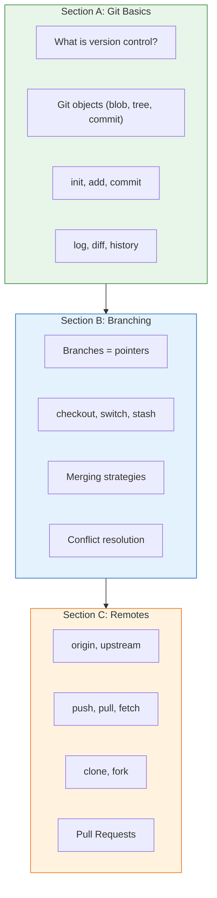
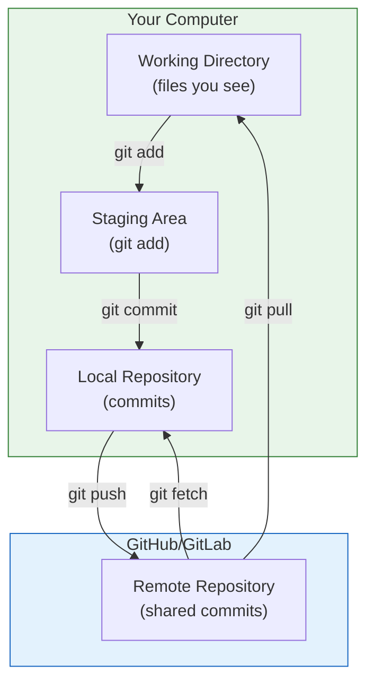

# Lesson 2.19: Module 2 Review

> **Duration**: 20 min | **Module Wrap-up**

## 📋 Module 2: Git & Version Control - Complete

You've completed the entire Git module! Let's review everything.



## 🎓 Independence Test

### Level 1: Know (Definitions)

| Term | Definition |
|:-----|:-----------|
| Repository | A folder tracked by Git (.git inside) |
| Commit | A snapshot of your project at a point in time |
| Branch | A pointer to a commit (movable label) |
| HEAD | Pointer to current branch/commit |
| Remote | Named URL to another Git repository |
| Clone | Copy repo with full history |
| Fork | Your own copy of a repo on GitHub |
| Pull Request | Proposal to merge with review |

### Level 2: Understand (Why it exists)

| Concept | Problem it solves |
|:--------|:------------------|
| Version control | "I need the old version" / "Who changed this?" |
| Commits | Trackable, reversible changes |
| Branches | Parallel development without conflicts |
| Merging | Combining work from branches |
| Remotes | Sharing code, backups, collaboration |
| Pull Requests | Code review before merging |

### Level 3: Apply (How to use)

```bash
# Start a project
git init
git add .
git commit -m "Initial commit"

# Work with branches
git checkout -b feature
# work...
git commit -m "Add feature"
git checkout main
git merge feature

# Work with remotes
git remote add origin <url>
git push -u origin main
git pull origin main

# Contribute to projects
git clone <url>
git checkout -b fix
# work...
git push origin fix
# Create PR
```

### Level 4: Analyze (When it fails)

| Situation | What breaks | Solution |
|:----------|:------------|:---------|
| Same line edited | Merge conflict | Manually resolve |
| Push rejected | Remote ahead | Pull first |
| Lost commits | Deleted branch | `git reflog` |
| Wrong branch | Committed to main | Reset, stash, switch |
| Large repo | Slow clone | `--depth 1` |

### Level 5: Create (Build something new)

**Challenge**: Set up a collaborative project:

1. Create a repo with README, .gitignore
2. Push to GitHub
3. Create a branch for a feature
4. Push and create a Pull Request
5. Have a friend (or yourself) review it
6. Merge the PR
7. Pull the changes

## 📊 The Complete Git Mental Model



## 🔧 Essential Commands Reference

### Day-to-Day Commands

```bash
git status              # What's changed?
git add .               # Stage everything
git commit -m "msg"     # Commit
git push                # Upload
git pull                # Download + merge
```

### Branching

```bash
git branch              # List branches
git checkout -b name    # Create + switch
git checkout name       # Switch
git merge branch        # Merge into current
git branch -d name      # Delete branch
```

### History

```bash
git log --oneline       # Compact history
git log --graph         # Visual history
git diff                # See changes
git show <hash>         # See commit details
```

### Remotes

```bash
git remote -v           # List remotes
git clone <url>         # Copy repo
git fetch origin        # Download (safe)
git push -u origin main # Push + track
```

### Rescue Commands

```bash
git stash               # Save work temporarily
git stash pop           # Restore saved work
git reflog              # Find "lost" commits
git reset --hard HEAD~1 # Undo last commit
git checkout -- file    # Discard changes
```

## ✅ You Can Now...

- [ ] Initialize Git repositories
- [ ] Make commits with meaningful messages
- [ ] View and understand history
- [ ] Create and switch branches
- [ ] Merge branches
- [ ] Resolve merge conflicts
- [ ] Push code to GitHub
- [ ] Pull changes from teammates
- [ ] Clone and fork repositories
- [ ] Create Pull Requests
- [ ] Collaborate on code

## 🎯 Practice Project

**Build a portfolio**:

1. Create a repo: `portfolio`
2. Add: README.md, .gitignore, index.html
3. Commit: "Initial portfolio setup"
4. Push to GitHub
5. Create branch: `feature/about-page`
6. Add: about.html
7. Push and create PR
8. Merge the PR
9. Pull locally
10. Repeat for more features!

## 🔗 Resources for Continued Learning

| Resource | Link |
|:---------|:-----|
| Pro Git Book | https://git-scm.com/book/en/v2 |
| GitHub Learning Lab | https://skills.github.com/ |
| Oh Shit, Git!?! | https://ohshitgit.com/ |
| Learn Git Branching | https://learngitbranching.js.org/ |
| Git Cheat Sheet | https://education.github.com/git-cheat-sheet-education.pdf |

## 🎉 Module Complete!

Congratulations! You've mastered Git fundamentals. You can now:
- Track your code changes
- Collaborate with others
- Contribute to open source
- Never lose code again

**Next Module**: Part II - Python Core

We'll learn Python from the ground up, using version control for all our projects!
