# Lesson 2.20: Git LFS - Managing Large Files

> **Duration**: 25 min | **Section**: D - Advanced Git

## 🎯 The Problem

Your ML project is going great. You commit your trained model:

```bash
git add models/bert-finetuned.bin
git commit -m "Add fine-tuned BERT model"
git push
```

**Error**:
```
remote: error: File models/bert-finetuned.bin is 1.2 GB
remote: error: this exceeds GitHub's file size limit of 100 MB
```

Your model is too big for Git. But you NEED to version it. What now?

> **Scenario**: You're building a RAG system. Your embedding model is 500MB. Your fine-tuned LLM is 3GB. Your vector index backup is 2GB. Git refuses all of them. You could use cloud storage, but then you lose version control. How do you track model versions alongside your code?

## 🧪 Try It: The Naive Approaches

### Approach 1: Just Don't Track It

```bash
# .gitignore
models/
*.bin
*.pt
*.onnx
```

**Problems**:
- ❌ No version history for models
- ❌ Team can't reproduce your results
- ❌ "Which model version goes with which code commit?"

### Approach 2: Cloud Storage + Manual Tracking

```bash
# Upload to S3
aws s3 cp models/bert.bin s3://my-bucket/models/bert-v1.bin

# Document in README
# Model v1: s3://my-bucket/models/bert-v1.bin
# Model v2: s3://my-bucket/models/bert-v2.bin
```

**Problems**:
- ❌ Manual bookkeeping
- ❌ No automatic linking to code versions
- ❌ Easy to get out of sync

## 🔍 Under the Hood: How Git Stores Files

```mermaid
flowchart TD
    subgraph Normal["NORMAL GIT"]
        CODE["code.py<br/>10 KB"] --> BLOB1["Blob object<br/>10 KB"]
        MODEL["model.bin<br/>1.2 GB"] --> BLOB2["Blob object<br/>1.2 GB"]
        BLOB1 --> REPO["Repository<br/>1.2 GB+ 😱"]
        BLOB2 --> REPO
    end
    
    subgraph LFS["GIT LFS"]
        CODE2["code.py<br/>10 KB"] --> BLOB3["Blob object<br/>10 KB"]
        MODEL2["model.bin<br/>1.2 GB"] --> POINTER["Pointer file<br/>130 bytes"]
        BLOB3 --> REPO2["Repository<br/>~10 KB"]
        POINTER --> REPO2
        MODEL2 --> REMOTE["LFS Server<br/>1.2 GB"]
    end
    
    style Normal fill:#FFEBEE,stroke:#C62828
    style LFS fill:#E8F5E9,stroke:#2E7D32
```



**Git LFS** (Large File Storage) replaces large files with tiny **pointer files** in Git, while storing the actual content on a separate LFS server.

## 💥 Where It Breaks (Without LFS)

```bash
# Clone a repo with large files
git clone https://github.com/team/ml-project.git

# Every clone downloads EVERY version of every large file
# 10 model versions × 1.2 GB = 12 GB download just to start!

# Repository history bloats forever
# Even if you delete the model, it's still in git history
```

## ✅ The Fix: Git LFS

### Step 1: Install Git LFS

```bash
# macOS
brew install git-lfs

# Ubuntu/Debian
sudo apt install git-lfs

# Initialize in your user account (one time)
git lfs install
```

### Step 2: Track Large Files

```bash
# Tell LFS to manage specific file patterns
git lfs track "*.bin"
git lfs track "*.pt"
git lfs track "*.onnx"
git lfs track "*.safetensors"
git lfs track "models/**"

# This creates/updates .gitattributes
cat .gitattributes
# *.bin filter=lfs diff=lfs merge=lfs -text
# *.pt filter=lfs diff=lfs merge=lfs -text
```

### Step 3: Commit As Normal

```bash
# Add the tracking rules first!
git add .gitattributes
git commit -m "Configure Git LFS for model files"

# Now add your large files
git add models/bert-finetuned.bin
git commit -m "Add fine-tuned BERT model v1"
git push
```

**What happens**:
1. Git sees `*.bin` is LFS-tracked
2. Stores actual file on LFS server
3. Commits tiny pointer file to Git

### Step 4: Verify LFS Is Working

```bash
# List LFS-tracked files
git lfs ls-files

# See what would be tracked
git lfs track

# Check pointer file content
cat models/bert-finetuned.bin
# version https://git-lfs.github.com/spec/v1
# oid sha256:abc123...
# size 1288490188
```

## 🔍 LFS Workflow Deep Dive


## 🎯 Common Patterns for AI Projects

### Pattern 1: ML Project Structure

```
my-ml-project/
├── .gitattributes          # LFS tracking rules
├── .gitignore
├── src/
│   └── train.py
├── models/                  # LFS-tracked
│   ├── checkpoints/
│   │   ├── epoch-10.pt
│   │   └── epoch-20.pt
│   └── final/
│       └── model.safetensors
├── data/                    # Usually gitignored (too big even for LFS)
│   └── .gitkeep
└── embeddings/              # LFS-tracked
    └── index.faiss
```

### Pattern 2: .gitattributes for AI

```gitattributes
# Model files
*.bin filter=lfs diff=lfs merge=lfs -text
*.pt filter=lfs diff=lfs merge=lfs -text
*.pth filter=lfs diff=lfs merge=lfs -text
*.onnx filter=lfs diff=lfs merge=lfs -text
*.safetensors filter=lfs diff=lfs merge=lfs -text
*.ckpt filter=lfs diff=lfs merge=lfs -text

# Embeddings and indexes
*.faiss filter=lfs diff=lfs merge=lfs -text
*.index filter=lfs diff=lfs merge=lfs -text
*.pkl filter=lfs diff=lfs merge=lfs -text

# Large data files (if tracking any)
*.parquet filter=lfs diff=lfs merge=lfs -text
*.arrow filter=lfs diff=lfs merge=lfs -text
```

### Pattern 3: Link Model to Code Version

```bash
# Tag releases that link code + model
git add models/v2/model.pt
git commit -m "Model v2: improved accuracy 92%"
git tag -a model-v2 -m "Model v2 with code commit"
git push --tags

# Later, reproduce exact version
git checkout model-v2
# Gets the exact code AND model from that point
```

## 📊 Git LFS vs Alternatives

| Approach | Version Control | Linked to Code | Storage Cost | Best For |
|----------|:---------------:|:--------------:|:------------:|----------|
| **Git LFS** | ✅ Full | ✅ Automatic | Medium | Models < 5GB |
| **DVC** | ✅ Full | ✅ Automatic | Your storage | Large datasets |
| **MLflow** | ✅ Registry | ⚠️ Manual link | Self-hosted | Experiment tracking |
| **HuggingFace Hub** | ✅ Full | ⚠️ Separate repo | Free tier | Public models |
| **S3 + README** | ❌ Manual | ❌ Manual | Cheap | Quick & dirty |

## ⚠️ LFS Gotchas

```bash
# WRONG: Track after adding (file already in Git history)
git add model.bin
git commit -m "oops"
git lfs track "*.bin"  # Too late!

# RIGHT: Track before adding
git lfs track "*.bin"
git add .gitattributes
git add model.bin
git commit -m "Add model with LFS"

# Fix: Migrate existing files to LFS
git lfs migrate import --include="*.bin" --everything
```

### Storage Limits

| Platform | LFS Storage (Free) | LFS Bandwidth (Free) |
|----------|:------------------:|:--------------------:|
| GitHub | 1 GB | 1 GB/month |
| GitLab | 5 GB | 10 GB/month |
| Bitbucket | 1 GB | 5 GB/month |

## 🎯 Practice

1. **Setup LFS** in a test repository
2. **Track patterns** for `.bin` and `.pt` files
3. **Commit a large file** (use `dd if=/dev/zero of=test.bin bs=1M count=150` to create 150MB test file)
4. **Verify** the pointer file was created
5. **Clone** the repo in a new location and confirm file downloads

```bash
# Create test file
dd if=/dev/zero of=test-model.bin bs=1M count=150

# Track and commit
git lfs track "*.bin"
git add .gitattributes test-model.bin
git commit -m "Add large test file via LFS"
git push

# Verify
git lfs ls-files
```

## 🔑 Key Takeaways

- **Git can't handle large files** - 100MB limit on GitHub, history bloat
- **Git LFS stores pointers** - tiny files in Git, actual content on LFS server
- **Track BEFORE adding** - set up `.gitattributes` first
- **Version models with code** - use tags to link specific model versions to code commits
- **Know your limits** - free tiers have storage/bandwidth caps

## ❓ Common Questions

| Question | Answer |
|----------|--------|
| Can I use LFS for datasets? | Yes, but DVC is often better for very large datasets (TB+) |
| What if I exceed the free tier? | Buy more storage or use self-hosted LFS server |
| Does LFS work with branches? | Yes, each branch can have different file versions |
| Can I remove old LFS files? | Yes, with `git lfs prune` (careful - permanent!) |

## 🔗 Further Reading

- [Git LFS Documentation](https://git-lfs.github.com/)
- [GitHub LFS Guide](https://docs.github.com/en/repositories/working-with-files/managing-large-files)
- [GitLab LFS Administration](https://docs.gitlab.com/ee/topics/git/lfs/)
- [DVC vs Git LFS Comparison](https://dvc.org/doc/user-guide/data-management)

---

**Next**: [Module 2 Review](Lesson-02-19-Module-2-Review.md) | **Up**: [Module 2 README](README.md)
