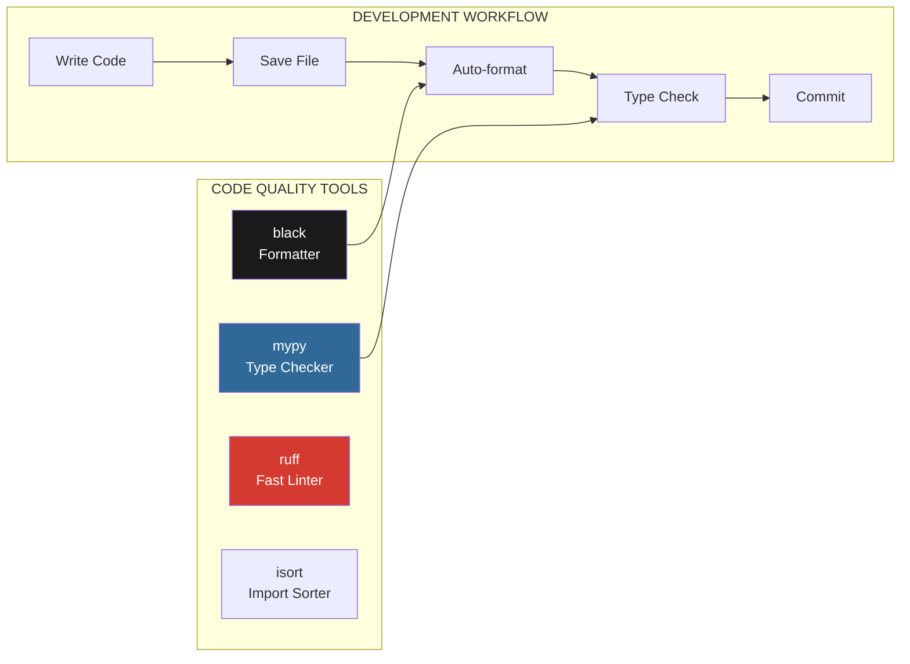
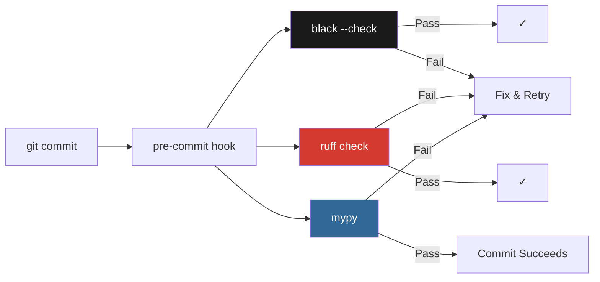

# Lesson 2.21: Type Checking and Code Formatting

> **Duration**: 30 min | **Section**: D - Professional Python Practices

## 🎯 The Problem

Your team is growing. Three developers are working on the same RAG application:
- Dev A uses `snake_case` for functions
- Dev B uses `camelCase` for functions
- Dev C sometimes forgets what type a function returns

Result: Code reviews become style debates. Bugs hide in type mismatches. Nobody wants to touch code they didn't write.

> **Scenario**: You call `get_embeddings(text)` expecting a list of floats. But someone changed it to return a numpy array. Your downstream code breaks in production. "Why didn't anyone catch this?"

## 🧪 Try It: The Naive Approach

```python
# Without types - what does this return?
def process_document(doc, options=None):
    # ... 100 lines later ...
    return result  # What is result? A string? A dict? A list?

# Without formatting - everyone does their own thing
def   get_embedding(text):
        embedding = model.encode( text )
        return   embedding

# Code review comment: "Use single quotes"
# Response: "I prefer double quotes"
# 3-hour debate ensues...
```

## 🔍 Under the Hood: The Tool Ecosystem



| Tool | Purpose | Speed |
|------|---------|-------|
| **mypy** | Static type checking | Medium |
| **black** | Opinionated code formatter | Fast |
| **ruff** | Linter (replaces flake8, isort) | Very Fast |
| **pyright** | Alternative type checker | Fast |

---

## ✅ The Fix: Type Hints and Formatting

### Step 1: Add Type Hints

```python
# app/services/embeddings.py
from typing import Optional

def get_embedding(text: str) -> list[float]:
    """Get embedding for a single text."""
    return model.encode(text).tolist()


def get_embeddings(texts: list[str]) -> list[list[float]]:
    """Get embeddings for multiple texts."""
    return [get_embedding(t) for t in texts]


def search_similar(
    query: str,
    top_k: int = 5,
    threshold: Optional[float] = None
) -> list[dict[str, any]]:
    """
    Search for similar documents.
    
    Args:
        query: The search query
        top_k: Number of results to return
        threshold: Minimum similarity score (optional)
    
    Returns:
        List of documents with scores
    """
    embedding = get_embedding(query)
    results = vector_db.search(embedding, limit=top_k)
    
    if threshold is not None:
        results = [r for r in results if r["score"] >= threshold]
    
    return results
```

### Step 2: Configure mypy

```toml
# pyproject.toml
[tool.mypy]
python_version = "3.11"
strict = true
warn_return_any = true
warn_unused_ignores = true
disallow_untyped_defs = true

# Ignore missing stubs for some libraries
[[tool.mypy.overrides]]
module = [
    "sentence_transformers.*",
    "chromadb.*",
    "langchain.*"
]
ignore_missing_imports = true
```

### Step 3: Configure Black and Ruff

```toml
# pyproject.toml
[tool.black]
line-length = 88
target-version = ["py311"]
include = '\.pyi?$'
exclude = '''
/(
    \.git
    | \.venv
    | __pycache__
    | migrations
)/
'''

[tool.ruff]
line-length = 88
target-version = "py311"

[tool.ruff.lint]
select = [
    "E",    # pycodestyle errors
    "W",    # pycodestyle warnings
    "F",    # pyflakes
    "I",    # isort
    "B",    # flake8-bugbear
    "C4",   # flake8-comprehensions
    "UP",   # pyupgrade
]
ignore = [
    "E501",  # line too long (handled by black)
]

[tool.ruff.lint.isort]
known-first-party = ["app"]
```

### Step 4: Run the Tools

```bash
# Install tools
pip install mypy black ruff

# Format code
black app/

# Check types
mypy app/

# Lint and fix
ruff check app/ --fix

# All together in CI
black --check app/ && ruff check app/ && mypy app/
```

---

## 🔄 Pre-commit Hooks

```yaml
# .pre-commit-config.yaml
repos:
  - repo: https://github.com/psf/black
    rev: 24.4.2
    hooks:
      - id: black
        language_version: python3.11

  - repo: https://github.com/astral-sh/ruff-pre-commit
    rev: v0.4.4
    hooks:
      - id: ruff
        args: [--fix, --exit-non-zero-on-fix]

  - repo: https://github.com/pre-commit/mirrors-mypy
    rev: v1.10.0
    hooks:
      - id: mypy
        additional_dependencies:
          - types-requests
          - types-redis
```

```bash
# Install pre-commit
pip install pre-commit
pre-commit install

# Now every git commit automatically:
# 1. Formats with black
# 2. Lints with ruff
# 3. Type-checks with mypy
```



---

## 🎯 Common Type Patterns for AI Code

```python
from typing import TypedDict, Literal, Union, Callable
from dataclasses import dataclass

# TypedDict for structured responses
class ChatMessage(TypedDict):
    role: Literal["user", "assistant", "system"]
    content: str


class RAGResult(TypedDict):
    answer: str
    sources: list[str]
    confidence: float


# Dataclass for internal models
@dataclass
class Document:
    id: str
    content: str
    embedding: list[float]
    metadata: dict[str, str]


# Function types
EmbeddingFunc = Callable[[str], list[float]]


def create_rag_chain(
    embedder: EmbeddingFunc,
    model: str = "gpt-4"
) -> Callable[[str], RAGResult]:
    """Create a RAG chain with the given embedding function."""
    
    def chain(query: str) -> RAGResult:
        embedding = embedder(query)
        # ... rest of RAG logic
        return {"answer": "...", "sources": [], "confidence": 0.9}
    
    return chain


# Union types for flexibility
ModelOutput = Union[str, dict[str, any], list[str]]


def parse_model_output(output: ModelOutput) -> str:
    if isinstance(output, str):
        return output
    elif isinstance(output, dict):
        return output.get("content", str(output))
    else:
        return "\n".join(output)
```

---

## 📊 VS Code Integration

```json
// .vscode/settings.json
{
    "python.analysis.typeCheckingMode": "basic",
    "editor.formatOnSave": true,
    "editor.defaultFormatter": "ms-python.black-formatter",
    "[python]": {
        "editor.defaultFormatter": "ms-python.black-formatter",
        "editor.codeActionsOnSave": {
            "source.organizeImports": "explicit"
        }
    },
    "mypy.runUsingActiveInterpreter": true,
    "ruff.enable": true
}
```

---

## 🎯 Practice

1. **Add types** to an existing function in your project
2. **Configure pyproject.toml** with black, ruff, and mypy
3. **Run all three tools** and fix any issues
4. **Set up pre-commit hooks** to automate checks
5. **Configure VS Code** for format-on-save

```bash
# Quick setup script
cat > pyproject.toml << 'EOF'
[tool.black]
line-length = 88

[tool.ruff]
line-length = 88
select = ["E", "W", "F", "I", "B", "UP"]

[tool.mypy]
python_version = "3.11"
warn_return_any = true
EOF

pip install black ruff mypy
black . && ruff check . --fix && mypy .
```

## 🔑 Key Takeaways

- **Type hints** = catch bugs before runtime, better IDE support
- **black** = end style debates, consistent formatting
- **ruff** = fast linting, replaces flake8 + isort
- **pre-commit** = automate checks on every commit
- **Gradual adoption** = start with `mypy --ignore-missing-imports`

## ❓ Common Questions

| Question | Answer |
|----------|--------|
| Do I need 100% type coverage? | No, start gradually. Even 50% helps |
| black vs prettier? | black is for Python, prettier for JS/TS |
| ruff vs flake8? | ruff is 10-100x faster, use ruff |
| What about pylint? | Heavy, slow. Use ruff for most checks |

## 🔗 Further Reading

- [mypy Documentation](https://mypy.readthedocs.io/)
- [black Documentation](https://black.readthedocs.io/)
- [ruff Documentation](https://docs.astral.sh/ruff/)
- [Python Typing Best Practices](https://typing.readthedocs.io/en/latest/)
- [pre-commit](https://pre-commit.com/)

---

**Previous**: [Lesson 2.20 - Git LFS](Lesson-02-20-Git-LFS-Large-Files.md) | **Up**: [Module 2 README](README.md)
